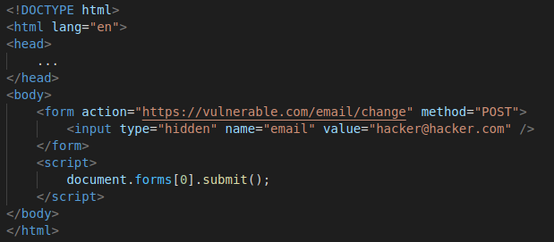

# CSRF

> Cross-Site Request Forgery is a web vulnerability that allows the attacker to force the website user to make unintended actions e.g transfer money , change account password or phone number.

It is also known as a one-click attack or session riding.

## Impact

The impact is limited to the capabilities exposed by the vulnerable website and the privilege of the targeted user , CSRF allows the attacker to forge a request to the vulnerable website to do unintended actions like  :

   1. Change password.
   2. Change account email address / phone number .
   3. Funds transfer .
   4. Full account takeover .

## CSRF Vulnerabilities

Assume we have the following request for changing user email. The action here (changing email) depends on the session cookie of the logged in user. 
```
POST /email/change HTTP/1.1
Host: vulnerable.com
Content-Type: application/x-www-form-urlencoded
Content-Length: 30
Cookie: session=yvthwsztyeX5gKgQkAPzeTvlyxHfsAfE
email=user@email.com 
```
For this vulnerable website crafting a CSRF PoC would be like:

We will construct the HTML page on our own server with the following content:


If the targeted user visit this web page it will do the following actions :
1. It will trigger an HTTP request to the vulnerable website 
2. If the user logged in that website , the browser will include the user session in the forged request automatically 
3. The vulnerable website will accept the forged request and process it as it was made by the targeted user, and it will change his email successfully to `hacker@hacker.com.`

However if the vulnerable website is using a GET request to process the action instead of POST, it will be so easier to exploit, and there will be no need to craft PoC on an external server.

The attacker can simply send a URL with the needed parameters to the victim, and he can deceive him to click on it by injecting the URL on an Image. 

### Broken CSRF token validation

**CSRF token** is a secret unique unpredictable value generated by the web application server and transmitted to the end-user to be included in the subsequent HTTP request made by the user , this token can help to prevent CSRF by making it difficult for the attacker to forge a valid request for the specified action as it will be impossible for him to predict the required token for the victim.

Sometimes there are some scenarios in which the validation is broken.

> **Example 1**

In some web applications the validation can be done when the request is using the POST method, and this can be broken by changing the POST request to GET.

That in some cases can bypass the token validation.

**Before**
```
POST /email/change HTTP/1.1
Host: vulnerable.com
Content-Type: application/x-www-form-urlencoded
Content-Length: 30
Cookie: session=yvthwsztyeX5gKgQkAPzeTvlyxHfsAfE
token=yvthwsztyeX5gKgQkAPzeTvlyxHfsAfE&email=user@email.com 
```

**After**
```
GET /email/change/?email=user@email.com  HTTP/1.1
Host: vulnerable.com
Cookie: session=yvthwsztyeX5gKgQkAPzeTvlyxHfsAfE
```

> **Example 2**

In some cases the validation can be bypassed by removing the entire CSRF token parameter from the initiated request as the validation depends on the present of the token.

**Before**
```
POST /email/change HTTP/1.1
Host: vulnerable.com
Content-Type: application/x-www-form-urlencoded
Content-Length: 30
Cookie: session=yvthwsztyeX5gKgQkAPzeTvlyxHfsAfE
token=yvthwsztyeX5gKgQkAPzeTvlyxHfsAfE&email=user@email.com 
```
**After**
```
POST /email/change HTTP/1.1
Host: vulnerable.com
Content-Type: application/x-www-form-urlencoded
Content-Length: 30
Cookie: session=yvthwsztyeX5gKgQkAPzeTvlyxHfsAfE
email=user@email.com 
```

### Crafting CSRF PoC for JSON requests

In some web applications the exchange of data is being done by JSON format.

Like the following :
```
POST /email/change HTTP/1.1
Host: vulnerable.com
{“email”:”user@email.com”}
```

To craft a PoC for this type of request, you are supposed to use a different way for sending parameters values.


## CSRF Exploitation

After crafting the successful PoC (Proof Of Concept exploit) the attacker will need to deceive the victim to visit his web page, this can be done by sending the victim a link to the attacker website, it can be sent by email or social media message.

## Mitigation 
1. Using a strong CSRF token , and making sure that it is validated correctly by the server-side application.
2. Using Same Site cookie attribute, this could help to prevent the browser from sending site-cookies along with the cross site requests.
3. Mitigation XSS vulnerabilities as it could defeat any CSRF mitigation 
4. Do not use GET requests for changing actions.

## Challenges
1. Wrong Token
