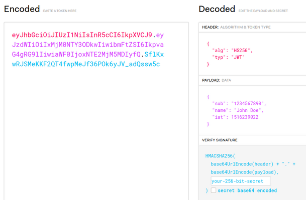
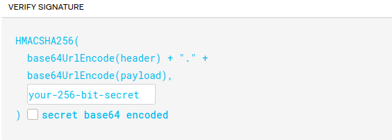

# JWT - JSON Web Tokens

> JSON Web Tokens are one of the common methods used in passing caller information with REST API calls and commercial web applications.

## JWT attacks 

Because of the JWT statelessness and the signature implementation, it is frequently misused and attackers can exploit it to bypass the access control due to the security issues that are specific to it. 

 
## Impact 
   - Authentication bypass 
   - Access to unauthenticated resources 
   - Compromising user accounts 

## JWT basics


The JWT consist of three components : header, payload and signature 

1. `Header`

The header is a JSON object usually consisting of two attributes to identify the algorithm used to generate the signature, the most commonly used algorithms HMAC and RSA.


2. `Payload`

Payload carries the information that is used for access control.

Also it contains some claims like:

	- Sub:  Identifies the subject of the JWT. 
	- exp: token expiration date.
	- iat: the time at which the token was issued.


3. `Signature`

The signature is used to validate the token and make sure that it has not been tampered with. it is calculated by concatenating the header with the payload, then signing with the algorithm specified in the header using a secret key.


The full JSON Web Token is the concatenation of the three parts together (header, payload, and signature ) with `.` dot between each part.


## JWT Attacks

There are some techniques to bypass the JWT controls 

 1. Algorithm manipulation 
   - Using None as the algorithm
   - Using symmetric encryption (HMAC) instead of asymmetric RSA
 2. Leaking secret key through another attack like SSRF 
 3. Weak secret key brute forcing 

 
### Changing the algorithm to none :

In some misused implementations changing the algorithm to none could allow the attacker to bypass the validation.

For example: Changing this 


### Brute forcing secret key 

Sometimes it is possible to brute force the secret key if it was weak , and in this case you can use any tool to get the key like jwtcat 

You can use any wordlist with this tool like rockyou wordlist , it can be found in kali linux at this path `/usr/share/wordlists/`

Tool usage is simple , just go to the tool directory and run the following command 
```
python3 jwtcat.py -t “your-JWT” -w “wordlist-path”
```
Output would be something like this:


## Mitigation 

1. Use strong secret key
2. Use JWT for authorization not session management 
3. Perform Algorithm Verification
4. Make sure your tokens expire 

## Tools
- [jwtcat](https://github.com/molekm/jwtcat)
- [c-jwt-cracker](https://github.com/brendan-rius/c-jwt-cracker)

## Challenges
1. admin gate first
