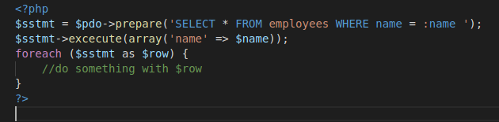

# SQL Injection

> SQL injection is a web security vulnerability in which the attacker is injecting malicious SQL queries into an SQL statement within the vulnerable application.

## Impact

In a successful SQL injection, the attacker can do the following:
	- Bypass website authentication
	- Exposing website sensitive data (eg Facebook database breaches)
	- Deleting/modifying or stealing website user data.
	
## SQL Basics

SQL Structured Query Language is used to communicate with relational database management systems.

Examples of a DBMS:
	- Mysql
	- PostgreSQL
	- Oracle
	- MSSQL

SQL Statements : 
| Statement | Use |
----------|-------------|
SELECT | Is used to retrieve records from one or more tables.
INSERT | Is used to insert a one or more records to a table.
UPDATE | Update existing records in the tables.
DELETE | Delete one or more records from a table.
ORDER BY | Sort records in the result set for a SELECT statement.
LIMIT | Limit number of records returned based on a limit value.
WHERE | Filter the result set and apply conditions in the statement.

SQL comments:
| Version | Comment |
|---------|---------|
| MySQL | #comment , -- comment , /*comment*/ |
| PostgreSQL | --comment , /*comment*/ |
| Oracle | --comment |
| SQLite | --comment , /*comment*/ |
| Microsoft | --comment , /*comment*/ |

Example of viewing database records using php:


## SQL Injection Techniques

SQL injection can be divided into 3 categories:
	- In-band SQLi
	- Blind SQLi
	- Out-of-band SQLi

1. **In-band SQLi**

Is one of the most common types in which the attacker uses the same communication channel to initiate his attack.

This category has 2 techniques:
	- Error-based SQLi
	- Union-based SQLi
	
a. `Error-based SQLi`

In this technique the attacker performs some actions to cause the database to return an error message which can lead one to know the used DBMS type and the structure of the SQL statement being used by the vulnerable web application. 

eg sending single quote (') or double quotes (") in the vulnerable input field.

DBMS error examples:
| MySQL | You have an error in your SQL syntax; check the manual that corresponds to your MySQL server version for the right syntax to use near “ ‘ at line 1 |
| MSSQL | Server Error in '/' Application | 
| Oracle | ORA-00933: SQL command not properly ended |

B. `Union-based SQLi`

This technique uses the **UNION** SQL operator which will execute multiple **SELECT** statements (SELECT statement of the vulnerable application and the injected SELECT statement after the UNION operator).

To craft a successful UNION-basedSQLi, one needs 2 things ie _the number of columns being used_ and _the column type in which the injection can be replaced._

You can get the number of columns by using the **ORDER BY** operatorm when the ORDER BY takes a number more than the actual column number in the table it will return an error message.

That can happen by sending a set of ORDER BY statements and changing the used number every time.
```
' ORDER BY 1--
' ORDER BY 2--
' ORDER BY 3--
```

Assuming the following SQL query :
```
SELECT username , password FROM users where password = ‘’ ORDER BY 3 -- ’
```
The above query will return an error message because the number of columns is 2 not 3 , here you will figure out that you need to craft a UNION statement with a SELECT query containing 2 columns.

After getting the number of columns you need to know the column type in which you will replace your payload.

You can send a set of UNION queries in which you will replace a string in one of the columns after the select statement.
```
' UNION SELECT 'a',NULL --

' UNION SELECT NULL,'a' -- 
```

And if you got an error like:
```
Conversion failed when converting the varchar value 'a' to data type int. 
```
This error will indicate if you replaced the correct data type.

After figuring out the correct place for injecting your payload, you can use one of the common SQL variables to gather some information about the database.

Examples:
| @@hostname | Current Hostname |
| database() | Current Database |
| version() | DB Version |
| current_user() | Get the current user |

2. **Blind SQLi**

In this type the attacker sends his injection payload to the web application and observes the response and behavior of the application server; it is blind because the data is not returned back from the database to the attacker.

This category has two techniques:

a. `Boolean-based SQLi`

This technique depends on sending a SQL query to the database which makes the web application return different result according to the query whether it returns True or False , attacker will use the changing of the HTTP response to enumerate the database character by character 

b. `Time-based SQLi`

In this technique the attacker will send a query that force the database to wait a for some seconds ,then from the time the database takes to respond can extract data by relying on the status of query whether it true or false.

3. **Out-of-band SQLi**

This type of SQLi occurs when the attacker can’t use the channel to launch his attack , and it relies on features enabled on the database server, for example the attacker would use the ability of the database to make a DNS / HTTP request to a server controlled by him .

## Dumping data using sqlmap
Sqlmap is an automated tool for SQL injection . it is installed by default on kali linux or on any pentesting OS .

One can use it on any OS by downloading its files from the github repository .

One can run sqlmap using : 
```
┌──(kali㉿kali)-[~]
└─$ sqlmap -u "http://example.com"                                                         
```

1. **Enumerate the database**

```
sqlmap --dbms=mysql -u "$URL" --dbs
```

**--dbms** : indicates the database management system
**--dbs** : to enumerate the database

2. **Enumerate tables**
```
sqlmap --dbms=mysql -u "$URL" -D "$DATABASE" --tables
```

**-D** : indicates the database name
**--tables** : to enumerate tables

3. **Dump data from specified table**
```
sqlmap --dbms=mysql -u "$URL" -D "$DATABASE" -T "$TABLE" --dump
```

**-T** : indicates the table name
**--dump** : to extract table name

## Mitigation
1. Validating user-input
2. Using prepared statement eg in php using [PHP Data Objects](https://www.php.net/manual/en/book.pdo.php)

3. Minimize the privileges assigned to every database account

##Challenges
1. Owls Blog
2. bypass the world >> FLAG{Y0u_Ar3_S0_C00L_T0d4y}
3. Easy access
