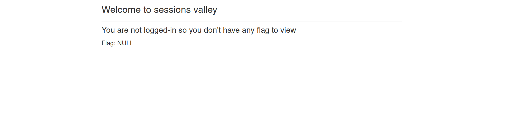
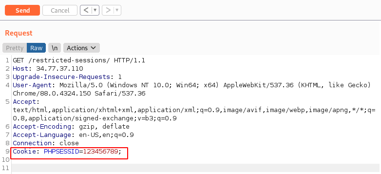
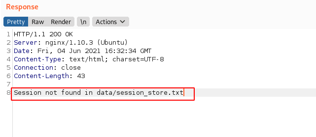
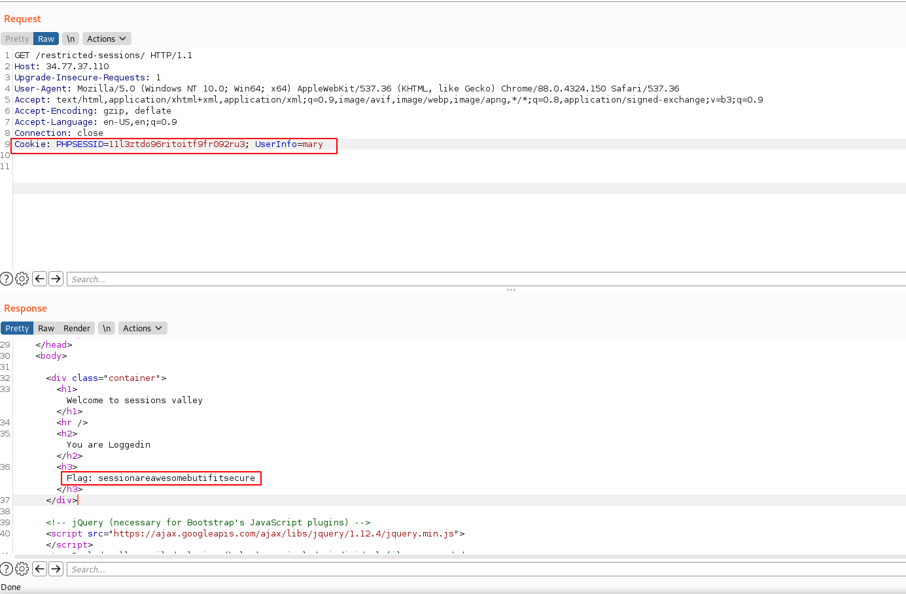

# CYBERTALENTS WRITEUPS
- Below is the wirteups of the web challenges done through my learning session.

# Challenge Name : Greeks

Category : General Information (50pts)

Challenge Description : The art of hiding messages or information inside other image / text or data

> flag : steganography

-------------------------------------------------------------------------------------------------------------

# Challenge Name : The Restricted Sessions

Category : Web Security

Challenge Description : Flag is restricted to logged users only, can you be one of them?

Link : [http://34.77.37.110/restricted-sessions/](http://34.77.37.110/restricted-sessions/)

#### Solution

The website is empty with a message.

You have to be logged in so as to be able to view the flag.

Though there is some interesting javascript available when we look at the source code: 

The javascript makes a post request to `getcurrentuserinfo.php` to exchange PHPSESSID cookie value with user info which is checked for login.

Trying to find the type of cookie or a clue around the cookie, we enter an invalid cookie ie `Cookie: PHPSESSID=123456789;`

this gives us the source of the php session id being stored under `data/session_store.txt`

We can use the link [http://34.77.37.110/restricted-sessions/data/session_store.txt](http://34.77.37.110/restricted-sessions/data/session_store.txt) that gives us 3 php sessions:
  - iuqwhe23eh23kej2hd2u3h2k23
  - 11l3ztdo96ritoitf9fr092ru3
  - ksjdlaskjd23ljd2lkjdkasdlk
  
We still can't get access since a `UserInfo` is required, so we insert one eg `mary`. This gives us the flag finally.

> **flag : sessionareawesomebutifitsecure**

--------------------------------------------------------------------------------------------------------------

# Challenge Name : Hide me

Category : General Information

Challenge Description : I act as a middle man to forward requests from different devices to access external resources . I am a ......?

> flag : proxy

--------------------------------------------------------------------------------------------------------------

# Challenge Name : Encoding

Category : General Information

Challenge Description : What type of this encoded , hashed text "aGVsbG93b3JsZDEx" ?

> flag : base64

-------------------------------------------------------------------------------------------------------------

# Challenge Name : Cheers

Category : Web Security

Challenge Description : Go search for what cheers you up [http://ec2-54-93-122-202.eu-central-1.compute.amazonaws.com/ch33r5/](http://ec2-54-93-122-202.eu-central-1.compute.amazonaws.com/ch33r5/)

#### Solution

when we visit the link we find the following message:

From the error message the error is undefined index and it might take the parameter welcome. ie `/ch33r5/?welcome`.

We can change the link to [http://ec2-54-93-122-202.eu-central-1.compute.amazonaws.com/ch33r5/?welcome](http://ec2-54-93-122-202.eu-central-1.compute.amazonaws.com/ch33r5/?welcome)

This still gives us another error but with a closer hint....

modify the link to `/ch33r5/?welcome&gimme_flag`

[http://ec2-54-93-122-202.eu-central-1.compute.amazonaws.com/ch33r5/?welcome&gimme_flag](http://ec2-54-93-122-202.eu-central-1.compute.amazonaws.com/ch33r5/?welcome&gimme_flag)

and we get the flag......

awesome

> flag : FLAG{k33p_c4lm_st4rt_c0d!ng}

------------------------------------------------------------------------------------------------------------

# Challenge Name : Contribute

Category : General Information

Challenge Description : I am an Organization that releases the Top 10 Vulnerabilities in Application Security . I am ……?

> flag : OWASP

------------------------------------------------------------------------------------------------------------

# Challenge Name : one click

Category : General Information

Challenge Description : a type of malicious exploit of a website where unauthorized commands are submitted from a user that the web application trusts .

> flag : CSRF
