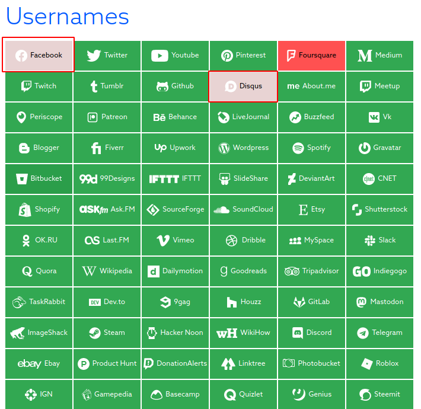
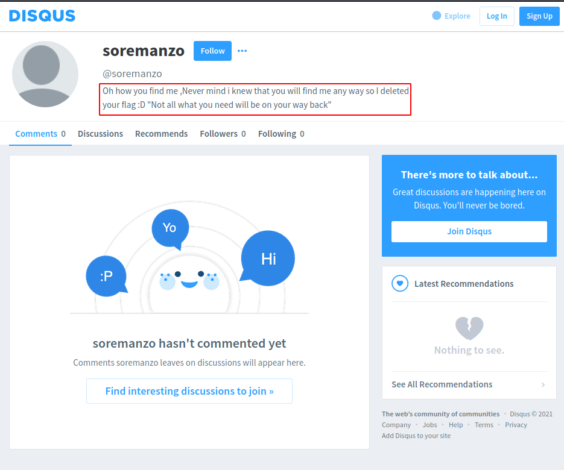

# RECONNAISANCE

> This phase deals with gathering as much information as possible about the target.

The more info you gather about the target, the more likely the next stages of the penetration test are successful.

2 types of recon:
  1. Passive recon.
  2. Active recon.
  
## 1. `Passive recon`
Is the process of gathering info about a target without any direct interaction with it.

### Passive recon tools and techniques.
 1. **Whois**

Is a TCP-based query/response protocol that is used to provide information services to internet users, usually about registered domain names.

This record contains information about the person or company that registers a domain name such as:
   1. Registrant information (owner of the domain).
   2. Registrar information (Organization that registered the domain).
   3. Registration dates.
   4. Name servers.
   5. Most recent update.
   6. Expiration dates.
   
whois can be used both online via [https://whois.domaintools.com/](https://whois.domaintools.com/) and on terminal via eg `whois google.com`.

 2. **GitHub**

Checking code hosting platforms is important because online stored source codes can provide information about the programming languages and frameworks that are used by the target.

Devs may accidentally add sensitive data or credentials to public repositories.

 3. **Stackoverflow**

Checking programming question-and-answer platforms is important because the developers might add an important part of the source code in their questions or the used programming languages and frameworks can be identified from the target's developers questions as in [stackoverflow](https://stackoverflow.com/)

 4. **Google Hacking / Google Dorking**

This is using advanced search queries in the google search engine to find vulnerable systems or sensitive infomation disclosures.

[The Google Hacking Database (GHDB)](https://www.exploit-db.com/google-hacking-database) is a collection of search terms that have been used to reveal sensitive data exposed by vulnerable servers and web applications.

 5. **Netcraft**

[Netcraft](https://www.netcraft.com/) is an internet services company that tracks websites, it provides information about the infrastructure and technologies used by the target's websites.

 6. **Crunchbase**

[Crunchbase](https://www.crunchbase.com/) is a platform for finding business information about companies.

 7. **The Harvester**

Is an OSINT tool that gathers information such as emails, names, hosts, subdomains, IPs and URLs using multiple public data sources.

 8. **Shodan**

[Shodan](https://www.shodan.io/) is a search engine for Internet-connected devices and it can be used to identify the services/technologies used by those devices.

 9. **Censys**

[Censys](https://censys.io/) is a public search engine that enables researchers to discover, monitor and analyze devices that are accessible from the internet.

 10. **Sherlock**

[Sherlock](https://sherlock-project.github.io/) is a command line tool that can be used to find people across many sites using their usernames.

 11. **OSINT Framework**

[OSINT Framework](https://osintframework.com/) is a big collection of OSINT tools or resources.

### 2. `Active Recon`
Involves direct interaction with the target.


---------------------------------------
## Writeups

#### Challenge #1
Challenge Name : version

Challenge Category : Machines

Challenge Description : This Challenge will help you understand to define the version of the web service

Can you find the web server version

Flag format Xxxxxxy.y.yy

Target IP: 35.156.4.248

**Solution**

This challenge requires us to make use of nmap.

First let's find any open or available ports.
```
┌──(fraize㉿fraize)-[~]
└─$ nmap 35.156.4.248 -Pn
Host discovery disabled (-Pn). All addresses will be marked 'up' and scan times will be slower.
Starting Nmap 7.91 ( https://nmap.org ) at 2021-06-22 13:40 EAT
Nmap scan report for ec2-35-156-4-248.eu-central-1.compute.amazonaws.com (35.156.4.248)
Host is up (0.18s latency).
Not shown: 998 filtered ports
PORT   STATE SERVICE
22/tcp open  ssh
80/tcp open  http

Nmap done: 1 IP address (1 host up) scanned in 16.00 seconds
                                                           
```

Ports 22 and 80 are open but since we need the web version we use port 80 and use (-sV) argument which is the version detection.
```
┌──(fraize㉿fraize)-[~]
└─$ nmap 35.156.4.248 -Pn -p 80 -sV 
Host discovery disabled (-Pn). All addresses will be marked 'up' and scan times will be slower.
Starting Nmap 7.91 ( https://nmap.org ) at 2021-06-22 13:42 EAT
Nmap scan report for ec2-35-156-4-248.eu-central-1.compute.amazonaws.com (35.156.4.248)
Host is up (0.18s latency).

PORT   STATE SERVICE VERSION
80/tcp open  http    Apache httpd 2.4.29 ((Ubuntu))

Service detection performed. Please report any incorrect results at https://nmap.org/submit/ .
Nmap done: 1 IP address (1 host up) scanned in 9.56 seconds
```

> flag : Apache2.4.29


#### Challenge #2
Challenge Name : Invincible

Challenge Category : Open Source Cyber Intelligence

Challenge Description : This Challenge will help you understand the basics of OSINT

Our threat intelligence team has noticed suspicious behavior from the user "soremanzo" , Can you trace him and find what he is trying to hide.

**Solution**

From the description, the goal is to track **soremanzo**. First off, let's do a name search on the user using [NameCheckup](https://namecheckup.com/)


Here we get that the name is taken on Facebook and Disqus. Facebook leads to a dead end whereas Disqus gives us a clue.



Next, we get to use a tool called **wayback machine** which will give us any history from soremanzo's disqus.

This gives use a calender which has the days and which month and year that soremanzo had activity in the disqus account. One of them gives us the flag.


> flag : FLAG{4rch1v3_Usu4LLy_C0nt41n_Us3fuL_1nf0rm4t10n}
