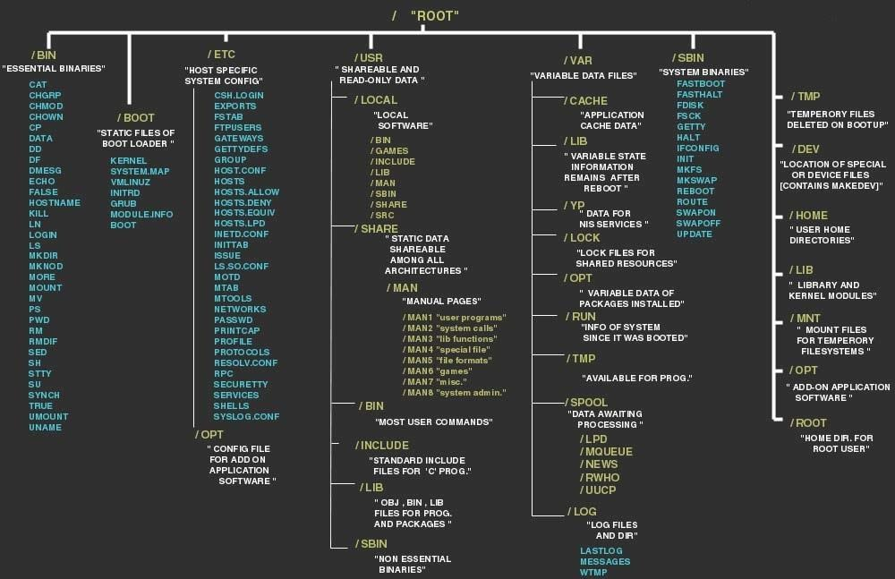

# Kali Linux

Released on the 13th March 2013, open-source debian-based linux distribution from Offensive Security.

Contains several tools targeted towards various information security fields.

## Linux File System
Below is a sample of the hierarchy of the file system used on linux machines.



| Directory | Description |
| ------- | ---------- |
| / | The root directory |
| /bin/ | Essential user command binaries |
| /boot/ | Linux kernel and other static files of the boot loader |
| /dev/ | Device files |
| /etc/ | System configuration files |
| /home/ | Home directories for normal users(non-root users) |
| /lib/ | essential shared libraries and kernel modules |
| /media/ | mount points for removable devices |
| /mnt/ | moint point for a temporary mounted filesystem |
| /opt/ | add-on application software packages |
| /proc/ | system processes information |
| /root/ | home directory for the root user |
| /run/ | volatile runtime data |
| /sbin/ | system administration binaries |
| /srv/ | data for services provided by this system |
| /sys/ | information about devices, drivers, and some kernel features |
| /tmp/ | temporary files(deleted when the system is restarted) |
| /usr/ | applications and files used by users |
| /var/ | variable data files handled by services such as logs, queues, caches and spools |

Linux command line general form:
```
command -option(s)[optional] argument(s)[optional]
```

Types of paths in file systems:
  1. Absolute path
    - Path specifying the location of a file or directory starting from the root directory (/).
     eg `test:/root/dir/test`
  2. Relative path
     - Path related to the present working directory.
     eg `test:./test`
     
## linux commands
**.** - Current Directory

**..** - The parent directory of the current directory.

pwd - prints full name of the current/working directory.

cd - change the working directory.

ls - list the directory contents.

touch - create an empty file.

mkdir - create an empty directory.

rm - remove files or directories.
  * -i prompt before every removal.
  * -d remove empty directories.
  * -r remove directories and their contents.
  
rmdir - remove empty directories

### Users and groups
| Command  | Description |
| -----  | --------- |
| id | find out user and group names and numeric IDs of the current user or any other user. |
| whoami | displays the username of the current user. |
| adduser | add a user to the system. |
| addgroup | add a group to the system |
| userdel | deletea user account and related files |
| groupdel | deletes a group |
| passwd | change user password |
| chmod | modify the permission types for files and directories. |
| chown | change the owner and the group of files and directories. |

### Permissions
There are 3 types of permissions:
  1. Read (r)
  2. Write (w)
  3. Execute (x)
  
---------------------------------------------------------------------------------------------------------------

# Challenges Writeups
## Challenge #1
Challenge Name : Linuxcmd101

Category : Digital Forensics

Challenge Description : Each point is linked to another point, connect the link and win the Flag!

 Link:[https://hubchallenges.s3-eu-west-1.amazonaws.com/Forensics/linux-chal.tar.gz](https://hubchallenges.s3-eu-west-1.amazonaws.com/Forensics/linux-chal.tar.gz)

`Solution`
We're given a gzip compressed file which we can decompress using `gunzip <file>` whereby we will get the file at **linux-chal.tar**.

Run `tar -xvf linux-chal.tar` to unzip thhe file and we will get a list of files. 
```
┌──(fraize㉿fraize)-[~/…/Penetration_Testing/linuxcmd101_chal]
└─$ tar -xvf linux-chal.tar
linux-chal/cat/.pass.txt
linux-chal/cat/exec.zip
linux-chal/cat/
linux-chal/

┌──(fraize㉿fraize)-[~/…/Penetration_Testing/linuxcmd101_chal]
└─$ tree linux-chal        
linux-chal
└── cat
    └── exec.zip

1 directory, 1 file
                      
```

Notice there's a .pass.txt filethat contains a string in that directory. Let's use it as the password for the zipfile.

```
┌──(fraize㉿fraize)-[~/…/Penetration_Testing/linuxcmd101_chal/linux-chal/cat]
└─$ 7z x exec.zip -p`cat .pass.txt`

7-Zip [64] 16.02 : Copyright (c) 1999-2016 Igor Pavlov : 2016-05-21
p7zip Version 16.02 (locale=en_US.UTF-8,Utf16=on,HugeFiles=on,64 bits,4 CPUs Intel(R) Core(TM) i7-4600U CPU @ 2.10GHz (40651),ASM,AES-NI)

Scanning the drive for archives:
1 file, 6960 bytes (7 KiB)

Extracting archive: exec.zip
--
Path = exec.zip
Type = zip
Physical Size = 6960

Everything is Ok

Folders: 1
Files: 2
Size:       21977
Compressed: 6960

┌──(fraize㉿fraize)-[~/…/Penetration_Testing/linuxcmd101_chal/linux-chal/cat]
└─$ ls
exec  exec.zip
                                                                                                               
┌──(fraize㉿fraize)-[~/…/Penetration_Testing/linuxcmd101_chal/linux-chal/cat]
└─$ tree exec
exec
├── -
└── ascii.zip

0 directories, 2 files

```

It works and we get a folder **exec** and **ascii.zip** files.

Running the '-' fike we get a number which perhaps could be the password for the ascii.zip file.

```
┌──(fraize㉿fraize)-[~/…/Penetration_Testing/linuxcmd101_chal/linux-chal/cat]
└─$ cd exec
                                                                                                               
┌──(fraize㉿fraize)-[~/…/linuxcmd101_chal/linux-chal/cat/exec]
└─$ ls
-  ascii.zip
                                                                                                               
┌──(fraize㉿fraize)-[~/…/linuxcmd101_chal/linux-chal/cat/exec]
└─$ ./-                 
998877665544332211      

┌──(fraize㉿fraize)-[~/…/linuxcmd101_chal/linux-chal/cat/exec]
└─$ 7z x ascii.zip -p`./-`     

7-Zip [64] 16.02 : Copyright (c) 1999-2016 Igor Pavlov : 2016-05-21
p7zip Version 16.02 (locale=en_US.UTF-8,Utf16=on,HugeFiles=on,64 bits,4 CPUs Intel(R) Core(TM) i7-4600U CPU @ 2.10GHz (40651),ASM,AES-NI)

Scanning the drive for archives:
1 file, 5281 bytes (6 KiB)

Extracting archive: ascii.zip
--
Path = ascii.zip
Type = zip
Physical Size = 5281

Everything is Ok

Folders: 1
Files: 10
Size:       4351
Compressed: 5281                                          
```
Awesome, worked just right..... Trying to unzip the file size37.zip, it's also encrypted. Assume that the password is in one of the files.

```
┌──(fraize㉿fraize)-[~/…/linux-chal/cat/exec/ascii]
└─$ file *
f0:         data
f1:         data
f2:         data
f3:         data
f4:         data
f5:         data
f6:         ASCII text
f7:         data
f8:         data
size37.zip: Zip archive data, at least v2.0 to extract

┌──(fraize㉿fraize)-[~/…/linux-chal/cat/exec/ascii]
└─$ cat f6        
rryuiytqpyuiqyofdkhsjhfewojnhfdss
                                                                                                               
┌──(fraize㉿fraize)-[~/…/linux-chal/cat/exec/ascii]
└─$ 7z x size37.zip -p`cat f6`

7-Zip [64] 16.02 : Copyright (c) 1999-2016 Igor Pavlov : 2016-05-21
p7zip Version 16.02 (locale=en_US.UTF-8,Utf16=on,HugeFiles=on,64 bits,4 CPUs Intel(R) Core(TM) i7-4600U CPU @ 2.10GHz (40651),ASM,AES-NI)

Scanning the drive for archives:
1 file, 4025 bytes (4 KiB)

Extracting archive: size37.zip
--
Path = size37.zip
Type = zip
Physical Size = 4025

Everything is Ok

Folders: 1
Files: 8
Size:       2644
Compressed: 4025
                                                                                                               
┌──(fraize㉿fraize)-[~/…/linux-chal/cat/exec/ascii]
└─$ ls   
f0  f1  f2  f3  f4  f5  f6  f7  f8  size37  size37.zip
                                                                                                               
┌──(fraize㉿fraize)-[~/…/linux-chal/cat/exec/ascii]
└─$ tree size37
size37
├── next.zip
├── test1
├── test2
├── test3
├── test4
├── test5
├── test6
└── test7

0 directories, 8 files
```
The password for next.zip might be in one of the extracted files. I’ll use a simple oneliner to crack the zipfile and then pass it to 7zip which will extract the contents.

```
┌──(fraize㉿fraize)-[~/…/cat/exec/ascii/size37]
└─$ 7z x next.zip -p$(zip2john next.zip > hash; cat test* > wordlist; john -w=wordlist hash | tail -n 4 | cut -d " " -f 1 | tail -n 1)
next.zip/next/ is not encrypted!
ver 78.8 next.zip/next/ is not encrypted, or stored with non-handled compression type
ver 81.9 next.zip/next/NumberOne.zip is not encrypted, or stored with non-handled compression type
ver 81.9 next.zip/next/nexttocybertalents is not encrypted, or stored with non-handled compression type
Using default input encoding: UTF-8
Will run 4 OpenMP threads
Press 'q' or Ctrl-C to abort, almost any other key for status
Warning: Only 7 candidates left, minimum 32 needed for performance.
1g 0:00:00:00 DONE (2021-06-10 22:23) 50.00g/s 350.0p/s 350.0c/s 350.0C/s dfhsvhsjkhuhgsadhuianvjsgufafrjimiouoiah..847n889t282m4y89txy58tx984379nv3498yvn934
Use the "--show" option to display all of the cracked passwords reliably
Session completed

7-Zip [64] 16.02 : Copyright (c) 1999-2016 Igor Pavlov : 2016-05-21
p7zip Version 16.02 (locale=en_US.UTF-8,Utf16=on,HugeFiles=on,64 bits,4 CPUs Intel(R) Core(TM) i7-4600U CPU @ 2.10GHz (40651),ASM,AES-NI)

Scanning the drive for archives:
1 file, 2404 bytes (3 KiB)

Extracting archive: next.zip
--
Path = next.zip
Type = zip
Physical Size = 2404

Everything is Ok

Folders: 1
Files: 2
Size:       9931
Compressed: 2404

┌──(fraize㉿fraize)-[~/…/cat/exec/ascii/size37]
└─$ tree next  
next
├── nexttocybertalents
└── NumberOne.zip

0 directories, 2 files                                

```

The password for NumberOne.zip is suggested by the file nexttocybertalents, therefore meaning that the word cybertalents is in the nexttocybertalents file and the word next to it is the password. Let's try out
```
┌──(fraize㉿fraize)-[~/…/exec/ascii/size37/next]
└─$ ls -al
total 24
drwxr-xr-x 2 fraize fraize 4096 Feb 23 08:44 .
drwxr-xr-x 3 fraize fraize 4096 Jun 10 22:23 ..
-rw-r--r-- 1 fraize fraize 8460 Feb 21 23:59 nexttocybertalents
-rw-r--r-- 1 fraize fraize 1471 Feb 23 08:44 NumberOne.zip
                                                                                                               
┌──(fraize㉿fraize)-[~/…/exec/ascii/size37/next]
└─$ cat nexttocybertalents| grep -i "cybertalents"
cybertalentsorderby1337
                                                                                                               
┌──(fraize㉿fraize)-[~/…/exec/ascii/size37/next]
└─$ cat nexttocybertalents| grep -i "cybertalents" | cut -c 13-23
orderby1337
                                                                                                               
┌──(fraize㉿fraize)-[~/…/exec/ascii/size37/next]
└─$ 7z x NumberOne.zip -p$(cat nexttocybertalents| grep -i "cybertalents" | cut -c 13-23) 

7-Zip [64] 16.02 : Copyright (c) 1999-2016 Igor Pavlov : 2016-05-21
p7zip Version 16.02 (locale=en_US.UTF-8,Utf16=on,HugeFiles=on,64 bits,4 CPUs Intel(R) Core(TM) i7-4600U CPU @ 2.10GHz (40651),ASM,AES-NI)

Scanning the drive for archives:
1 file, 1471 bytes (2 KiB)

Extracting archive: NumberOne.zip
--
Path = NumberOne.zip
Type = zip
Physical Size = 1471

Everything is Ok

Folders: 1
Files: 2
Size:       14379
Compressed: 1471
                                                                                                               
┌──(fraize㉿fraize)-[~/…/exec/ascii/size37/next]
└─$ ls    
nexttocybertalents  NumberOne  NumberOne.zip
                                                                                                               
┌──(fraize㉿fraize)-[~/…/exec/ascii/size37/next]
└─$ tree NumberOne
NumberOne
├── decodeme1.zip
└── One

0 directories, 2 files

┌──(fraize㉿fraize)-[~/…/exec/ascii/size37/next]
└─$ cd NumberOne                                                 
                                                                                                               
┌──(fraize㉿fraize)-[~/…/ascii/size37/next/NumberOne]
└─$ 7z x decodeme1.zip -p$(zip2john decodeme1.zip > hash; john -w=One hash | tail -n 4 | cut -d " " -f 1 | tail -n 1)
decodeme1.zip/decodeme1/ is not encrypted!
ver 78.8 decodeme1.zip/decodeme1/ is not encrypted, or stored with non-handled compression type
ver 81.9 decodeme1.zip/decodeme1/decodeme2.zip is not encrypted, or stored with non-handled compression type
ver 81.9 decodeme1.zip/decodeme1/pass is not encrypted, or stored with non-handled compression type
Using default input encoding: UTF-8
Will run 4 OpenMP threads
Press 'q' or Ctrl-C to abort, almost any other key for status
1g 0:00:00:00 DONE (2021-06-10 22:33) 12.50g/s 23137p/s 23137c/s 23137C/s fare..west
Use the "--show" option to display all of the cracked passwords reliably
Session completed

7-Zip [64] 16.02 : Copyright (c) 1999-2016 Igor Pavlov : 2016-05-21
p7zip Version 16.02 (locale=en_US.UTF-8,Utf16=on,HugeFiles=on,64 bits,4 CPUs Intel(R) Core(TM) i7-4600U CPU @ 2.10GHz (40651),ASM,AES-NI)

Scanning the drive for archives:
1 file, 754 bytes (1 KiB)

Extracting archive: decodeme1.zip
--
Path = decodeme1.zip
Type = zip
Physical Size = 754

Everything is Ok

Folders: 1
Files: 2
Size:       388
Compressed: 754
                                                                                                               
┌──(fraize㉿fraize)-[~/…/ascii/size37/next/NumberOne]
└─$ ls
decodeme1  decodeme1.zip  hash  One
                                                                                                               
┌──(fraize㉿fraize)-[~/…/ascii/size37/next/NumberOne]
└─$ tree decodeme1
decodeme1
├── decodeme2.zip
└── pass

0 directories, 2 files
                                                                                                               
┌──(fraize㉿fraize)-[~/…/ascii/size37/next/NumberOne]
└─$ cat pass                                                     
cat: pass: No such file or directory
                                                                                                               
┌──(fraize㉿fraize)-[~/…/ascii/size37/next/NumberOne]
└─$ cd decodeme1                                                                                           1 ⨯
                                                                                                               
┌──(fraize㉿fraize)-[~/…/size37/next/NumberOne/decodeme1]
└─$ cat pass    
dXNlbWVhc3Bhc3N3b3Jk
                                                                                                               
┌──(fraize㉿fraize)-[~/…/size37/next/NumberOne/decodeme1]
└─$ cat pass | base64 -d
usemeaspassword                                                                                                               
┌──(fraize㉿fraize)-[~/…/size37/next/NumberOne/decodeme1]
└─$ 7z x decodeme2.zip -p$(cat pass | base64 -d)

7-Zip [64] 16.02 : Copyright (c) 1999-2016 Igor Pavlov : 2016-05-21
p7zip Version 16.02 (locale=en_US.UTF-8,Utf16=on,HugeFiles=on,64 bits,4 CPUs Intel(R) Core(TM) i7-4600U CPU @ 2.10GHz (40651),ASM,AES-NI)

Scanning the drive for archives:
1 file, 367 bytes (1 KiB)

Extracting archive: decodeme2.zip
--
Path = decodeme2.zip
Type = zip
Physical Size = 367

Everything is Ok

Folders: 1
Files: 1
Size:       23
Compressed: 367
                                                                                                               
┌──(fraize㉿fraize)-[~/…/size37/next/NumberOne/decodeme1]
└─$ ld
ld: no input files
                                                                                                               
┌──(fraize㉿fraize)-[~/…/size37/next/NumberOne/decodeme1]
└─$ ls                                                                                                     1 ⨯
decodeme2  decodeme2.zip  pass
                                                                                                               
┌──(fraize㉿fraize)-[~/…/size37/next/NumberOne/decodeme1]
└─$ tree decodeme2
decodeme2
└── flag.txt

0 directories, 1 file
                                                                                                               
┌──(fraize㉿fraize)-[~/…/size37/next/NumberOne/decodeme1]
└─$ cd decodeme2        
                                                                                                               
┌──(fraize㉿fraize)-[~/…/next/NumberOne/decodeme1/decodeme2]
└─$ cat flag.txt        
synt{f1zcyr_yvahk_101}

                       
```
Use caesar to loop through the 26 rotations and then grep the flag format from the output.

```
for i in {1..26}; do echo "synt{f1zcyr_yvahk_101}" | caesar $i; done | grep -oE "flag{.*?}"
flag{s1mple_linux_101}
```
> flag : flag{s1mple_linux_101}


## Challenge #2
Challenge Name : remove

Challenge Category : General Information

Challenge Description : I need to remove a file called secret in my home directory. which command should i use 

> flag : 

## Challenge #3
Challenge Name : Distribution

Category : General Information

Challenge Description : Debian-based distribution with a collection of security and forensics tools. It features timely security updates, support for the ARM architecture
The flag without spaces 

> flag : kalilinux
