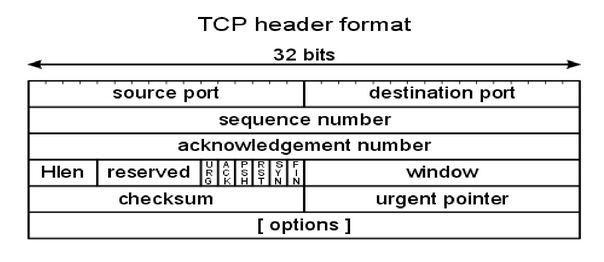

# Scanning

> Network Scanning is a method of getting network information such as identification of hosts, port information, and services by scanning networks and ports.

**Main objectives of scanning**
   1. Learn more about targets and find openings by interacting with the target environment.
   2. Determine network addresses of live hosts, firewalls, routers, etc on the network.
   3. Determine the network topology of the target environment.
   4. Determine the OS types of discovered hosts.
   5. Determine open ports and network services in a target environment.
   6. Determine lists of potential vulnerabilities. Do this in a manner that minimizes risk of impairing host or services.
   
### TCP/IP Basics
The design and operation of the Internet is based on the Internet Protocol Suite, commonly also called **TCP/IP**.

Network services are referenced using two components: a `host address` and a `port number`.

There are 65535 distinct and usable port numbers.(Port 0 is not a usable port number).

Some port scanners scan only the most common port numbers or ports most associated with vulnerable services on a given host.

Result of a scan on a port is generalized into three categories:
   1. `Open or Accepted` : The host sent a reply indicating that a service is listening on the port.
   2. `Closed or Denied or Not Listening` : The host sent a reply indicating that connections will be denied to the port.
   3. `Filtered, Dropped or Blocked` : There was no reply from the host.
   
Open ports present two vulnerabilities:
   1. Security and stability concerns associated with the **program** responsible for delivering the service.
   2. Security and stability concerns associated with the **operating system** that is running on the host.
   
Filtered ports do not tend to present vulnerabilities.

## TCP
> TCP : Connection-oriented; tries to preserve sequence; retransmits lost packets.


###### TCP Flags:
   1. **SYN** Initializes a connection between two hosts to facilitate communication.
   2. **ACK** Acknowledge the receipt of a packet.
   3. **URG** Indicates that the data contained in the packet is urgent and should be processed immediately.
   4. **PSH** Instructs the sending system to send all buffered data immediately.
   5. **FIN** Tells the remote system about the end of the communication. Closes a connection.
   6. **RST** Reset a connection.

###### TCP Three-way Handshake
Every legit TCP connection starts with three-way handshake.

Used to exchange sequence numbers that will be applied in increasing fashion for all follow-on packets for that connection.

###### Scanning TCP ports: 
If something is listening on a TCP port and a SYN arrives on that port, the system responds with a SYN-ACK regardless of the payload of the SYN packet. giving a reliable indication of which ports are listening.

| **HOST A** |         | **HOST B** |
| -----------|----------|---------- |
| Send SYN seq=x | &#8594; | Receive SYN |
| Receive SYN + ACK | &#8592; | Send SYN seq=y, ACKx+1 |
| Send ACK y+1 | &#8594; | Receive ACK |

## UDP
> UDP : Connectionless; no attempt made for reliable delivery.


###### Scanning UDP ports:
   1. There is no connection with UDP.
   2. Less options for scanning.
   3. Often slower scanning.
   4. Less reliable scanning.

### Scanning Types.
1. `Network Sweeping` - Send a series of probe packets to identify live hosts at IP addresses in the target network.
2. `Network Tracing` - Determine network topology and draw a map.
3. `Port Scanning` - Determine listening TCP and UDP ports on target systems.
4. `OS fingerprinting` - Determine target OS type based on network behaviour.
5. `Version scanning` - Determine the version of services and protocols spoken by open TCP and UDP ports.
6. `Vulnerability scanning` - Determine a list of potential vulnerabilities(misconfigurations, unpatched services etc) in the target environment.
---------------------------------------------------
## NMAP
1. **Specifying the target**

To print every packet that Nmap sends and receives, use the --packet-trace option. The simplest way is through passing the address or domain name.
```
```

2. **Specifying multiple targets**

Using **CIDR notation**, eg to scan all 256 addresses beginn with eg =>  `nmap 10.1.1.0/24`.

Using the **dash**, eg to scan 10.1.50.1, 10.1.51.1 and 10.1.52.1 use => `nmap 10.1.50-52.1`.

Using **commas**, => `nmap 10.1.50,51,52,57,59.1`.

All combined,=> `nmap 10.1,2.50-52.1/30 10.1.1.1 10.1.1.2`

3. **List scan**

The list scan option **(-sL)** is useful for making sure that correct addresses are specified before doing the real scan

=> `nmap -sL 10.1,2.50-52.1/30 10.1.1.1 10.1.1.2`

List scan prints the specified addresses without sending a single packet to the target.

4. **Default Options**

If you specify only an IP address or domain name and no other options => `nmap 74.207.244.221`, Nmap performs the following;
  - The IP address is reverse-DNS resolved to domain name, or viceversa in case a domain name is specified. Disabled by **-n**.
  - Ping scanning using TCP ACK:80 and ICMP. This is equivalent to **-PA -PE**. Disabled by **-PN**.
  - Scans the host(s)'s top 1000 most popular ports. When running as root, SYN stealth scan is used. When running as user, connect scan is used.
  
  
### Ping Scan with Nmap
Ping Scanning is used to determine whether the specified computers are up and running.

By default Nmap performs ping scan before port scan to avoid wasting time on hosts that are not connected. Use **-sn** to only perform ping scan.

Nmap uses different kinds of ping packets when run with user or root privileges and when scanning the same or different subnets.
| | **External IP** | **Local IP** |
| ---------- | ------- | ----- |
| **User Privileges** | TCP SYN at ports 80 & 443 | TCP SYN at ports 80 & 443 and ARP |
| **Root privileges** | TCP SYN at ports 80 & 443 and IGMP | ARP |

**Ping Scan Types**
| **Options** | **Ping Scan Type** |
| ------| -------|
| -Pn  | Disable ping scan entirely. | 
| -PS  | TCP **S**YN (default at port 80) |
| -PA  | TCP **A**CK (default at port 80) |
| -PU  | **U**DP |
| -PY  | SCTP INIT |
| -PE  | ICMP **E**cho |
| -PP  | ICMP timestam**p** |
| -PM  | ICMP address **m**ask |
| -PO  | **O**ther IP protocol |
| -PR  | A**R**P scan |

> Pn is useful when the machine is heavily firewalled, TCP 80 and 443 ports and IGMP requests are blocked, but the IP address might still have a machine listening on other less common ports.

### Port scan with Nmap
Nmap by default scans top 1000 most popular ports found in /etc/nmap/nmap-services.

To specify a different number of common ports use => `nmap --top-ports 1000 10.1.1.1`

To specify custom port numbers use **-p** => `nmap -p -25,135-137 10.1.1.1`

**Scan types**
| **Option** | **Port Scan Type** |
| ---------- | ------------------ |
| -sP | Ping scan only |
| -sS | TCP SYN (stealth, default as root) |
| -sT | TCP connect (default as user) |
| -sA | TCP ACK |
| -sF | TCP FIN |
| -sX | TCP FIN, SYN, ACK |
| -sW | TCP window |
| -sM | TCP miamon |
| -sU | UDP scan |
| -sl | Idle scan |
| -b | FTP bounce scan |
| -sO | Other IP protocol |

-----------------

## Anti-scanning techniques
#### iptables PSD module
PSD is an extension module of iptables used on some linux-based commercial routers. It has 4 parameters.
1. **--psd-weight-threshold _threshold_, default value : 21**

Total weight of the latest TCP/UDP packets with different destination ports coming from the same host to be treated as port scan sequence.

2. **--psd-delay-threshold _delay_, default value : 300(3sec)**

Delay for the packets with different dest ports coming from the same host to be treated as possible port scan subsequence.

3. **--psd-lo-ports-weight _weight_, default value : 3**

Weight of the packet with privileged (<=1024) dest port.

4. **--psd-hi-ports-weight _weight_, default value : 1**

Weight of the packet with non-privileged (>1024) dest port.

> If requests from a single IP have gained a value more than _threshold_ in _delay_ seconds, then the IP is classified as port scanner.

#### In a math expression
_lo_ports_weight_* **REQUEST_LOW** + _hi_ports_weight_* **REQUESTS_HIGH** >= _threshold_

where

**REQUESTS_LOW** = number of requests to privileged (0 to 1024) ports within last _delay_ seconds.

**REQUESTS_HIGH** = number of requests to privileged (1024 to 65535) ports within last _delay_ seconds.
---------------------
### Avoiding detection
Simplest way to avoid PSD is to scan slowly.

For default values, the following parameters would work => `nmap --scan-delay 3.192.168.56.1`

PSD doesn't detect a request as a port scan when the ack or rst flags are set.

When port scanning a host and the latter has an HTTP(S) service running on it, nmap will use Mozilla/5.0 as default user agent and actions will thus be easily detected esp if an admin or a robot are taking measures if such a user agent appears in the logs.

Nmap allows us to change the string eeaily by passing **-script-args http.useragent="user agent you want"**.

-----------------------
### Tips and Tricks.
1. Limiting scan speed

Nmap scans can be fast which in  turn can be counter-productive especially when you want to test your system's firewall without disabling any activated flood detection rules or when you want to run a long-term test for a specific port or service.

To send a packet at most every 3.33 seconds => `nmap --max-rate 0.3 192.168.56.1`

To a packet every 3.1 seconds user => `nmap --scan-delay 3.1 192.168.56.1`

**specifying targets input from a list file**

Nmap supports input from a list file bby passing (**-iL**):
```
addresses.txt
10.1.1.1 10.1.1.2 10.1.1-10.3

10.3.1.3 10.3.1.50 10.3.2.55

10.1.1.100

...
```
use => `nmap -iL addresses.txt`

Addresses in the file must be separated with a whitespace.

**Specifying targets to exclude from a scan**

=> `nmap 10.1.1.1-10 --exclude 10.1.1.5,7`

excluding from the same file => `nmap 10.1.1.1-10 --excludefile excludeaddr.txt`

2. Spoofing

To spoof source IP => `nmap -S 192.168.56.35 -e vboxnet0 192.168.56.11`

To spoof the source MAC address => `nmap --spoof-mac 192.168.56.11`

To spoof source port => `nmap --source-port 22 192.168.56.11`

3. Speeding up the scan

By default, Nmap performs DNS/reverse-DNS resolution on targets. To tell Nmap **n**ever do any DNS resolution, pass the (**-n**) option => `nmap -n 192.168.56.0/24`

4. Scan port number 0

By default, port 0 is skipped from scans, even if -p- is specified. To scan it, it must be specified explicitly ie => nmap -p- 0-65535.

Port 0 is invalid in RFC standards, however it can be used by malware and the likes to avoid more naive port scanners.

5. File output formats

Nmap has built-in support for for file output alongside with terminal output => `-oN filename`

Normal output, same as the terminal output => `oX filename`

XML output, contains very detailed information about the scan, easy to parse with software => `oG filename`

Grepable output, deprecated => `oA`

All of the above combined. Creates files called sitename.nmap, sitename.xml and sitename.gnmap if no filename is specified.

eg => `nmap -oN output.txt -oX output.xml scanme.nmap.org`

--------------------------------------
## Writeups

#### Challenge #1
Challenge Name : Open Doors

Challenge Category : Machines

Challenge Description : How many ports under 1000 opened in the targets

Target IP : 35.156.4.248

flag md5(ports)

**Solution**

First off, lets carry an nmap scan and see the open ports
```
┌──(fraize㉿fraize)-[~]
└─$ nmap -Pn 35.156.4.248         
Host discovery disabled (-Pn). All addresses will be marked 'up' and scan times will be slower.
Starting Nmap 7.91 ( https://nmap.org ) at 2021-06-23 13:02 EAT
Nmap scan report for ec2-35-156-4-248.eu-central-1.compute.amazonaws.com (35.156.4.248)
Host is up (0.17s latency).
Not shown: 998 filtered ports
PORT   STATE SERVICE
22/tcp open  ssh
80/tcp open  http

Nmap done: 1 IP address (1 host up) scanned in 13.58 seconds

```

