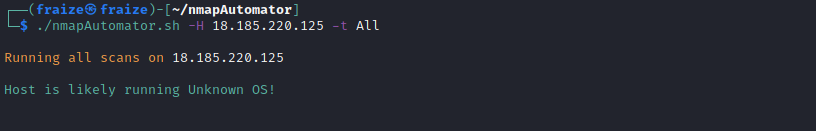

# Vulnerability assessment

## What is a Vulnerability Assessment?

> A vulnerability assessment is a process that identifies the bugs that could be exploited on your network, along with how important the associate threat really is. 

Silent Breach conducts a thorough analysis to determine the attack surface that is intentionally or unintentionally exposed and correlates it with a risk value to determine your security posture.

Vulnerability Assessment Tools:
  - OpenVAS
  - Nessus
  - Nexpose
  - Outpost24
  - Qualys

### Nessus?
> Nessus is a remote security scanning tool that gives you a variety of options for arranging results, which scans a computer and raises an alert if it discovers any vulnerabilities that malicious hackers could use to gain access to any computer you have connected to a network. 

It does this by running over 1200 checks on a given computer, testing to see if any of these attacks could be used to break into the computer or otherwise harm it.

**How Nessus Works?**

Most high-level network traffic, such as email, web pages, etc. reach a server via a high-level protocol that is transmitted reliably by a TCP stream. 

To keep different streams from interfering with each other, a computer divides its physical connection to the network into thousands of ports. 

Each computer has thousands of ports, all of which may or may not have services (i.e.: a server for a specific high-level protocol) listening on them. 

Nessus works by **testing** each port on a computer, **determining** what service it is running, and then testing this service to make sure there are no vulnerabilities in it that could be used by a hacker to carry out a malicious attack. 

Nessus is called a "remote scanner" because it does not need to be installed on a computer for it to test that computer.  Instead, you can install it on only one computer and test as many computers as you would like.

[https://www.youtube.com/watch?v=30qx-SFwRv8&list=PLB6BB6F9582BA2C5D](https://www.youtube.com/watch?v=30qx-SFwRv8&list=PLB6BB6F9582BA2C5D) 
 
Reporting

| High Level Report | Vulnerability Report | Step by Step Guide |
|-------------------|----------------------|--------------------|
| Statistics | Each IP with Vulnerability | Starting with NMAP how to Scan |
| Overview of Network | Contain Exploit Details | Trail of Thoughts what we were thinking |
| How Secure the network | Screenshot of Successful Exploit | Fail Exploits |
| Works Well for Management | Screenshot of Privilege Escalation | Trial and Errors |
| | How to Fix the Vulnerability | |
	
#### Public Pentesting Reports

[https://github.com/juliocesarfort/public-pentesting-reports](https://github.com/juliocesarfort/public-pentesting-reports)

-----------------------------
# Writeups

## Challenge 1 : CVE Number

**Challenge Category : General Information**

Challenge Level : basic

Challenge Description : What is the CVE ID that is related to EternalBlue

Flag Format: XXX-XXXX-XXXX

> Flag : CVE-2017-0144

## Challenge 2 : remote-CVE

**Challenge Category : Machines**

Challenge Level : easy

Challenge Description : What’s CVE ID could be used against the web application in the below target

Target IP1: 18.185.220.125

Target IP2: 18.156.191.247

Flag format CVE-xxxx-xxxx

**Solution**
Let's use nmap automator to identify the vulnerabilities that are available that will assist in getting the vulnerability.

From the above we find links to exploitable solutions that both give us the vulnerability in [https://vulners.com/exploitdb/EDB-ID:49584](https://vulners.com/exploitdb/EDB-ID:49584).

> Flag : CVE-2014-6287
