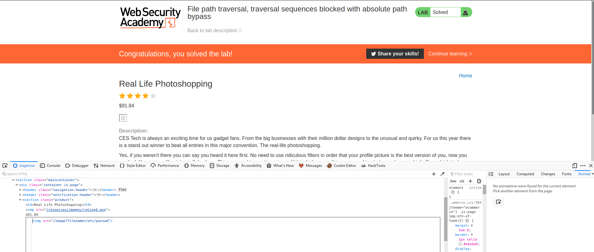
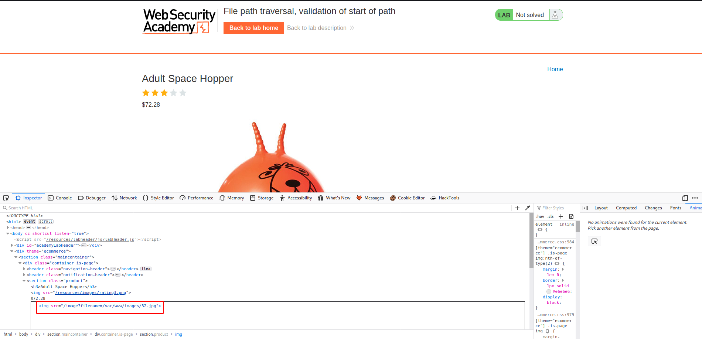

# Directory Traversal

> `Directory traversal/path traversal` is a web security vulnerability that allows an attacker to read arbitrary files on the server that is running an application.
- This can include application code and data, credentials for back-end systems, sensitive operating system files among many more.
- One may be able to write to arbitrary files on the server, allowing them to modify application data or behavior and ultimately take full control of the server.

### Reading arbitrary file via directory traversal.
- An application implements no defenses against directory traversal attacks, so an attacker can request the following URL to retrieve an arbitrary file from the server's filesystem:
```
https://website.com/loadImage?filename=../../../etc/passwd
```
- This causes the application to read from the following file path:
```
/var/www/images/../../../etc/passwd
```
- The sequence `../` is valid within a file path and means to step up one level in the directory structure.
- The three consecutive `../` sequences step up from `/var/www/images/` to the filesystem root, and so the file that is actually read is: `/etc/passwd`.
- On Unix-based operating systems, this is a standard file containing details of the users that are registered on the server.
- On Windows, both `../` and`..\` are valid directory traversal sequences, and an equivalent attack to retrieve a standard operating system file would be:
```
https://website.com/loadImage?filename=..\..\..\windows\win.ini
```

### Common obstacles to exploiting file path traversal vulnerabilities.
- Many applications that place user input into file paths implement some kind of defense against path traversal attacks but can often be circumvented.
- If an application strips or blocks directory traversal sequences from the user-supplied filename, then it might be possible to bypass the defense using a variety of techniques.
- One might be able to use an absolute path from the filesystem root such as `filename=/etc/passwd` to directly reference a file without using any traversal sequences.
- One might be able to use nested traversal sequences such as `....//` or `....\/` which will revert to simple traversal sequences when the inner sequence is stripped.
- You can also use various non-standard encodings such as `..%c0%af` or `..%252f` to bypass the input filter.
- If an application requires that the user-supplied filename must end with an expected file extension such as **.png** then it might be possible to use a null byte to effectively terminate the file path before the required extension. Eg
```
filename=../../../etc/passwd%00.png
```

### Preventing directory traversal attacks.
- Most effective way is avoid passing user-supplied input to filesystem APIs altogether.
- Many application functions that observe this can be rewritten to deliver the same behavior in a safer way.
- If unavoidable to pass user-supplied input to a filesystem APIs, then two layer of defense should be used together to prevent attacks:
    1. Application should validate the user input before processing it.
          - Validation should compare against a whitelist of permitted values.
          - If not possible for the required functionality, then the validation should verify that the input contains only permitted content, such as purely alphanumeric characters.
    2. After validating the supplied input, the application should append the input to the base directory and use a platform filesystem API to canonicalize the path. It should verify that the canonicalized path start with the expected base directory.
      
- Example of Java code to validate the canonical path of a file based on user input
```
File file = newFile(BASE_DIRECTORY, userInput);
if (file.getCanonicalPath().startsWith(BASE_DIRECTORY)){
    //process file
}
```
----------------------------------------------------------------------------------------

# LABS

## Lab 1 : File path traversal, simple case

This lab contains a file path traversal vulnerability in the display of product images.

To solve the lab, retrieve the contents of the /etc/passwd file. 

**Solution**

To solve this lab, select on any of the items inspect the page then edit the images attribute to retrieve the contents of the `etc/passwd` file as below:

```html

```
This completes the lab.

## Lab 2 : File path traversal, traversal sequences blocked with absolute path bypass

This lab contains a file path traversal vulnerability in the display of product images.

The application blocks traversal sequences but treats the supplied filename as being relative to a default working directory.

To solve the lab, retrieve the contents of the `/etc/passwd` file. 

**Solution**

In this lab, we shall use the same file path as above, the only difference is that we shall use:

```html

```


## Lab 3 : File path traversal, traversal sequences stripped non-recursively

This lab contains a file path traversal vulnerability in the display of product images.

The application strips path traversal sequences from the user-supplied filename before using it.

To solve the lab, retrieve the contents of the /etc/passwd file. 

**Solution**

For this lab, we will use a different mechanism on the filename parameter by changing the value to: `....//....//....//etc/passwd`

```html

```

## Lab 4 : File path traversal, traversal sequences stripped with superfluous URL-decode

This lab contains a file path traversal vulnerability in the display of product images.

The application blocks input containing path traversal sequences. It then performs a URL-decode of the input before using it.

To solve the lab, retrieve the contents of the /etc/passwd file. 

**Solution**

```html

```

## Lab 5 : File path traversal, validation of start of path

This lab contains a file path traversal vulnerability in the display of product images.

The application transmits the full file path via a request parameter, and validates that the supplied path starts with the expected folder.

To solve the lab, retrieve the contents of the /etc/passwd file.

**Solution**

Looking at the image when inspecting the page, we see the filepath being as follows:


Therefore, we can edit the image source to be as follows:
```html

```

## Lab 6 : File path traversal, validation of file extension with null byte bypass 

This lab contains a file path traversal vulnerability in the display of product images.

The application validates that the supplied filename ends with the expected file extension.

To solve the lab, retrieve the contents of the /etc/passwd file.

**Solution**

```html

```
