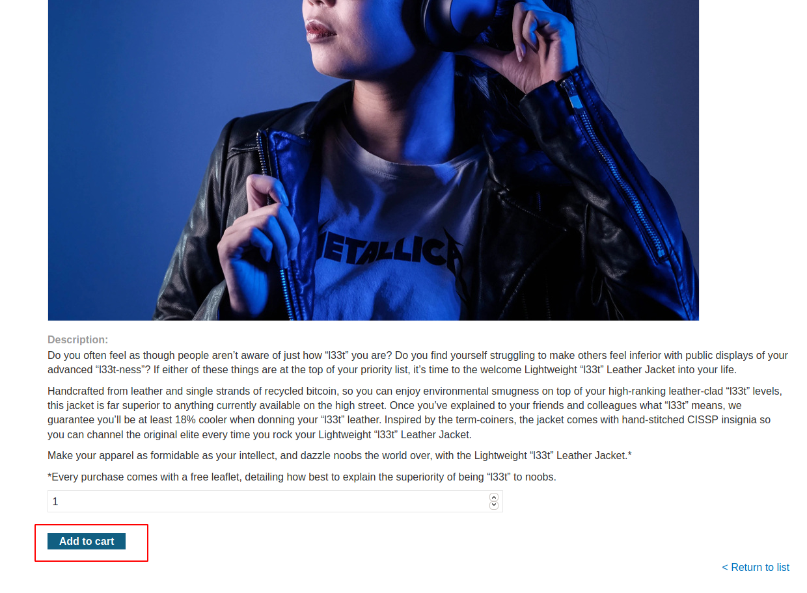
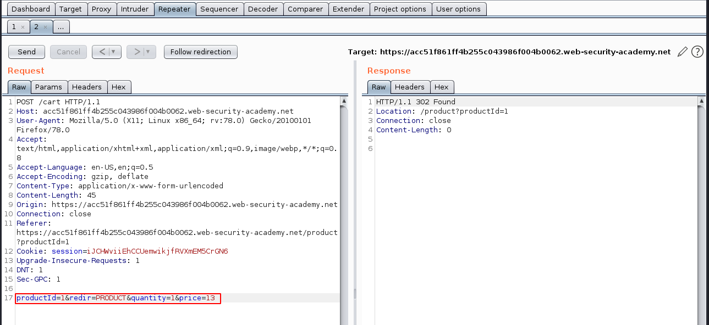

# Business Logic Vulnerabilities

> `Business logic vulnerabilities` are flaws in the design and implementation of an application that allow an attacker to elicit unintended behaviour.
- Business logic vulnerabilities are ways of using the legitimate processing flow of an application in a way that results in a negative consequence to the organization.
- `Business logic` refers to the set of rules that define how the application operates.
- Logic flaws are often invisible to people who aren't explicitly looking for them as they typically won't be exposed by normal use of the application, however one may be able to exploit behavioural quirks by interacting with the appliaction in ways that developers never intended.
- Main  purpose of business logic is to enforce the rules and constraints that were defined when designing the application or functionality.
- BUsiness rules dictate how the application should react when a given scenario occurs such as preventing users from doing things that will have a negative impact on the business of that simply don't make sense.
- Logic-based vulnerabilities can be extremely diverse and are often unique to the application and its specific functionality.
- Identifying them often requires a certain amount of human knowledge such as an understanding of the business domain or what goals an attacker might have in a given context making them difficult to detect using automated vulnerable scanners.
> Logic flaws are a great target for bug bounty hunters and manual testers in general.

### Arising of business logic vulnerabilities.
- Often arise because the design and development teams make flawed assumptions about how users will interact with application.
- These bad assumptions can lead to inadequate validation of user input.
- When an attacker deviates from the expected user behavior, the application fails to take appropriate steps to prevent this and subsequently  fails to handle the situation safely.
- Logic flaws are common in overly complicated systems that even the development team themselves don't fully understand.
- To avoid logic flaws the devs need to understand the application as a whole.
- If the developers don't explicitly document any assumptions that are being made, it is easy for these kind of vulnerabilities to creep into an application.

### Impact of business logic vulnerabilities.
- Any unintended behaviour can potentially lead to high-severity attacks if an attacker is able to manipulate the application in the right way.
- The impact of any logic flaw dependds on what functionality it is related to.
- If the flaw, for example, is in the authentication mechanism, this could have serious impact on overall security and attackers could potentially exploit this for privilege escalation  or to bypass authentication entirely, gaining access to sensitive data and functionality.
- Flawed logic in financial transactions can obviously lead to massive losses for the business through stolen funds, fraud etc.
- Logic flaws may not allow an attacker to benefit directly, they could still allow malicious party to damage the business in some way.

### How to prevent business logic vulnerabilities.
- Main keys to preventing business logic vulnerabilities are to:
    1. Make sure developers and testers understand the domain that the application serves.
    2. Avoid making implicit assumptions about user behavior or the behaviour of other parts of the application.
    
- Identify what assumptions you have made about the server-side state and impliment the necessary logic to verify that these assumptions are met.
- Make sure that both the developers and testers are able to fully understand these assumptions and how the application is supposed to react in different scenarios as it can help the team to spot logic flaws as early as possible.
- The development team should adhere to the following best practices wherever possible:
    1. Maintain clear design documents and data flows for all transactions and workflows, noting any assumptions that are made at each stage.
    2. Write code as clearly as possible. Producing clear documentation is crucial to ensure that other developers and testers know what assumptions are being made and exactly what the expected behavior is.
    3. Note ant references to other code that uses each component. Think about any side-effects of these dependencies if a malicious party were to manipulate them in an unusual way.
    
- Analyzing how a logic flaw existed in the first place and how it was missed by the team can help you to spot weaknesses in your processes.
- By making minor adjustments, you can increase the likelihood that similar flaws will be cut off at the source or caught earlier in the development process.

# Business Logic Vulnerabilities - Examples

- Logic flaws can be loosely grouped based on the initial mistakes that introduced the vulnerability in the first place.
- Examples of logic flaws include:
## 1. Excessive trust in client-side controls.
- A fundamentally flawed assumption is that users will only interact with the application via the provided web interface. This can lead to further assumption that client-side validation will prevent users from supplying malicious input.
- An attacker can simply use tools such as `Burp Proxy` to tamper with data after it has been sent by the browser but before it is passed into the server-side logic rendering the client-side controls useless.
- Accepting data at face value without performing proper integrity checks and server-side validation can allow an attacker to perform all kinds of damage with relatively minimal effort.
- What one is able to achieve is dependent on the functionality and what it is doing with the controllable data.
- This kind of flaw can have devastating consequences for both business-related functionality and the security of the website itself.

## 2. Failing to handle unconventional input.
- An aim of the application logic is to restrict user input to values that adhere to the business rules.
- Example: the application may be designed to accept arbitrary values of a certain data type but the logic determines whethher or not this value is acceptable from the perspective of the business.
- Many applications incorporate numeric limits into their logic which may include limits designed to manage inventory, apply budgetary restrictions, trigger phases of the supply chain among many more.
- Developers need to anticipate all possible scenarios and incorporate ways to handle them into the application logic ie tell the application whether it should allow a given input and how it should react based on various conditions.
- If there is no explicit logic for handling a given case, this can lead to unexpected and potentially exploitable behaviour.
- If an application doesn't perform adequate server-side validation and reject an input, an attacker may be able to pass in a negative value and induce unwanted behavior.
- Example:
> Consider a funds transfer between two bank accounts. This functionality will almost certainly check whether the sender has sufficient funds before completing the transfer:
```
$transferAmount = $_POST['amount'];
$currentBalance = $user->getBalance();

if ($transferAmount <= $currentBalance){
    //complete the transfer
}
else{
    //Block the transfer:insufficient funds
}
```
> If the logic doesn't prevent users from supplying a negative value in the `amount` parameter, this could be exploited by an attacker to both bypass the balance check and transfer funds in the "wrong" direction. If the attacker sent -1000USD to the victim's account, this might result in them receiving 1000USD from the victim instead.
> The logic would always evaluate that -1000 is less than the current balance and approve the transfer.
- Simple logic flaws like above are easy to miss during both development and testing especially given that such inputs may be blocked by client-side controls on the web interface.
- When auditing an application, use tools like `Burp Proxy` and `Repeater` to try submitting unconventional values such as values that legitimate users are unlikely to ever enter such as exceptionally high or low numeric inputs. By observing the application's response one should be able to answer:
        1. Are there any limits that are imposed on the data?
        2. What happens when you reach those limits?
        3. Is any transformation or normalization being performed on your input?
- This may expose weak input validation that allows you to manipulate the application in unusual ways.

## 3. Making flawed assumptions about user behavior.
- This is one of the most common root causes of logic vulnerabilities.
- This can lead to a wide range of issues where developers have not considered potentially dangerous scenarios that violate these assumptions.

  a. `Trusted users won't always remain trustworthy.`
    - Applications may appear to be secure because they implement seemingly robust measures to enforce the business rules.
    - Some applications make the mistake of assuming that having passed the strict controls initially, the user and their data can be trusted indefinitely resulting in relatively lax enforcement of the same controls from that point on.
    - If business rules and security measures are not applied consistently throughout the application, this can lead to potentially dangerous loopholes that may be exploited.
        
  b. `Users won't always supply mandatory input`
    - Browsers may prevent ordinary users from submitting a form without a required input but attackers can tamper with parameters in transit.
    - This is a particular issue in cases where multiple functions are implemented within the same server-side script.
    - The presence or absence of a particular parameter may determine which code is executed. Removing parameter values may allow an attacker to access code paths that are supposed to be out of reach.
    - When probing for logic flaws, try removing each parameter in turn and observing what effect this has on the response.
    - Make sure to:
        1. Only remove one parameter at a time to ensure all relevant code paths are reached.
        2. Try deletting the name of the parameter as well as the value.
        3. Follow multi-stage processes through to completion. Sometimes tampering with a parameter in one step will have an effect on another step further along in the workflow.
    - This applies to both `URL` and `POST` parameters and `cookies` too.
        
  c. `Users won't always follow the intended sequence.`
    - Many transactions rely on predefined workflows consisting of a sequence of steps.
    - Attackers won't necessarily adhere to this intended sequence and failing to account for this possibility can lead to dangerous flaws that may be relatively simple to exploit.
    - Example, many websites that implement 2FA require users to log in on one page before entering a verification code on a separate page. Assuming that users will always follow this process through to completion and, as a result, not verifying that they do, may allow attackers to bypass the 2FA step entirely.
    - Making assumptions about the sequence of events can lead to a wide range of issues even within the same workflow or functionality.
    - Using tools like `Burp Proxy` and `Repeater`, once an attacker has seen a request, they can replay it at will and use forced browsing to perform any interactions with the server in any order they want allowing them to complete different actions while the application is in an unexpected state.
    - This kind of testing will often cause exceptions because expected variables have null or uninitialized values.
    - Pay close attention to any error messages or debug information encountered as it can be a valuable source of information disclosure which can help you fine-tune an attack and understand key details about the back-end behaviour.

## 4. Domain-specific flaws.
- The discounting functionality of online shops is an attack surface when hunting for logic flaws and can be a gold mine for an attacker with all kinds of basic logic flaws occurring in the way discounts are applied.
- Pay attention to any situation where prices or other sensitive values are adjusted based on criteria determined by user actions.
- Understand what algorithms the application uses to make these adjustments and at what point these adjustments are made. Often involves manipulating the application so that it is in a state where the applied adjustments don't correspond to the original criteria intended by the developers.
- Read as much documentation as possible and where available, talk to subject-matter experts from the domain to get their insight. May be alot of work but the more obscure the domain is, the more likely other testers will have missed plenty of bugs.

## 5. Providing an encryption oracle.
- Dangerous scenarios can occur when user-controllable input is encrypted and the resulting ciphertext is then made available to the user in some way. This kind of input is known as an `encryption oracle`.
- An attacker can use this input to encrypt arbitrary data using the correct algorithm and assymmetric key.
- An attacker can potentially use the encryption oracle to generate valid, encrypted input and then pass it into other sensitive functions.
- The severity of an encryption oracle depends on what functionality also uses the same algorithm as the oracle.

--------------------------------------------------------------------------------

# Labs

## Lab 1 : Excessive trust in client-side controls

This lab doesn't adequately validate user input. You can exploit a logic flaw in its purchasing workflow to buy items for an unintended price. To solve the lab, buy a "Lightweight l33t leather jacket".

You can log in to your own account using the following credentials: wiener:peter 

**Solution**

With Burp running, log into the page using the above given credentials then try purchasing any item and add it to cart as below


The order does not go through since what is in the account does not much the amount needed for the purchase.

Send the POST request for adding the item to cart to burp repeater and edit the price to any amount of our choice.


Proceed to your cart and `place order` and place the order. It successfully checks out and the lab completes successfully.

## Lab 2 : High-level logic vulnerability

This lab doesn't adequately validate user input. You can exploit a logic flaw in its purchasing workflow to buy items for an unintended price. To solve the lab, buy a "Lightweight l33t leather jacket".

You can log in to your own account using the following credentials: wiener:peter

**Solution**

## Lab 3 : Low-level logic flow

## Lab 4 : Inconsistent handling of exceptional input

## Lab 5 : Inconsistent security controls

## Lab 6 : Weak isolation on dual-use endpoint

## Lab 7 : Insufficient workflow validation

## Lab 8 : Authentication bypass via flawed state machine

## Lab 9 : Flawed enforcement of business rules

## Lab 10 : Infinite money logic flaw

## Lab 11 : Authentication bypass via encryption oracle
