# OWASP TOP 10


-----------------------------------------------------------
## [Severity 7] - Cross-site Scripting XSS
- Is a security vulnerability found in web apps. Is a type of injection which can allow an attacker to execute malicious scripts and have it execute on a victim's machine.
- A web app is vulnerable to XSS if it uses unsanitized user input and is possible in JS, VBScript, Flash and CSS.

**Types of XSSS**

1. **Stored XSS** - Is where a malicious string originates from the website's database. Often happens when a website allows user input that is not sanitised when inserted into the database.

2. **Reflected XSS** - The malicious payload is part of the victims request to the website. The website includes this payload in response back to the user.

3. **DOM-Based XSS** - It represents the page so that programs can change the document structure, style and content. A web page is a document and this document can be either displayed in the browser window or as the HTML source.

**XSS Payloads**

- XSS is a vulnerability that can be exploited to execute malicious JS on a victim's machine. Commonly used payload types include:
	- Popup's `<script>alert(“Hello World”)</script>`
	- Writing HTML `document.write`
	- XSS Keylogger `http://www.xss-payloads.com/payloads/scripts/simplekeylogger.js.html`
	- Port Scanning `http://www.xss-payloads.com/payloads/scripts/portscanapi.js.html`
- [XSS-Payloads.com](http://www.xss-payloads.com/) has XSS related payloads, tools, documentation etc.
- One can download XSS payloads that take snapshots from a webcam or even get a more capable port and network.

**Challenge**

1. Navigate to `http://10.10.15.77/` in your browser and click on the "Reflected XSS" tab on the navbar; craft a reflected XSS payload that will cause a popup saying "Hello".
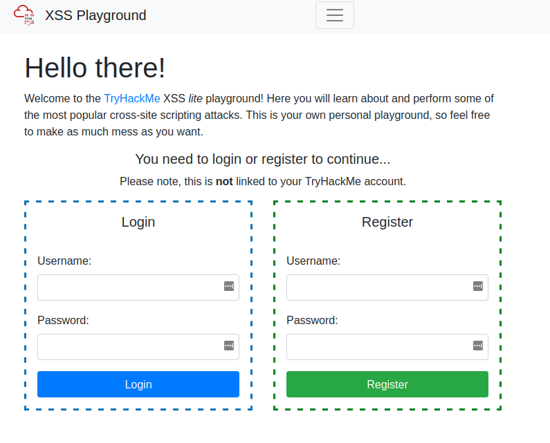
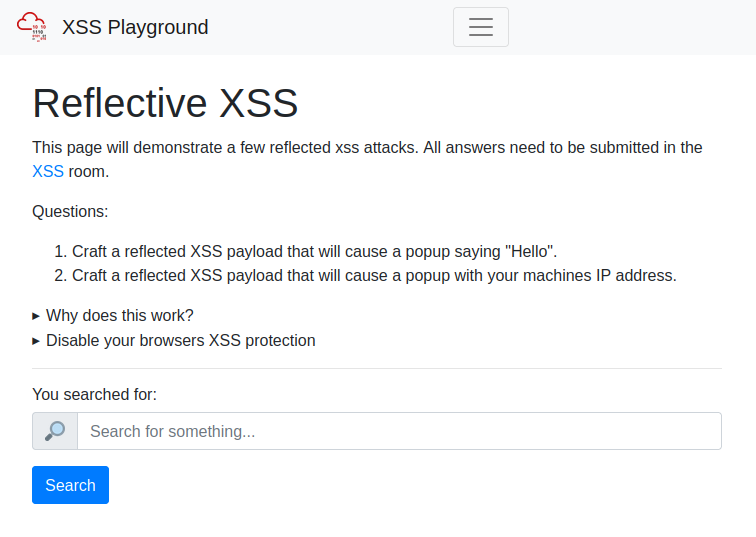
	- Our Payload will look like `<script>alert(“Hello”)</script>` giving us the flag/solution
```
ThereIsMoreToXSSThanYouThink
```
2. On the same reflective page, craft a reflected XSS payload that will cause a popup with your machines IP address.
	- Our payload will look like `<script>alert(window.location.hostname)</script>`
```
ReflectiveXss4TheWin
```
3. Now navigate to `http://10.10.15.77/` in your browser and click on the "Stored XSS" tab on the navbar; make an account. Then add a comment and see if you can insert some of your own HTML.
	- Register an account then insert a HTML comment in the comments section which gives us the flag.
```
HTML_T4gs
```

4. On the same page, create an alert popup box appear on the page with your document cookies.
	- Our document should create an alert as well as the cookie hence comment will be `<script>alert(document.cookie)</script>`
```
W3LL_D0N3_LVL2
```

5. Change "XSS Playground" to "I am a hacker" by adding a comment and using Javascript.
	- <script>document.querySelector("#thm-title").textContent = 'I am a hacker'</script>
```
websites_can_be_easily_defaced_with_xss
```
-----------------------------------------------------------

## [Severity 8] - Insecure Deserialization
- Insecure Deserialization is a vulnerability which occurs when untrusted data is used to abuse the logic of an application.
- Insecure Deserialization is replacing data processed by an application with malicious codel allowing anything from DoS to RCE that the attacker can use to gain a foothold.
- Exploit is only dangerous as the attacker's skill permits, moreso, value of the data being exposed.
- Business impact varies on the infrastructure of the organization.
- Any application that stores or fetches data where there are no validations or intefrity checks in place for the data queried or retained. Eg of such applications are E-commerce sites, APIs, Forums, Application Runtimes such as Tomcat, Jenkins, Jboss etc.

**Challenge**

1. Who developed the Tomcat application?
	- 
```
The Apache Software Foundation
```

2. What type of attack that crashes services can be performed with insecure deserialization?
```
Denial of Service
```

#### Objects
- Objects are made up of 2 things:
	1. State
	2. Behaviour
- Objects allow one to create similar lines of code without having to do the leg-work of writing the same lines of code again.

**Challenge**

1. Select the correct term of the following statement:

_if a dog was sleeping, would this be:_
A) A State
B) A Behaviour

```
A Behaviour
```

#### Deserialization
- Serialization is the process of converting objects used in programming into simpler, compatible formatting for transmiting between systems or networks for further processing or storage.
- Deserialization is converting the serialized information into their complex form, ie an object that the application will understand.
- Insecure deserialization occurs when data from an untrusted party gets executed because there is no filtering or input validation; the system asumes that the data is trustworthy and will execute it no holds barred.

**Challenge**

1.  What is the name of the base-2 formatting that data is sent across a network as? 
```
binary
```

#### Cookies
- Websites use cookies to store user-specific behaviours like items in their shopping cart or session IDs, login information etc.
- Cookies are not permanent storage solutions like databases. Some cookies such as session ID's clear when the browser is closed, others last longer even after browser is closed, determined by the `"Expiry"` timer set when the cookie is created.

| Attribute | Descriotion |
|-----------|-------------|
| Cookie Name | The Name of the Cookie to be set |
| Cookie Value | Value, this can be anything plaintext or encoded  |
| Secure Only | If set, this cookie will only be set over HTTPS connections |
| Expiry | Set a timestamp where the cookie will be removed from the browser |
| Path | The cookie will only be sent if the specified URL is within the request |

**Challenge**

1.  If a cookie had the path of _webapp.com/login_ , what would the URL that the user has to visit be? 
```
webapp.com/login
```

2. What is the acronym for the web technology that Secure cookies work over?
```
HTTPS
```

#### Cookies Practical

**Inspecting Encoded Data**

- You will see here that there are cookies are both plaintext encoded and base64 encoded. The first flag will be found in one of these cookies.

**Modifying Cookie Values**

- Notice here that you have a cookie named "userType". You are currently a user, as confirmed by your information on the "myprofile" page.

- This application determines what you can and cannot see by your userType. What if you wanted to be come an admin?
- Double left-click the "Value" column of "userType" to modify the contents. Let's change our userType to "admin" and navigate to `http://MACHINE_IP/admin` to answer the second flag.

**Writeup**

- Let's open up the page.
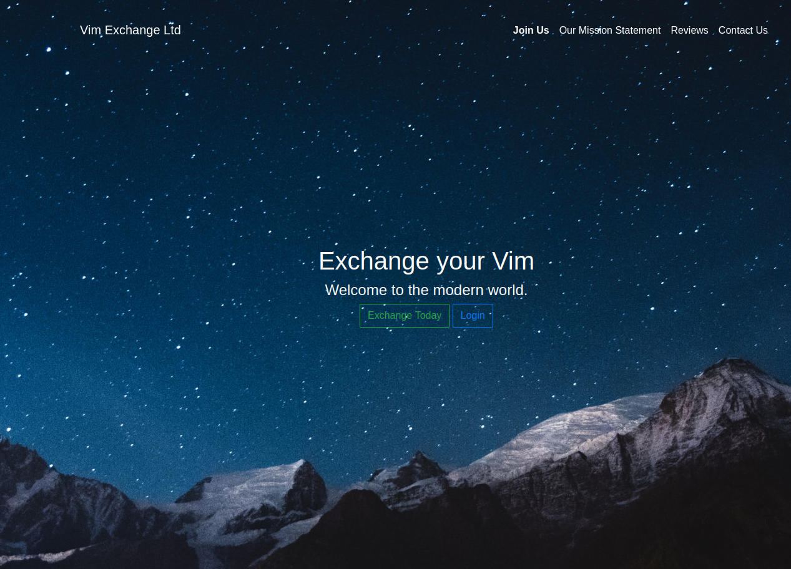
- After opening up, register an account

**Challenges**

1. 1st flag (cookie value)
	- On account profile, inspect the page and have a look at the sessionId cookie. Copy the cookie value and decode it
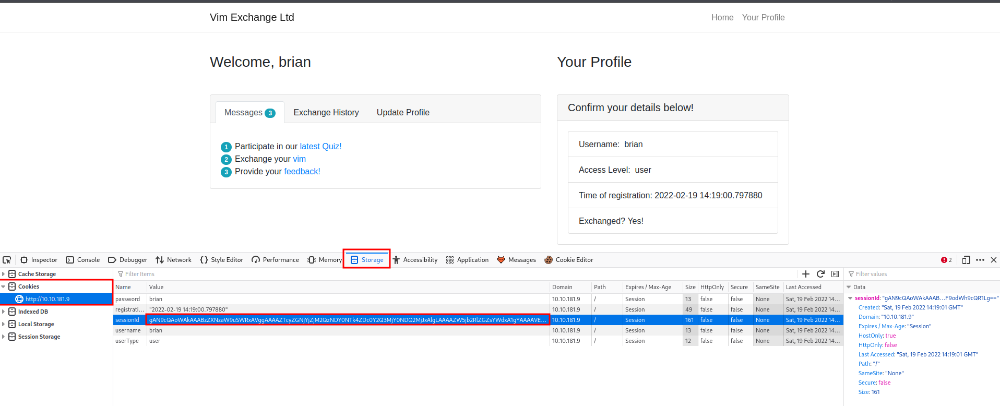
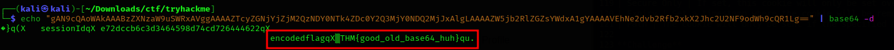
```
THM{good_old_base64_huh}
```

2. 2nd flag (admin dashboard)
	- Go to the admin dashboard, via `http://MACHINE_IP/admin` and you get the second flag.
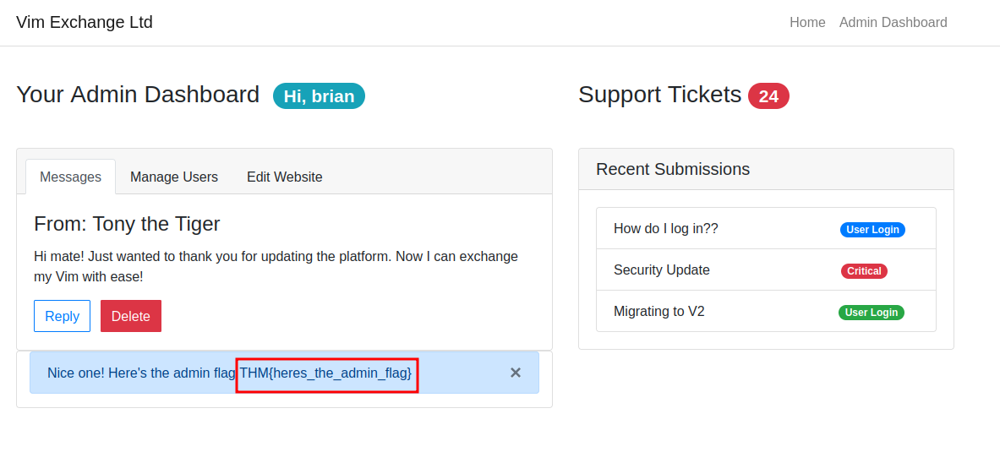
```
THM{heres_the_admin_flag} 
```

#### Code Execution
- Setup is as guided by (tryhackme)[https://tryhackme.com/room/owasptop10]
- Go to your profile then click on the `Exchange your vim`, once done that click on `provide your feedback!` where you get a form.
- If a user was to enter their feedback, the data will get encoded and sent to the application.
- When you visit the `Exchange your vim` URL, a cookie is encoded and stored within your browser, which we can modify. Once you visit the feedback form, the value of this cookie is decoded and then deserializsed.
- In the snippet below we can see how the cookie is retrieved and then deserialized via `pickle.loads` 
```py
cookie = request.cookies.get("encodedPayload")
cookie = pickle.loads(base64.b64decode(cookie))
```
- This vulnerability exploits Python Pickle.
- Setup a netcat listener on kali
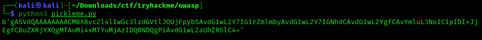
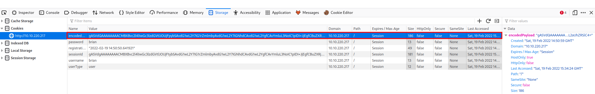
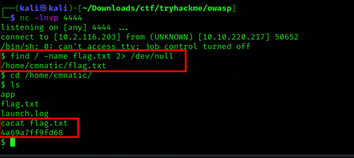

-------------------------------------------------------

## [Severity 9] Components With Known Vulnerabilities
- The task looks on known vulnerabilities that can be searched on the web and can be used to perform exploitation. They are mainly found on [exploit-db](https://www.exploit-db.com/) or [rapid7](https://www.rapid7.com/)
- This method can be defined though the following steps:
		1. Determine the veersion of the software, application or service.
		2. Try to find out various exploits related to that specific version on the web.
		3. Make necessary adjustments to the exploit as per requirements.
		4. Try to implement the exploit.
		5. Debug for any related issues incase the exploit doesn't run.

**Challenge**

- The following is a vulnerable application, all information you need to exploit can be found online. When you exploit the script, put all of your input in quotes, eg, "id"

- How many characters are in /etc/passwd (use wc -c /etc/passwd to get the answer)

- First off, deploy the machine.
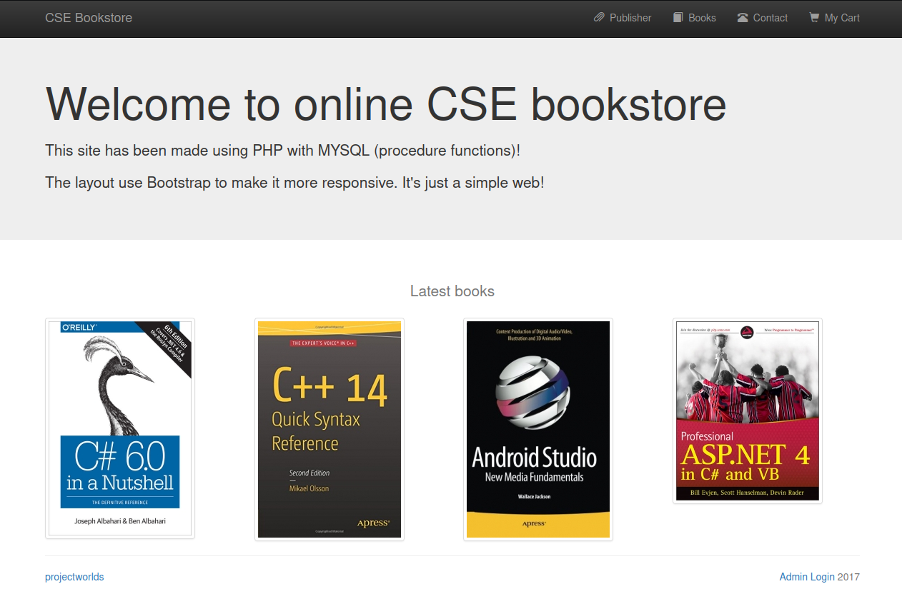
- For a pentest, I'd look for everything running, from ports, to pages and common vulnerabilities running. This challenge is focused mainly on the known vulnerabilities that can be exploited.
- Being a bookstore application, we can check for recent unauthenticated bookstore app RCE.
- I checked on exploit-db and found (this](https://www.exploit-db.com/exploits/47887)
- Run the exploit as below and check for the characters present:

```
1611
```

------------------------------------------------------------

## [Severity 10] Insufficient Logging and Monitoring
- Logging is important as incase of incidents, the attackers actions can be traced, once traced, their risk and impact can be determined.
- Without logging, there would be no way to tell what actions an attacker performed if they gain access to particular applications.
- Bigger impacts include:
		1. Regulatory damage
		2. Risk of further attacks.
- Information stored in logs should include:
		- HTTP status codes
		- Timestamps
		- Usernames
		- API endpoints/page locations
		- IP Addresses
- These logs do have some sensitive information on them hence the logs should be stored securely and multiple copies stored at different locations.
- The aim of monitoring is detecting malicious activity either to mitigate them or reduce their impact and identifying suspicious activity. Examples of suspicious activity include:
		- Multiple unauthorised attempts for a particular action.
		- Requests from anomalous IP addresses of locations.
		- Use of automated tools. eg particular  automated tooling can be easily identifiable using the value of User-Agent headers or the speed.
		- Common payloads. eg in web apps, attackers can use XSS payloads which can be a method of detecting and indicating the presence of an attacker conducting unauthorized or malicious testing on the application.

**Challenge**

- From the Tryhackme page we get the login-logs file which we can use to find the solutions for the challenge.
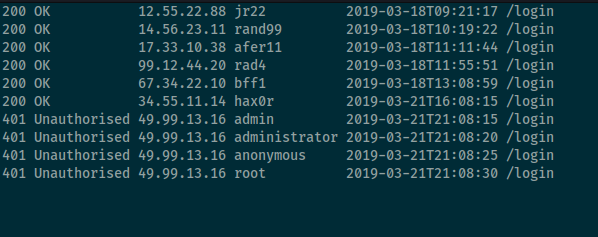
1.  What IP address is the attacker using? 
- There is 1 IP address that is trying to access with various user names
```
49.99.13.16
```

2. What kind of attack is being carried out?
- From the logs, we can see that the attacker is trying different usernames and passwords therefore doing a `brute force` attack.
