# OWASP JUICE SHOP ROOM

This room can bbe found [here](https://tryhackme.com/room/owaspjuiceshop).

The OWASP Juice Shop is an open-source project that is intentionally vulnerable web application for web security training filled with hacking challenges at different levels for user exploitation.

The following topics are covered in the room:
- Injection
- Broken Authentication
- Sensitive Data Exposure
- Broken Access Control
- Cross-Site Scripting (XSS)

---------------------------------

## Task 2 : Let's go on an adventure

Launch the instance and have a walkthrough the application given to identify how the different functionalities are working, best done with burp running to log the flows of the website.
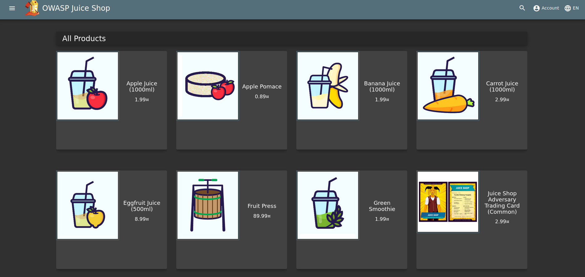

**Challenges**

1. What is the Administrator's email address?

Going through the page I came across the admins email in one of the juice's reviews
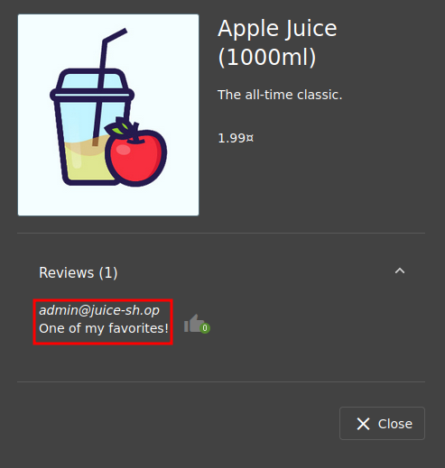
```
admin@juice-sh.op
```

2. What parameter is used for searching?

Using the magnifying lense on the page, I tried searching for an apple, checking the URL we got something like: `http://10.10.67.111/#/search?q=apple`
```
q
```

3. What show does Jim reference in his review?

We can start by looking for the item in which Jim left his review
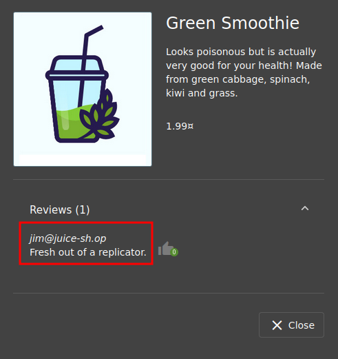

From the above review, we can search for the whole string that was left and we get the show being star trek.
```
Star Trek
```

----------------------------------------------------------------------

## Task 3 : Inject the juice

The tasks focus on injection vulnerabilities. These are vulnerabilities that can potentially cause downtime and/or loss of data.

**Types of injection attacks**

| SQL injection | SQL Injection is when an attacker enters a malicious or malformed query to either retrieve or tamper data from a database. |
| Command injection | Command Injection is when web applications take input or user-controlled data and run them as system commands. An attacker may tamper with this data to execute their own system commands. This can be seen in applications that perform misconfigured ping tests. |
| Email injection | Email injection is a security vulnerability that allows malicious users to send email messages without prior authorization by the email server. These occur when the attacker adds extra data to fields, which are not interpreted by the server correctly. |

**Challenges**

1. Log into the administrator account.

To login, I used SQLi on the login page with the parameters `' or 1=1--` for username and a random letter `a` for password.
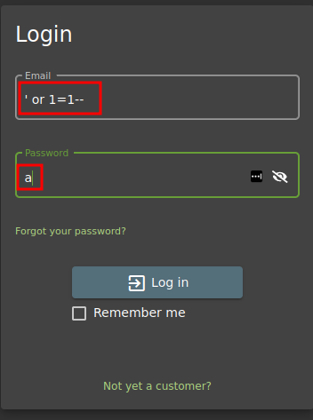


The character `'` closes the brackets in the SQL query; `or` returns true if either side of it is true, in which in this case `1=1` is always true thereby telling the servers that the email is valid and logs us into **user id 0** which is the admins account.

The `--` character comments out data.

2. Log into the Bender account.

From the previous challenge, we could assume that the user emails take the format `"@juice-sh.op"`

Therefore, we can use `bender@juice-sh.op` as the email and `a` as the password : `{"email":"bender@juice-sh.op'--","password":"a"}`

```
fb364762a3c102b2db932069c0e6b78e738d4066
```

-------------------------------------------------------------------------

## Task 4 : Who Broke My Lock?

The task looks at exploiting authentication via the different flaws such as:
- Weak passwords in high privileged accounts
- Forgotten password pages

**Challenges**

1. Bruteforce the Administrator account's password!

To log in to the administrators account in the previous challenge, we used SQL injection, but now instead of using SQLi, we can bruteforce by passing it through burpsuite intruder.

Once the file is loaded into Burp, start the attack and filter for the request by `status`.

A **failed** request will receive a **401 Unauthorized** whereas a **successful** request will return a **200 OK**. 

Once complete, we can login to the account with the password.
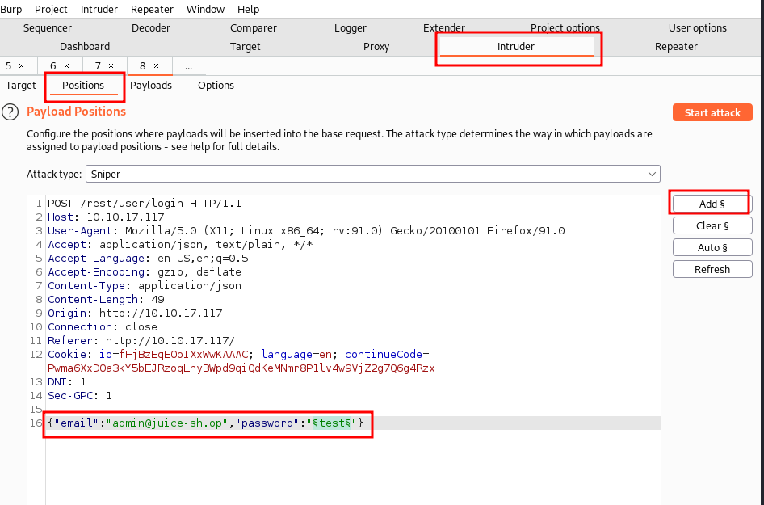
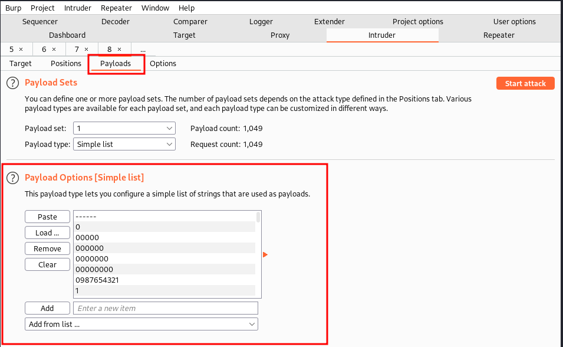
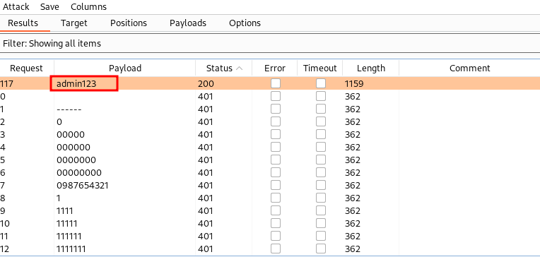
```
c2110d06dc6f81c67cd8099ff0ba601241f1ac0e
```

2. Reset Jim's password!

The reset password mechanism can be exploited. When inputted into the email field in the Forgot Password page, Jim's security question is set _"Your eldest siblings middle name?"_

From the previous task, it was visible that Jim had something to do with **Star Trek** hence we can try to google and see if we could find a hint on this challenge.

Found Jim's eldest siblings middle name on wikipedia, which we used as the security answer.
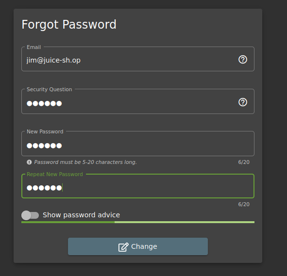
```
094fbc9b48e525150ba97d05b942bbf114987257
```

------------------------------------------------------------------------------

## Task 5 : AH! Don't look!

A web app should store and transmit sensitive data safely and securely but developers may not correctly protect their sensitive data making it vulnerable.

This task majorly looks at `Sensitive Data Exposure`

1. Access the Confidential Document

When going through the pages, noticed on the `/#/about/` page there's an external link that leads to `/#/ftp/`
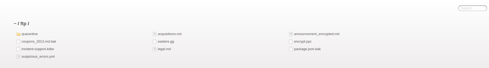

From the above, we can look at the various files to see if there is a sensitive file or folder that shouldn't be available for the public, and fortunately we do get one; the `acquisition.md` in `/ftp/acquisition.md`.

```
edf9281222395a1c5fee9b89e32175f1ccf50c5b
```

2. Log inot the MC SafeSearch's account!

After watching the video there are certain parts of the song that stand out.

He notes that his password is `Mr. Noodles` but he has replaced some `vowels into zeros`, meaning that he just replaced the o's into 0's.

We now know the password to the `mc.safesearch@juice-sh.op` account is `Mr. N00dles`

```
66bdcffad9e698fd534003fbb3cc7e2b7b55d7f0
```

3. Download the Backup file!

For the backup files, we will be looking for a file with the `.bak` extension.

We can't download the `.bak` file extensions as we get an error, we can try using a null character in the string to download `/ftp/package.json.bak%2500.md`

```
bfc1e6b4a16579e85e06fee4c36ff8c02fb13795
```

-------------------------------------------------------------------------------

## Task 6 : Who's flying this thing?

Modern-day systems allow for multiple users to have access to different pages such as when building websites with programs such as Wix.

When Broken Access Control exploits or bugs are found, it will be categorised into one of 2 types:
- **Horizontal Privilege Escalation** : Occurs when a user can perform an action or access data of another user with the same level of permissions.
- **Vertical Privilege Escalation** : Occurs when a user can perform an action or access data of another user with a higher level of permissions.

1. Access the administrators page!

Open the debugger on firefox then navigate to the debugger, refresh and look for a js file  in this case `main-es2015.js` then search for admin. Click on the {} button to get a readable format. As below, the path for admin is `/#/administration`

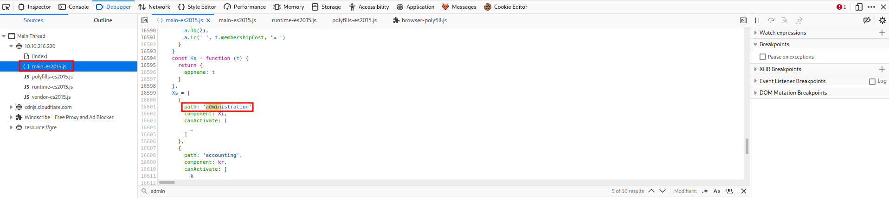

```
946a799363226a24822008503f5d1324536629a0
```

2. View another user's shopping basket.

To view another users shopping basket, we can exploit the `GET /rest/basket/1` request and change the nuumber 1 to 2.
```
41b997a36cc33fbe4f0ba018474e19ae5ce52121
```

3. Remove all 5-star reviews
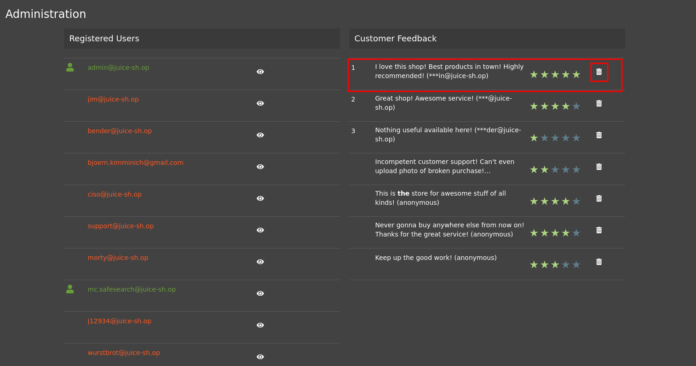
```
50c97bcce0b895e446d61c83a21df371ac2266ef
```

----------------------------------------------------------------------------------

## Task 7 : Where did that come from?

XSS allows attackers to run JS in web applications. Their complexity ranges from easy to extremely hard as each web application parses the queries differently.

There are 3 major XSS types of attacks:
1. `DOM XSS` : uses the HTML environment to execute malicious js and uses `<script></script>` HTML tag.
2. `Persistent XSS` : is js that is run when the server loads the page containing it. These can occur when the server doesn't sanitise the user data when it is uploaded to a page. These are commonly found on blog posts.
3. `Reflected XSS` : is js that is run on the client-side end of the web application. These are most commonly found when the server doesn't sanitise **search** data.

**Challenges**

1. Perform a DOM XSS.

We will use the _iframe_ element with a javascript alert tag, ie : `<iframe src="javascript:alert(`xss`)">`

In this we will be using **iframe** element, hence the type of XSS is also called **XFS (Cross-Frame Scripting)**

Being that the search bar sends a request to the server and the server relays the related information that is queried. Without correct input sanitisation then an XSS attack is able to be performed.

```
9aaf4bbea5c30d00a1f5bbcfce4db6d4b0efe0bf
```

2. Perform a persistent XSS

Login to the admin account then navigate to the **Last Login IP** page for the attack.

With Burp intercept on, catch the requests then forward the last logout request to the server. When signing back into the admin account navigate to the last login page again and see the XSS alert.

Both the `True-Client-IP` header and the `X-Forwarded-For` header are similar and tell the server or proxy what the IP of the client is.
```
149aa8ce13d7a4a8a931472308e269c94dc5f156
```

3. Perform a reflected XSS

Login to the admin account and navigate to the `Order History` page. When there, from there you will see a "Track" icon, click on the page and it brings the track result page back. 
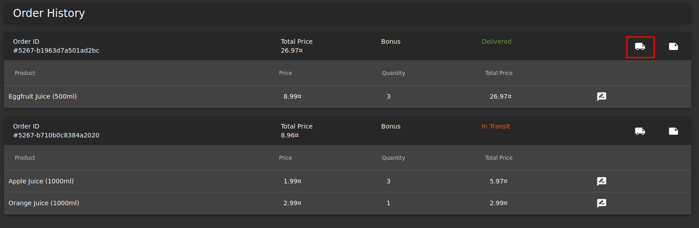

The id is paired with the order. `/#/track-result?id=5267-b1963d7a501ad2bc`

We use the iframe XSS `<iframe src%3D"javascript:alert(`xss`)">` in place of the `5267-b1963d7a501ad2bc`.

```
23cefee1527bde039295b2616eeb29e1edc660a0
```

-----------------------------------------------------------------------------

## Task 8 : Exploration

If you wish to tackle some of the harder challenges that were not covered within this room, check out the /#/score-board/ section on Juice-shop. Here you can see your completed tasks as well as other tasks in varying difficulty.

**Challenge**

Access the /#/score-board/page

```
7efd3174f9dd5baa03a7882027f2824d2f72d86e
```

Hurraayyy, that was quite some delicious juice. Some great learning experience.

