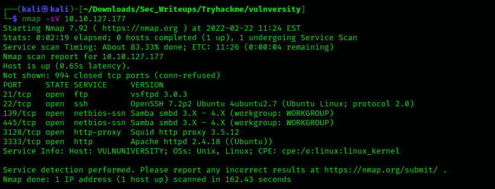
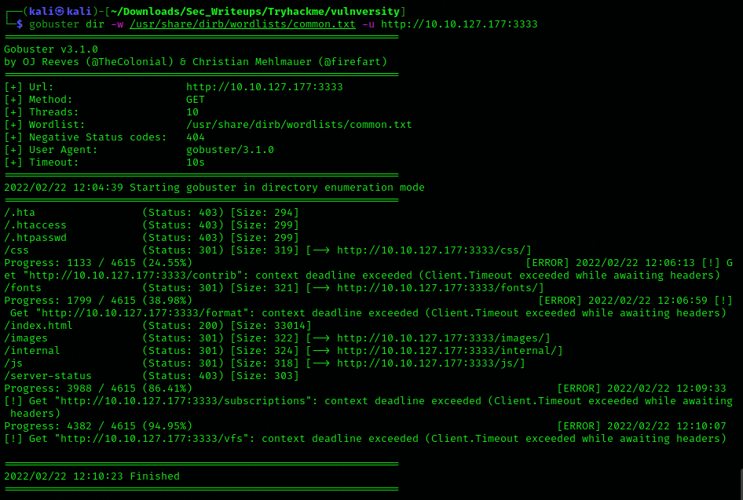

# [Vulnversity](https://tryhackme.com/room/vulnversity) Room

## Task 1 : Deploy the machine

Connect to the tryhackme machine

## Task 2 : Reconnaissance

Gather information about the machine using `nmap`, a network scanning tool.

Scan the box by using `nmap -sV <machine ip>`

| nmap flag | Description |
|-----------|-------------|
| -sV | Attemptes to determine the version of the services running |
| -p <x> or -p- | Port scan for port <x> or scan all ports |
| -Pn | Disable host discovery and just scan for open ports |
| -A | Enables OS and version detection, executes in-build scripts for further enumeration |
| -sC | Scan with the default nmap scripts |
| -v | Verbose mode |
| -sU | UDP port scan |
| -sS | TCP SYN port scan |

More about nmap can also be found (here)[https://github.com/fraizerbrian/Sec_Writeups/blob/main/Vapt/nmap.md].

```
┌──(kali㉿kali)-[~/Downloads/Sec_Writeups/Tryhackme/vulnversity]
└─$ nmap -sV 10.10.127.177
Starting Nmap 7.92 ( https://nmap.org ) at 2022-02-22 11:24 EST
Nmap scan report for 10.10.127.177
Host is up (0.65s latency).
Not shown: 994 closed tcp ports (conn-refused)
PORT     STATE SERVICE     VERSION
21/tcp   open  ftp         vsftpd 3.0.3
22/tcp   open  ssh         OpenSSH 7.2p2 Ubuntu 4ubuntu2.7 (Ubuntu Linux; protocol 2.0)
139/tcp  open  netbios-ssn Samba smbd 3.X - 4.X (workgroup: WORKGROUP)
445/tcp  open  netbios-ssn Samba smbd 3.X - 4.X (workgroup: WORKGROUP)
3128/tcp open  http-proxy  Squid http proxy 3.5.12
3333/tcp open  http        Apache httpd 2.4.18 ((Ubuntu))
Service Info: Host: VULNUNIVERSITY; OSs: Unix, Linux; CPE: cpe:/o:linux:linux_kernel

Service detection performed. Please report any incorrect results at https://nmap.org/submit/ .
Nmap done: 1 IP address (1 host up) scanned in 162.43 seconds
                                                                    
```

1. Scan the box, how many ports are open?

```
6
```

2. What version of the squid proxy is running on the machine?
```
3.5.12
```
3. How many ports will nmap scan if the flag `-p-400` was used?
```
400
```
4. Using the nmap flag `-n` what will it not resolve?
	nmap doesn't resolve DNS when invoked.
```
DNS
```
5. What is the most likely operating system this machine is running?
	To find the OS running, we should run the nmap scan with `-O` flag invoked in root.

```
Ubuntu
```

6. What port is the web server running on?
	 On the nmap scan, identify the `http` service that is running.
```
3333
```

---------------------------------------------------------

## Task 3 : Locating directories using GoBuster

Using a fast directory tool called `GoBuster` you will locate a directory you can use to upload a shell to.

GoBuster is a tool used to brute-force URIs (directories and files), DNS subdomains and virtual host names.

To brute force, we need a wordlist that we can use for various directories.

Run Gobuster with the following command `gobuster dir -u http://<ip>:3333 -w <wordlist location>`

| GoBuster flag | Description |
|---------------|-------------|
| -e | Print the full URLs in your console |
| -u | The target URL |
| -w | Path to your wordlist |
| -U and -P | Username and Password for Basic Auth |
| -p<x> | Proxy to use for requests |
| -c <http cookies> | Specify a cookie for simulating your auth |




1. What is the directory that has an upload form page?
```
/internal/
```

---------------------------------------------------------

## Task 4 : Compromising the webserver

Now that we have found a form to upload files, we can leverage this to upload and execute our payload that will lead to compromising the web server

**Challenges**

1. Try upload a few file types to the server, what common extension seems to be blocked?