# Pentest - Metasploit

---------------------------

## CHECKLIST
- [x] Information Gathering
	- [x] Network scan
	- [x] Identify web server, technologies and database
	- [x] Vulnerable versions
- [ ] Exploiting the Various ports
	- [x] Port 21
	- [x] Port 22
	- [x] Port 23
	- [x] Port 25
	- [x] Port 80
	- [x] Port 139 & 445
	- [x] Port 512, 513 & 514
	- [x] Port 1524
	- [x] Port 111 & 2049
	- [x] Port 2121
	- [x] Port 3306
	- [ ] Port 3632
	- [x] Port 5900
	- [ ] Port 6000
	- [x] Port 6667
	- [x] Port 6697
	- [ ] Port 8009
	- [ ] Port 8180
	- [ ] Port 8787
	- [ ] Port 36349
	- [ ] Port 44733
	- [ ] Port 44951
- [ ] OWASP TOP 10
	- [ ] Injection
	- [ ] Broken Authentication
	- [ ] Sensitive Data Exposure
	- [ ] XML External Entities (XXE)
	- [ ] Broken Access Control
	- [ ] Security Misconfiguration
	- [ ] Cross-Site Scripting (XXS)
	- [ ] Insecure Deserialization
	- [ ] Using Components with know Vulnerabilities
	- [ ] Insufficient Logging & Monitoring
- [ ] Attack Vectors
	- [ ] Mutillidae
	- [ ] DVWA
	- [ ] WebDAV
	- [ ] phpMyAdmin
	- [ ] Twiki
---------------------------

## Information Gathering

I ran the metasploit framework on docker using `sudo docker run --rm -it -p 80:8080 peakkk/metasploitable`

ip address > `172.17.0.2`

First off let's do an nmap scan 

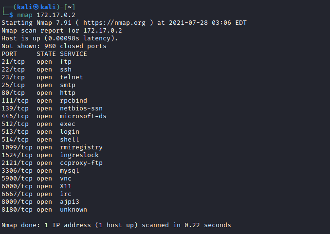

```
┌──(root💀kali)-[~]
└─# nmap -p- -sV 172.17.0.2
Starting Nmap 7.91 ( https://nmap.org ) at 2021-08-03 07:43 EDT
Nmap scan report for 172.17.0.2
Host is up (0.0011s latency).
Not shown: 65509 closed ports
PORT      STATE    SERVICE     VERSION
21/tcp    open     ftp         vsftpd 2.3.4
22/tcp    open     ssh         OpenSSH 4.7p1 Debian 8ubuntu1 (protocol 2.0)
23/tcp    open     telnet      Linux telnetd
25/tcp    open     smtp        Postfix smtpd
80/tcp    open     http        Apache httpd 2.2.8 ((Ubuntu) DAV/2)
111/tcp   open     rpcbind     2 (RPC #100000)
139/tcp   open     netbios-ssn Samba smbd 3.X - 4.X (workgroup: WORKGROUP)
445/tcp   open     netbios-ssn Samba smbd 3.X - 4.X (workgroup: WORKGROUP)
512/tcp   open     exec        netkit-rsh rexecd
513/tcp   open     login
514/tcp   open     shell       Netapp ONTAP rshd
1099/tcp  open     java-rmi    GNU Classpath grmiregistry
1524/tcp  open     ingreslock?
2121/tcp  open     ftp         ProFTPD 1.3.1
3306/tcp  open     mysql       MySQL 5.0.51a-3ubuntu5
3632/tcp  open     distccd?
5900/tcp  open     vnc         VNC (protocol 3.3)
6000/tcp  open     X11         (access denied)
6667/tcp  filtered irc
6697/tcp  filtered ircs-u
8009/tcp  open     ajp13       Apache Jserv (Protocol v1.3)
8180/tcp  open     http        Apache Tomcat/Coyote JSP engine 1.1
8787/tcp  open     drb         Ruby DRb RMI (Ruby 1.8; path /usr/lib/ruby/1.8/drb)
36349/tcp open     status      1 (RPC #100024)
44733/tcp open     status      1 (RPC #100024)
44951/tcp open     java-rmi    GNU Classpath grmiregistry
```

Finding the ports available and their uses, we can find the versions that are being used using the `-sV` nmap switch

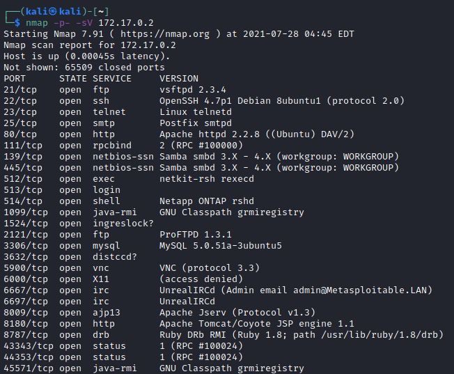

### Web Server and technologies

The Following web technologies were discovered

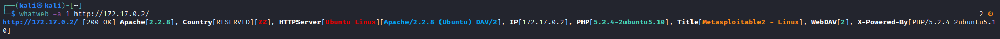

We find that the server is an _ubuntu linux_ server running _Apache v2.2.8_, title is _Metasploitable2 - Linux_

### Vulnerable versions

From the version scan run, we can identify the vulnerable versions that are being run by the service using `searchsploit`

1. Port 21 - ftp - vsftpd 2.3.4
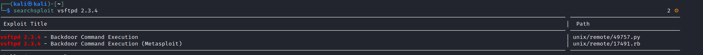

2. Port 22 - ssh - OpenSSH 4.7p1 Debian 8ubuntu1
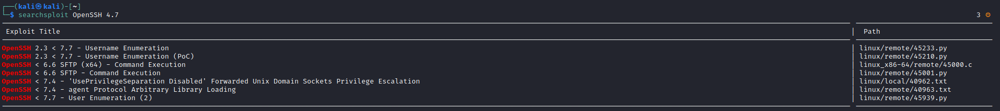

3. Port 23 - telnet - Linux telnetd
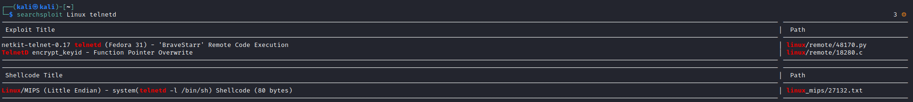

4. Port 80 - http - Apache httpd 2.2.8 ((Ubuntu) DAV/2)

5. Port 139 & Port 445- netbios-ssn - Samba smbd 3.X - 4.X (workgroup: WORKGROUP)
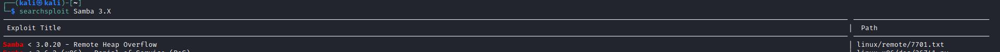
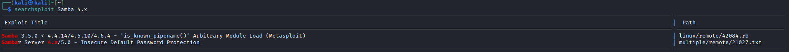

6. Port 514 - shell - Netapp ONTAP rshd

7. Port 1099 - java rmi - GNU Classpath grmiregistry
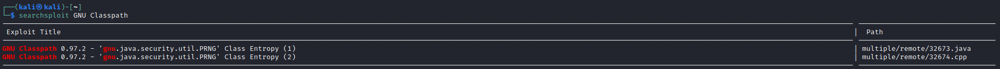

8. Port 2121 - ftp - ProFTPD 1.3.1
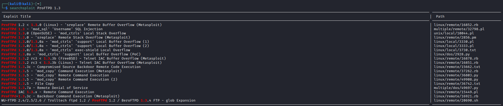

9. Port 3306 - mysql - MySQL 5.0.51a-3ubuntu5
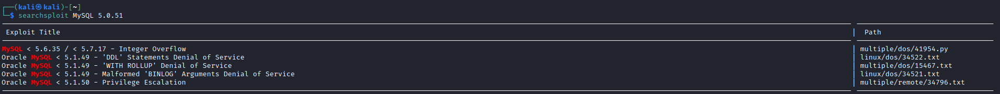

10. Port 5900 - vnc - VNC (protocol 3.3)


11. Port 6667 && Port 6697- irc - UnrealIRCd (Admin email admin@Metasploitable.LAN)
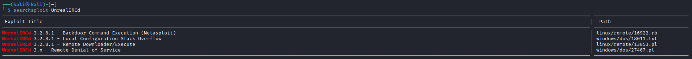

12. Port 8180 - http - Apache Tomcat/Coyote JSP engine 1.1
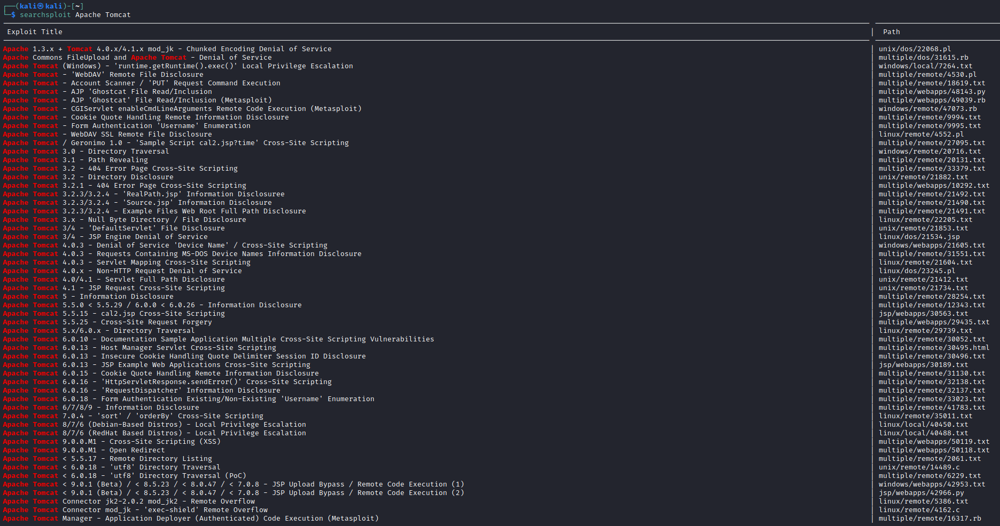

13. Port 8787 - drb - Ruby DRb RMI (Ruby 1.8; path /usr/lib/ruby/1.8/drb)
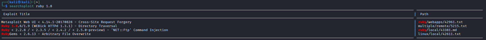

---------------------------------------------------------

## Exploitation

After carrying out the nmap scan, finding open ports, identifying the different vulnerablities for the versions, next up is exploitation; finding out how secure the services running in the ports are.


### Port 21 {ftp}

We will be using metasploit

**Version Scan and exploitation**

Within metasplot framework, we can run an nmap service as well to check on the services running and versions in port 21
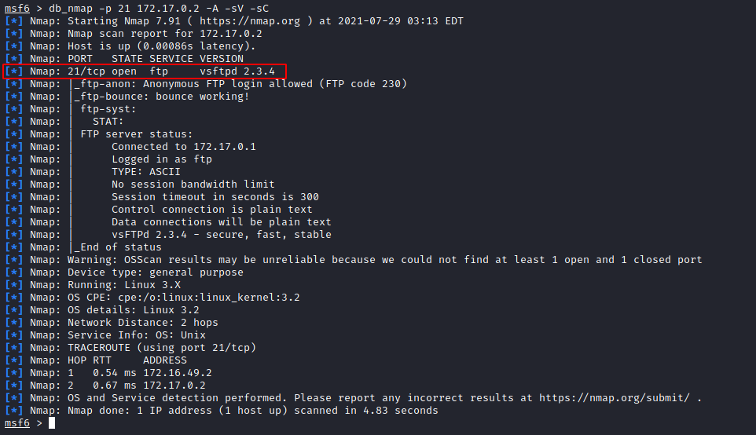

Within msf we can search for modules that we can use to exploit ftp
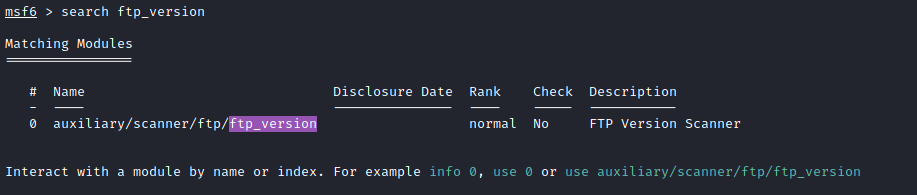

We can use the auxiliary module for ftp is `auxiliary/scanner/ftp/ftp_version`

Set the RHOSTS and the LHOSTS then show options
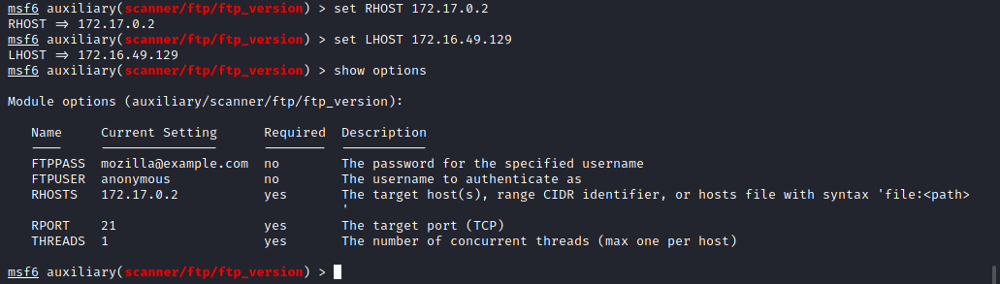

There is an ftp server present ie `vsftpd 2.3.4`. Use searchsploit to do a search in exploitDB to find exploits we can use;


From the above, there is a backdoor command execution exploit for the available version that's being used.
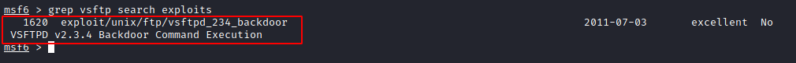

Use the above exploit, confirm everything is okay then run the exploit
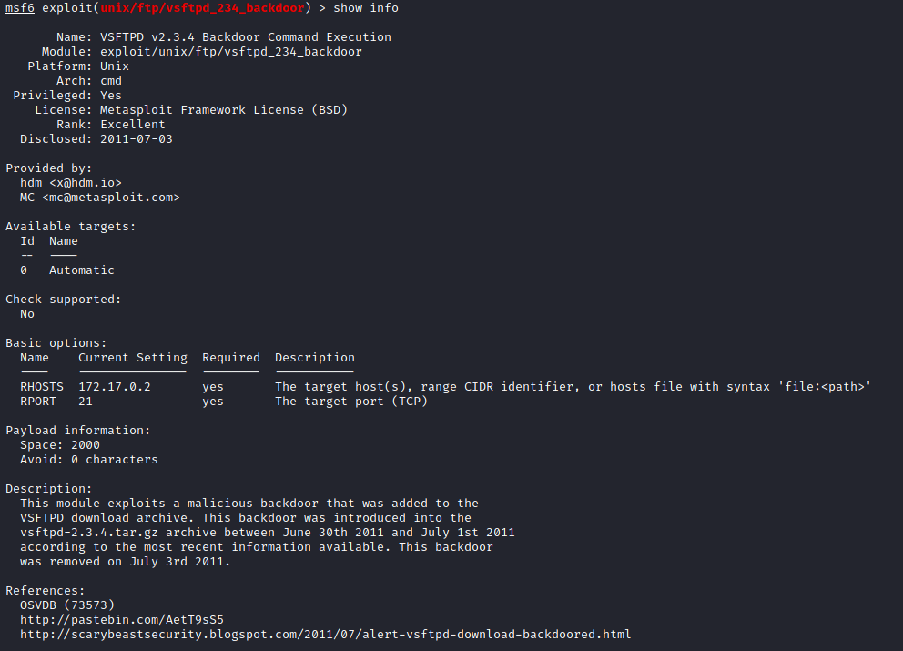

We now have an active session running which can be sent to the background using `Ctr+z`
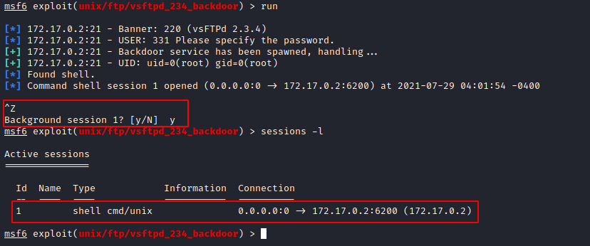

use hashdump module to get users and their passwords, set the SESSION the same as the session running in the background then run
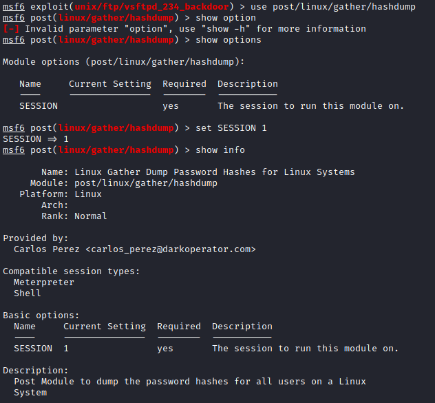
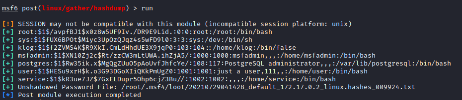

Use the `loot` command to see the results for the exploit just run.
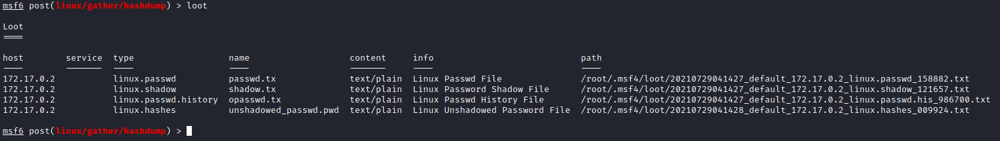

Use `John the Ripper` to crack the files and the --show command to view the results/
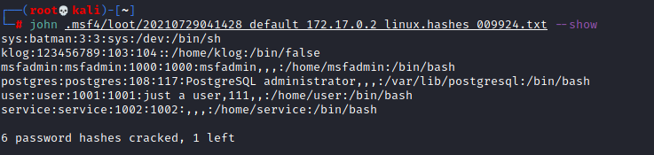


**Anonymous Login**

Next up we can check if the ftp server allows for anonymous login using the auxiliary module anonymous through `use auxiliary/scanner/ftp/anonymous`.

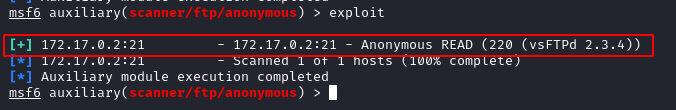

The FTP server has the permission **READ** for anonymous login.

Logging into the FTP using Filezilla anonymous user, we get a successful login.
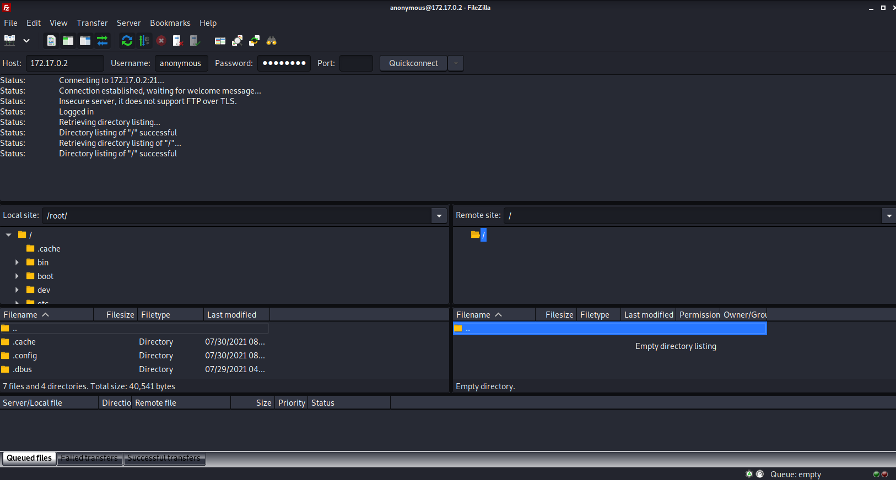

**Unencrypted Clear text login**

The host port runs an FTP service that allows cleartext logins over unencrypted connections.

One can uncover the login names and passwords by sniffing traffic to the FTP service using [Wireshark](https://www.wireshark.org/)

---------------------------------------------------------------------------------------

### Port 22 {ssh}

Port 22 runs on OpenSSH 4.7p1 Debian 8ubuntu1


Since port 22 is open we can use the auxiliary scanner `ssh_login` to bruteforce a password and see if we can login into it.

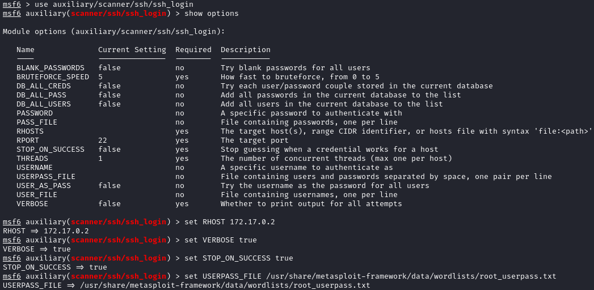
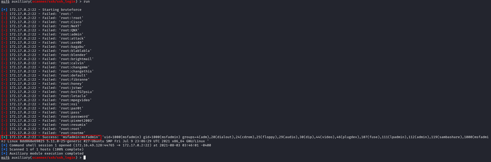

From the above we get a success of the username and password being msfadmin; msfadmin.

Login to the ssh using the above session through `sessions -i 1` and we have a successful login.
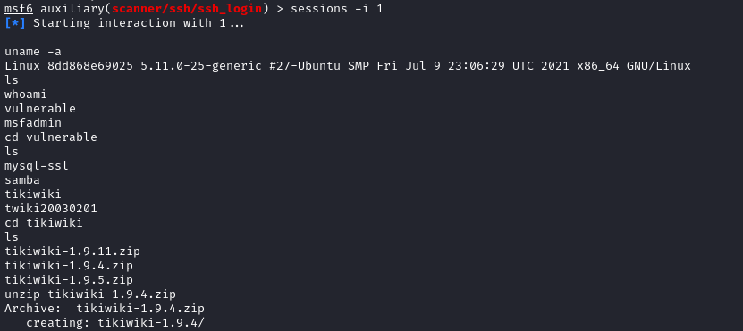

We can confirm the password by connecting via ssh as below.
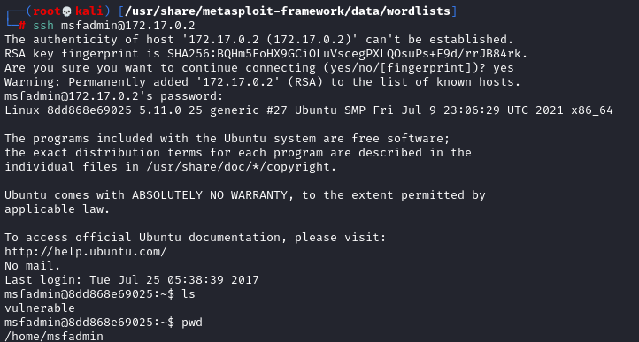

---------------------------------------------------------------------------------------

### Port 23 {telnet}

Port 23 is telnet and runs on Linux telnetd


Using an auxiliary module for telnet_login and userpass_file `/usr/share/metasploit-framework/data/wordlists/telnet_cdata_ftth_backdoor_userpass.txt`, we are able to get a login success using the username and password `msfadmin:msfadmin`
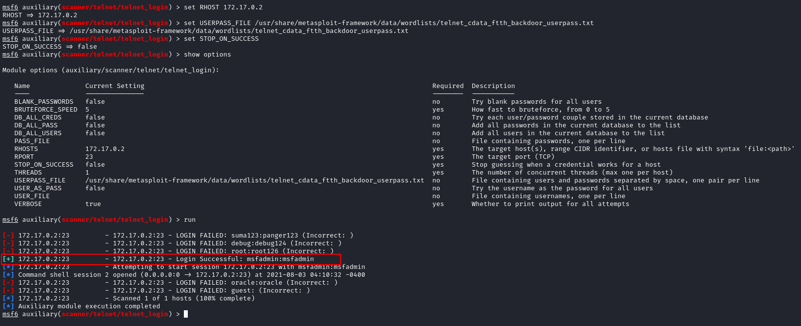

Using telnet to login we have a successful login into the metasploitable machine
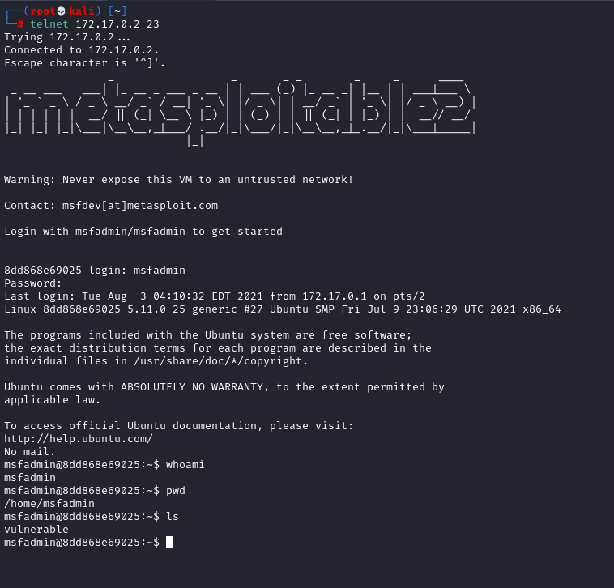

---------------------------------------------------------------------------------------
### Port 25 {SMTP}

Port 25 is responsible for SMTP and is an internet mailing system that operates at the **Application Layer** of the TCP/IP stack.

Use nmap scan in msf to identify the version running and services.
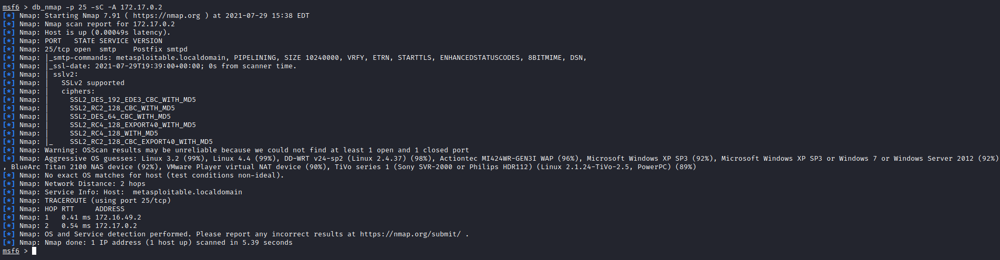
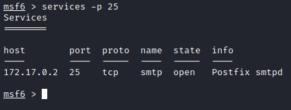

We can also confirm that port 25 is open using telnet
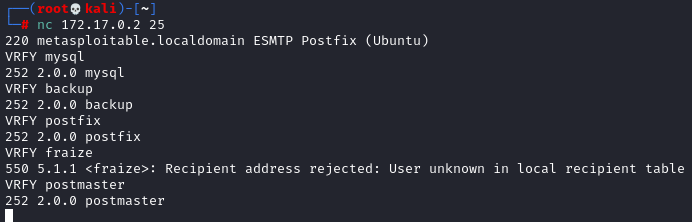

We can search for modules we can use using msf and we get an auxiliary module that we can use, ie, `auxiliary/scanner/smtp/smtp_version` , and can be used for SMTP banner grabbing.

Run the above module and then `services -p 25`

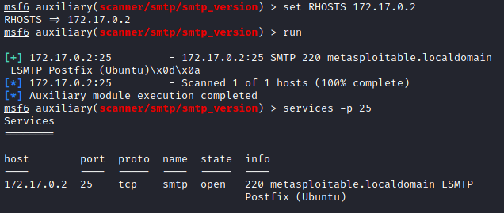

We can do user enumeration for SMTP using `auxiliary/scanner/smtp/smtp_enum`
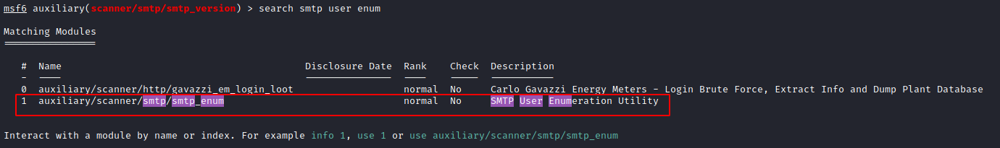

This scan could take a while but produces a list of users available.
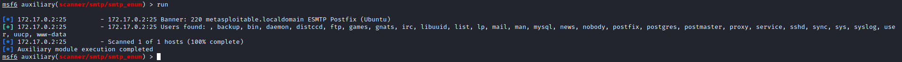

So the users found are :
```
backup, bin, daemon, distccd, ftp, games, gnats, irc, libuuid, list, lp, mail, man, mysql, news, nobody, postfix, postgres, postmaster, proxy, service, sshd, sync, sys, syslog, user, uucp, www-data
```

The above users can be verified by using the **VRFY** command after logging in using netcat [nc] .


Basic [smtp commands](https://www.ibm.com/docs/en/zos/2.3.0?topic=set-smtp-commands)


------------------------------------------------------------------

### Port 80 {http}

Port 80 is the default port used for http services ie web pages.

It is a stateless protocol that is based on request-response activity. 

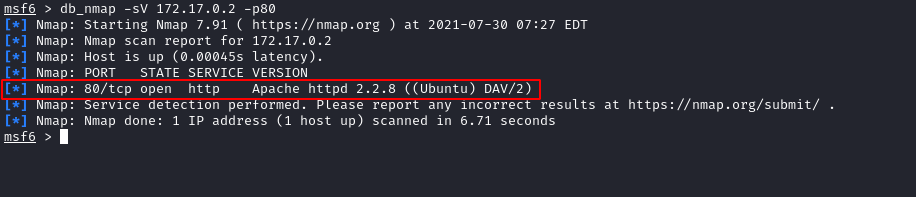

Port 80 is runnning Apache in ubuntu. 

We can as well use a http_version scan by msf which is an auxiliary module

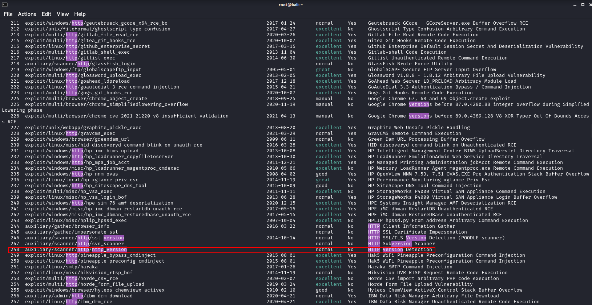
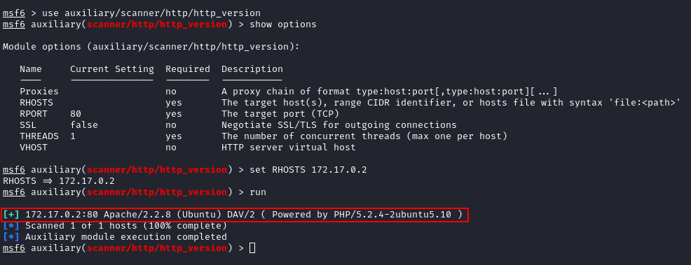

We can search for vulnerabilities related to the apacher version as below;
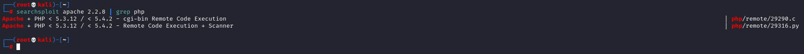

We can exploit using the php cgi exploit
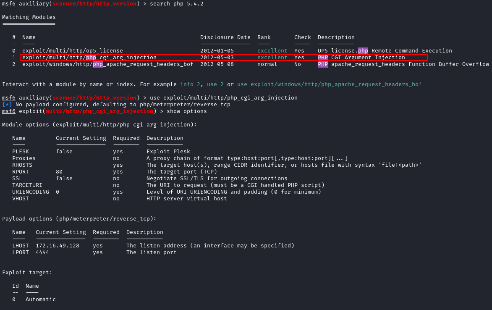

After exploiting we get a meterpreter shell session.
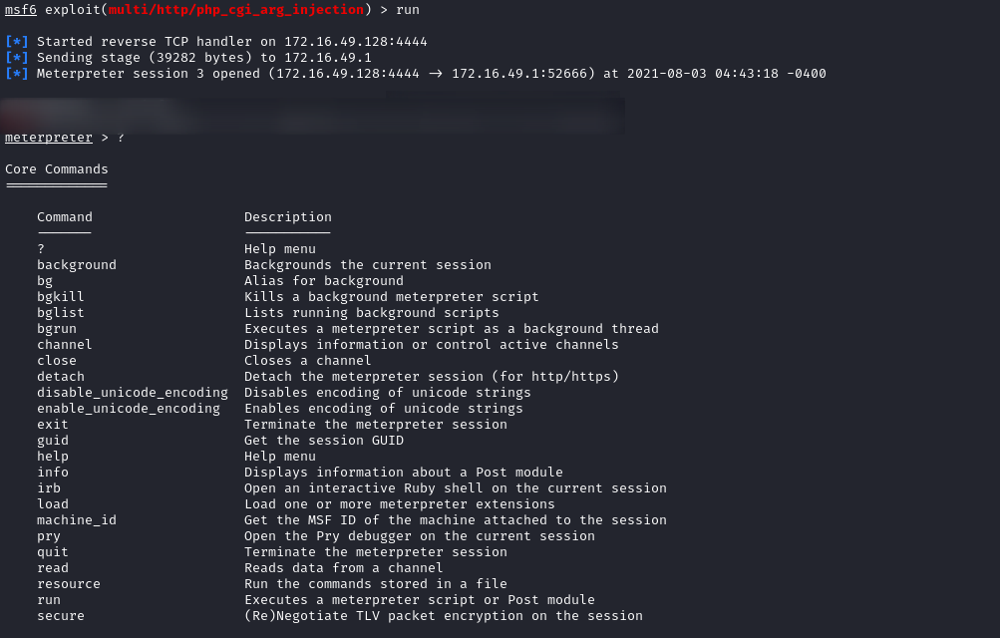

---------------------------------------------------------------------------------------

### Port 139 & 445 {smb}

Port 139 & Port 445- netbios-ssn - Samba smbd 3.X - 4.X (workgroup: WORKGROUP)


> SMB - Server Message Block

This is a protocol used in windows networks for sharing resources.

It runs n top of both NetBIOS on port 139 and Microsoft DS on port 445.

First off, we can check the version of SMB running using the auxiliary scanner for `smb_version`
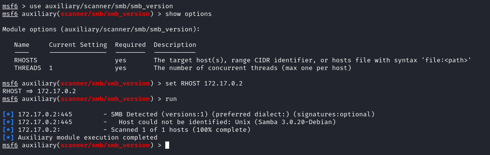

We can use searchsploit to get the exploits that can be used.
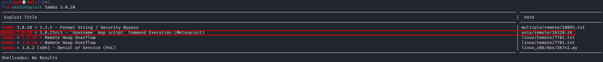

The above can be gotten in msf
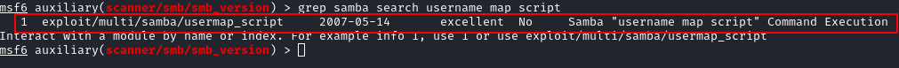

We have a reverse TCP session
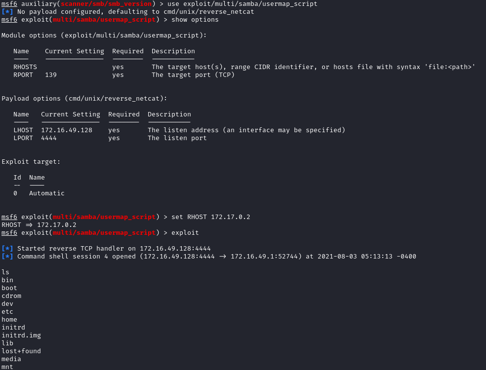

-----------------------------------------------------------------------------------------

### Port 512 {exec}, 513{login} & 514{tcpwrapped}

Are known as "r" services and allows users to login remotely using .rhosts

_Tcpwrapper_ is a host-based network access control program.


----------------------------------------------------------------------------------------

### Port 1524 {ingreslock}

This port is running the service ingreslock

Ingreslock is a backdoor exploit that allows a third-party to gain access to the affected computer.

Ingreslock is used as a backdoor by programs which exploit vulnerable Remote Procedure Call(RCP) services and is usually accompanie by a file called `/tmp/bob` which is the configuration file which opens a shell on the port.

I will exploit this using ncat

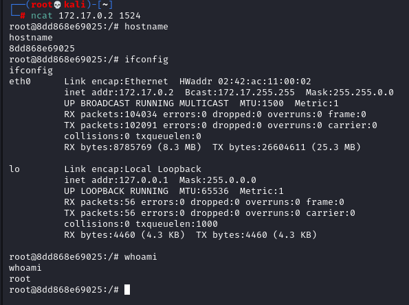

We have a login success and can get root privileges.
------------------------------------------------------------------------------------------

### Port 111{Rpcbind} & 2049{NFS}

NFS helps to share files and folders between Linux/Unix systems.

It enables one to mount a remote share locally

Rpcbind is a server that converts RPC program numbers into universal addresses.

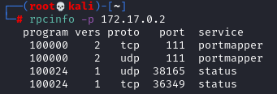

------------------------------------------------------------------------------------------
### Port 2121

Similar to port 21. This port makes use of ProFTPD 1.3.1

We are going to use the auxiliary module ftp_login to bruteforce our way into the system.

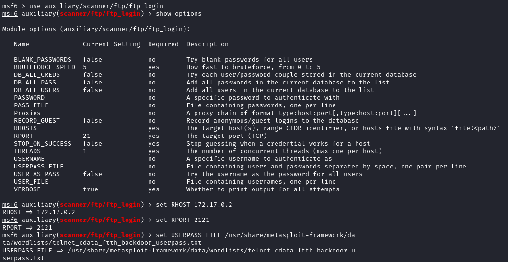
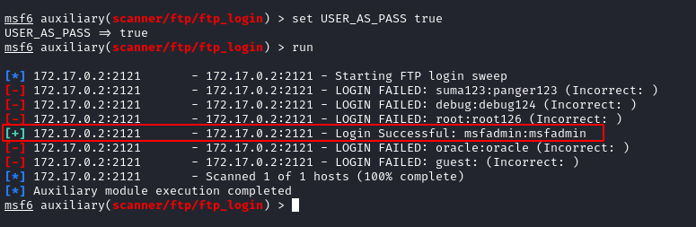

We can use ftp to login to the sytem.

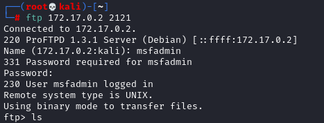

We can also use ssh to login and use sudo su to get the highest privilege.
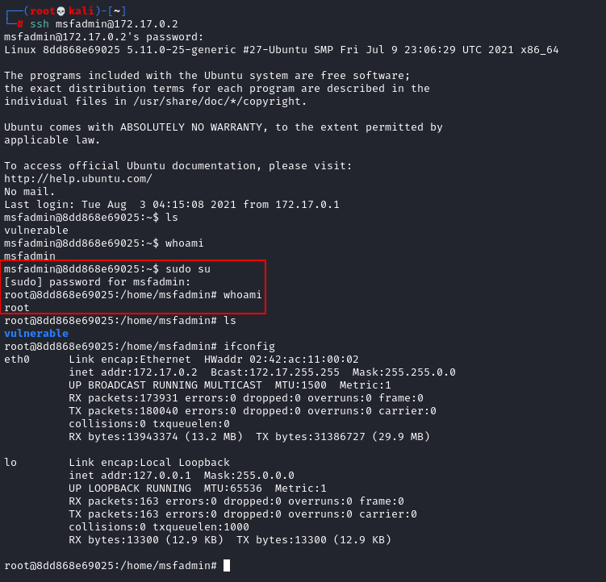

------------------------------------------------------------------------------------------

### Port 3306 {MySQL}

This is an open source relational SQL Database Management System used with PHP. MySQL is a component of the LAMP web application software stack.

We can confirm the version running using a metasploitable auxiliary version scan.
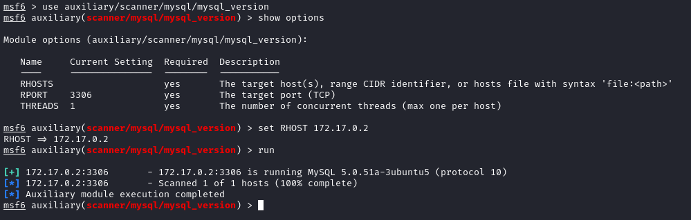

We can use the auxiliary `mysql_login` to try to get a login username and password.
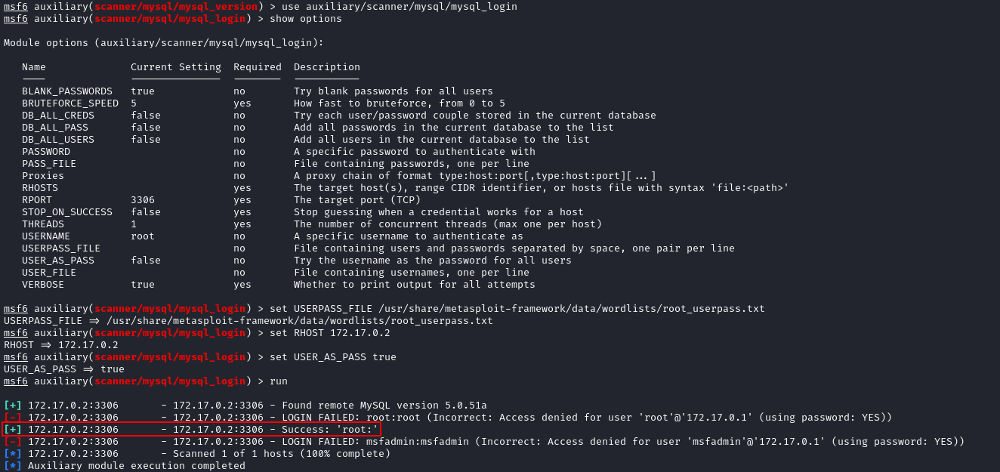

Since we have the access credentials, we can try to login to mysql shell.
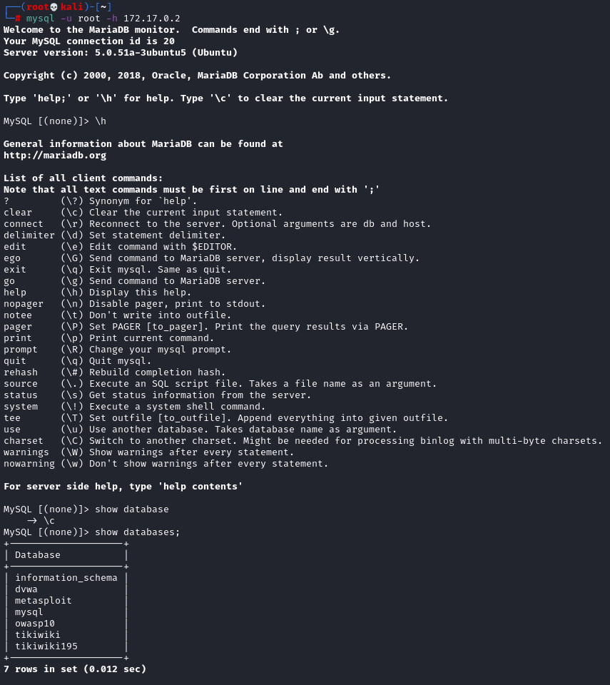

As above, there is a successful shell login.

------------------------------------------------------------------------------------------

### Port 3632 {distcc}

**[Distcc](https://en.wikipedia.org/wiki/Distcc)** is a program to distribute builds of C, C++, Objective C or Objective C++ code across several machines on a network. 

It enables any client on the network to distribute compilation jobs onto other machines.

Let's search on msf what we can get about distcc.

We have an exploit that uses payloads, of which we can use the ruby payload that has command shell.

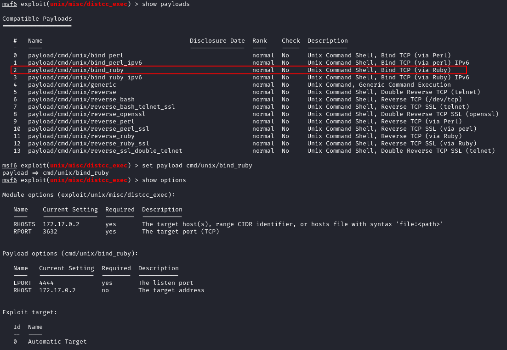

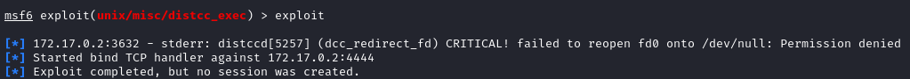
(to continue)

------------------------------------------------------------------------------------------

### Port 5432 {PostgreSQL}


------------------------------------------------------------------------------------------

### Port 5900 {VNC}

Using metasploitable, we can search the given version of vnc.

I will then use the auxiliary module scanner `vnc_login`.

Run the above module, and we get a login successful with the password being `password`


To verify that the password is correct, we can try to login to vncviewer, of which we get a successful login.
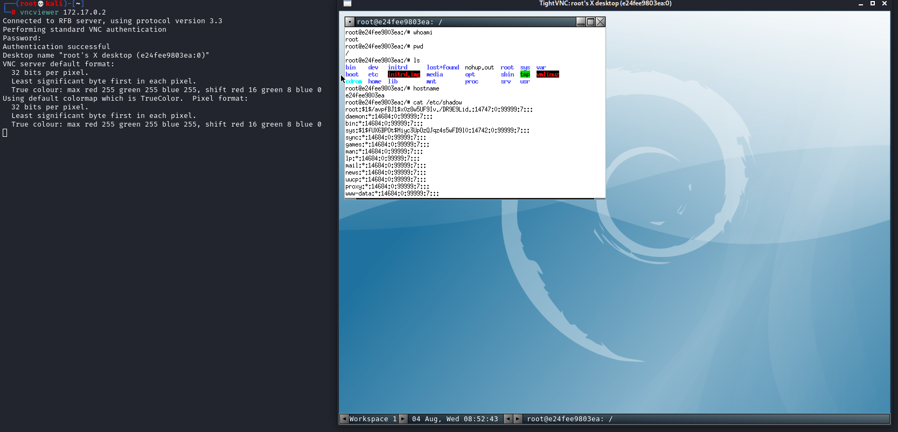

After successful login we can try to get the highest privilege which we get is **root**.

------------------------------------------------------------------------------------------

### Port 6000 {x11}

Also known as **X Window System** is a client/server windowing system for bitmap displays.

The remote server accepts connections from anywhere.

We will login in using ssh , once in, we can elevate privileges using `sudo su` command to get root access.
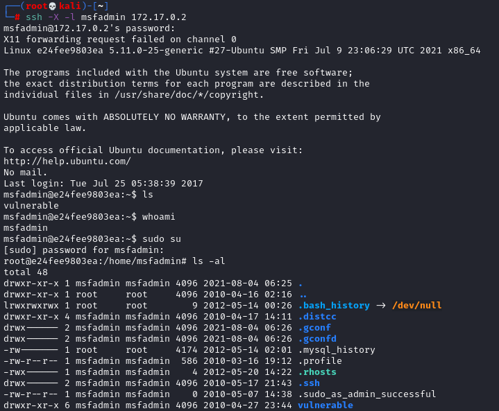

------------------------------------------------------------------------------------------

### Port 6667 & 6697 {UnrealIRCd}

UnrealIRCd is an open-source Internet Relay Chat daemon.

First off, search for what we can get to us in msf,

We can use the backdoor command execution exploit, and configure it.

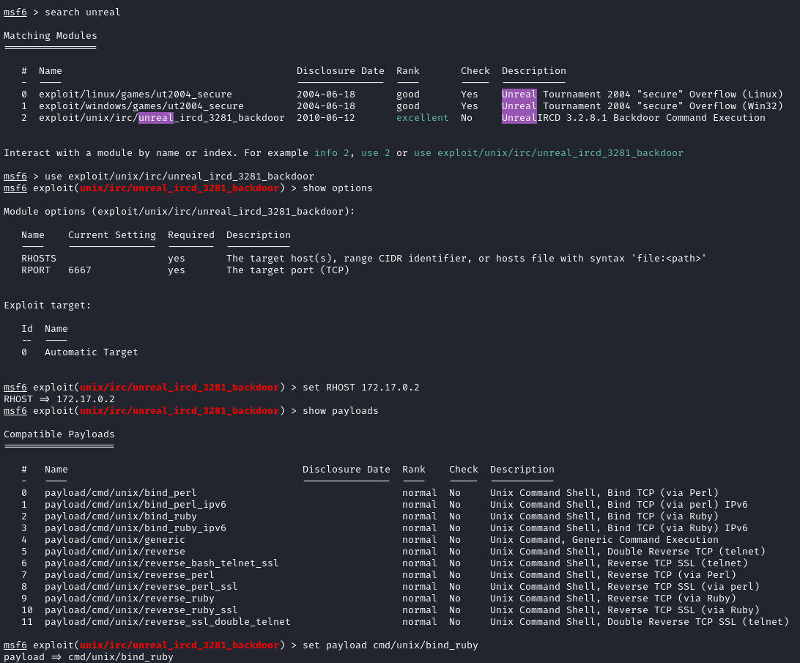

Since there is no payload preconfigured, we can configure one.

We can use the `payload/cmd/unix/bind_ruby`

Exploit the machine and we get a shell session opened

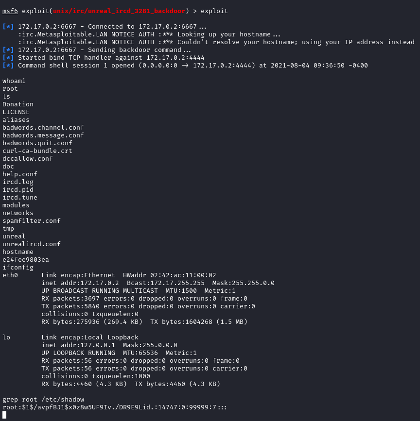
