# Pentest - Metasploit

## Information Gathering

I ran the metasploit framework on docker using `sudo docker run --rm -it -p 80:8080 peakkk/metasploitable`

ip address > `172.17.0.2`

First off let's do an nmap scan 


Finding the ports available and their uses, I can find the versions that are being used using the `-sV` nmap switch


### Web Server and technologies

The Following web technologies were discovered


I found that the server is an _ubuntu linux_ server running _Apache v2.2.8_, title is _Metasploitable2 - Linux_

### Vulnerable versions

From the version scan run, I can identify the vulnerable versions that are being run by the service using `searchsploit`

1. Port 21 - ftp - vsftpd 2.3.4


2. Port 22 - ssh - OpenSSH 4.7p1 Debian 8ubuntu1


3. Port 23 - telnet - Linux telnetd


4. Port 80 - http - Apache httpd 2.2.8 ((Ubuntu) DAV/2)

5. Port 139 & Port 445- netbios-ssn - Samba smbd 3.X - 4.X (workgroup: WORKGROUP)


6. Port 514 - shell - Netapp ONTAP rshd

7. Port 1099 - java rmi - GNU Classpath grmiregistry


8. Port 2121 - ftp - ProFTPD 1.3.1


9. Port 3306 - mysql - MySQL 5.0.51a-3ubuntu5


10. Port 5900 - vnc - VNC (protocol 3.3)


11. Port 6667 && Port 6697- irc - UnrealIRCd (Admin email admin@Metasploitable.LAN)


12. Port 8180 - http - Apache Tomcat/Coyote JSP engine 1.1


13. Port 8787 - drb - Ruby DRb RMI (Ruby 1.8; path /usr/lib/ruby/1.8/drb)


---------------------------------------------------------

## Exploitation

After carrying out the nmap scan, finding open ports, identifying the different vulnerablities for the versions, next up is exploitation; finding out how secure the services running in the ports are.


### Port 21 {ftp}

I will be using metasploit

**Version Scan and exploitation**

Within metasplot framework, I can run an nmap service as well to check on the services running and versions in port 21


Within msf I can search for modules that I can use to exploit ftp


I can use the auxiliary module for ftp is `auxiliary/scanner/ftp/ftp_version`

Set the RHOSTS and the LHOSTS then show options


There is an ftp server present ie `vsftpd 2.3.4`. Use searchsploit to do a search in exploitDB to find exploits we can use;


From the above, there is a backdoor command execution exploit for the available version that's being used.


Use the above exploit, confirm everything is okay then run the exploit


I now have an active session running which can be sent to the background using `Ctr+z`


use hashdump module to get users and their passwords, set the SESSION the same as the session running in the background then run


Use the `loot` command to see the results for the exploit just run.


Use `John the Ripper` to crack the files and the --show command to view the results/


**Anonymous Login**

Next up I can check if the ftp server allows for anonymous login using the auxiliary module anonymous through `use auxiliary/scanner/ftp/anonymous`.


The FTP server has the permission **READ** for anonymous login.

Logging into the FTP using Filezilla anonymous user, I get a successful login.


**Unencrypted Clear text login**

The host port runs an FTP service that allows cleartext logins over unencrypted connections.

One can uncover the login names and passwords by sniffing traffic to the FTP service using [Wireshark](https://www.wireshark.org/)

### Port 22 {ssh}

Port 22 runs on OpenSSH 4.7p1 Debian 8ubuntu1


Since port 22 is open I can use the auxiliary scanner `ssh_login` to bruteforce a password and see if I can login into it.


From the above I get a success of the username and password being msfadmin; msfadmin.

Login to the ssh using the above session through `sessions -i 1` and I have a successful login.


I can confirm the password by connecting via ssh as below.


### Port 23 {telnet}

Port 23 is telnet and runs on Linux telnetd


Using an auxiliary module for telnet_login and userpass_file `/usr/share/metasploit-framework/data/wordlists/telnet_cdata_ftth_backdoor_userpass.txt`, we are able to get a login success using the username and password `msfadmin:msfadmin`


Using telnet to login I have a successful login into the metasploitable machine


### Port 25 {SMTP}

Port 25 is responsible for SMTP and is an internet mailing system that operates at the **Application Layer** of the TCP/IP stack.

Use nmap scan in msf to identify the version running and services.


I can also confirm that port 25 is open using telnet


I can search for modules I can use using msf and I get an auxiliary module that I can use, ie, `auxiliary/scanner/smtp/smtp_version` , and can be used for SMTP banner grabbing.

Run the above module and then `services -p 25`


I can do user enumeration for SMTP using `auxiliary/scanner/smtp/smtp_enum`


This scan could take a while but produces a list of users available.


So the users found are :
```
backup, bin, daemon, distccd, ftp, games, gnats, irc, libuuid, list, lp, mail, man, mysql, news, nobody, postfix, postgres, postmaster, proxy, service, sshd, sync, sys, syslog, user, uucp, www-data
```

The above users can be verified by using the **VRFY** command after logging in using netcat [nc] .


Basic [smtp commands](https://www.ibm.com/docs/en/zos/2.3.0?topic=set-smtp-commands)


### Port 80 {http}

Port 80 is the default port used for http services ie web pages.

It is a stateless protocol that is based on request-response activity. 


Port 80 is runnning Apache in ubuntu. 

I can as well use a http_version scan by msf which is an auxiliary module


I can search for vulnerabilities related to the apacher version as below;


 can exploit using the php cgi exploit


After exploiting I get a meterpreter shell session.


### Port 139 & 445 {smb}

Port 139 & Port 445- netbios-ssn - Samba smbd 3.X - 4.X (workgroup: WORKGROUP)


> SMB - Server Message Block

This is a protocol used in windows networks for sharing resources.

It runs n top of both NetBIOS on port 139 and Microsoft DS on port 445.

First off, I can check the version of SMB running using the auxiliary scanner for `smb_version`


I can use searchsploit to get the exploits that can be used.


The above can be gotten in msf


I have a reverse TCP session


### Port 512 {exec}, 513{login} & 514{tcpwrapped}

Are known as "r" services and allows users to login remotely using .rhosts

_Tcpwrapper_ is a host-based network access control program.

### Port 1524 {ingreslock}

This port is running the service ingreslock

Ingreslock is a backdoor exploit that allows a third-party to gain access to the affected computer.

Ingreslock is used as a backdoor by programs which exploit vulnerable Remote Procedure Call(RCP) services and is usually accompanie by a file called `/tmp/bob` which is the configuration file which opens a shell on the port.

I will exploit this using ncat


I have a login success and can get root privileges.

### Port 111{Rpcbind} , 36349 & 44733

NFS helps to share files and folders between Linux/Unix systems.

It enables one to mount a remote share locally

Rpcbind is a server that converts RPC program numbers into universal addresses.


------------------------------------------------------------------------------------------
### Port 2121

Similar to port 21. This port makes use of ProFTPD 1.3.1

I am going to use the auxiliary module ftp_login to bruteforce our way into the system.


I can use ftp to login to the sytem.


I can also use ssh to login and use sudo su to get the highest privilege.


### Port 3306 {MySQL}

This is an open source relational SQL Database Management System used with PHP. MySQL is a component of the LAMP web application software stack.

I can confirm the version running using a metasploitable auxiliary version scan.


I can use the auxiliary `mysql_login` to try to get a login username and password.


Since I have the access credentials, I can try to login to mysql shell.


As above, there is a successful shell login.

### Port 3632 {distcc}

**[Distcc](https://en.wikipedia.org/wiki/Distcc)** is a program to distribute builds of C, C++, Objective C or Objective C++ code across several machines on a network. 

It enables any client on the network to distribute compilation jobs onto other machines.

Let's search on msf what I can get about distcc.

I have an exploit that uses payloads, of which I can use the ruby payload that has command shell.


(to continue)

------------------------------------------------------------------------------------------

### Port 5900 {VNC}

Using metasploitable, I can search the given version of vnc.

I will then use the auxiliary module scanner `vnc_login`.

Run the above module, and I get a login successful with the password being `password`


To verify that the password is correct, I can try to login to vncviewer, of which I get a successful login.


After successful login I can try to get the highest privilege which I get is **root**.


### Port 6000 {x11}

Also known as **X Window System** is a client/server windowing system for bitmap displays.

The remote server accepts connections from anywhere.

I will login in using ssh , once in, I can elevate privileges using `sudo su` command to get root access.


### Port 6667 & 6697 {UnrealIRCd}

UnrealIRCd is an open-source Internet Relay Chat daemon.

First off, search for what I can get to us in msf,

I can use the backdoor command execution exploit, and configure it.


Since there is no payload preconfigured, I can configure one.

I can use the `payload/cmd/unix/bind_ruby`

Exploit the machine and I get a shell session opened


### Port 8180 {Apache Tomcat}

Apache Tomcat is an open source implementation of the Java Servlet, JavaServer Pages, Java Expression Language and WebSocket technologies.

Tomcat provides a "pure Java" HTTP web server environment in which Java code can run.

First off, let's use metasploit to search any modules that can be used with the given tomcat version.

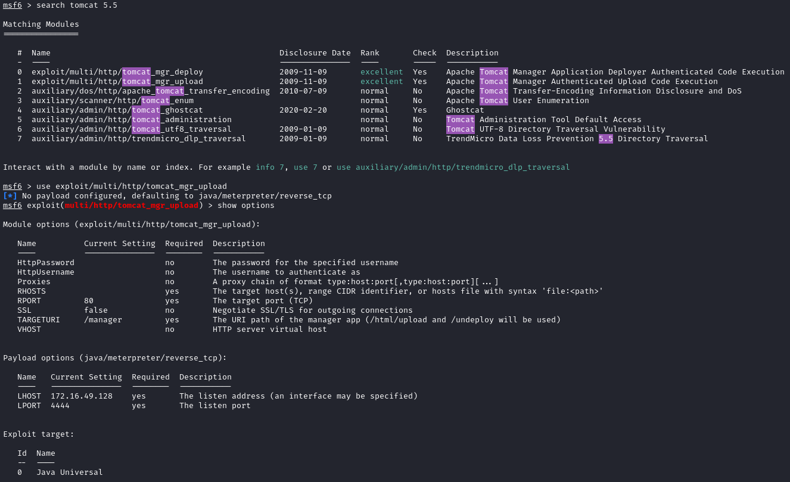

I can use the second exploit module that allows us Apache Tomcat Manager Authenticated Upload Code Execution. 

Configure the above exploit and run the exploit and I get a meterpreter session opened for us.

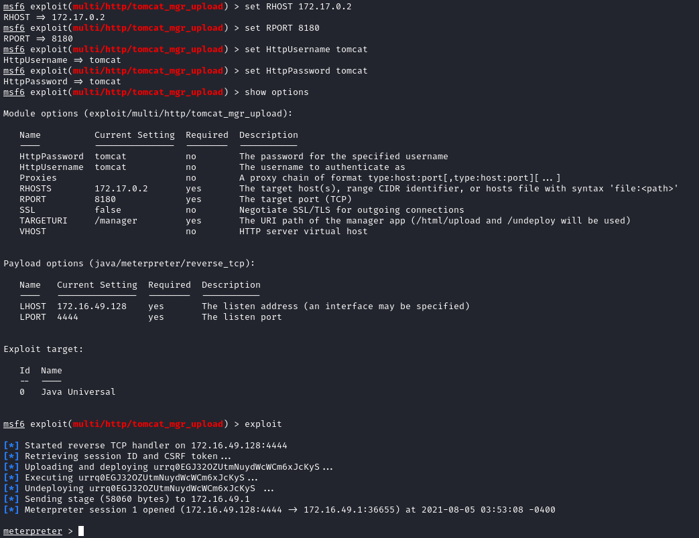

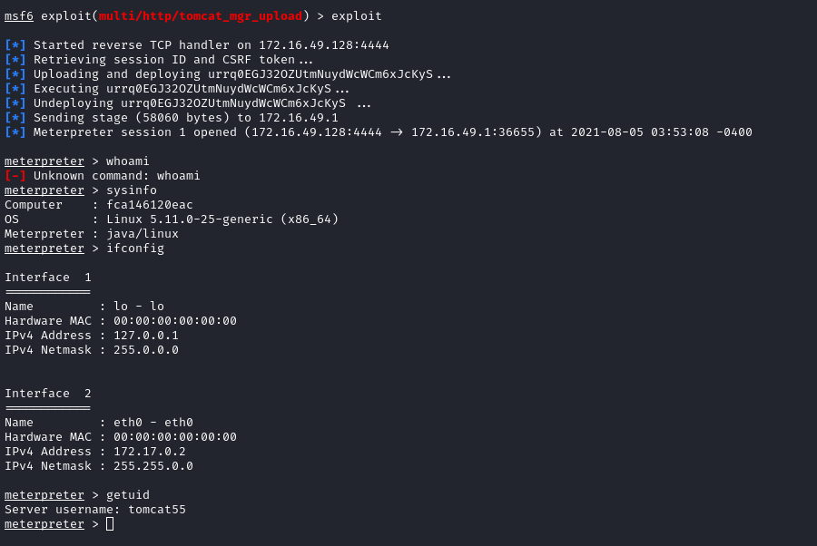


### Port 1099 & 44951 {Java-rmi}

The Java Remote Method Invocation(RMI) is a Java API that provides a mechanism to create distributed application in java.

Search for matching modules on msf tha can be used, set it and configure the relevant settings.
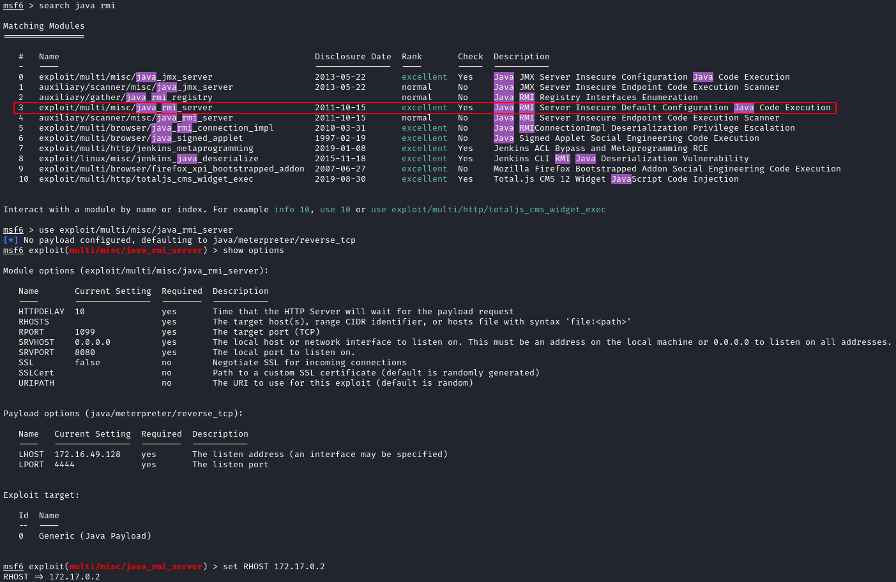

Running it gives us a meterpreter session


-----------------------------------------------------------------------------------------

# DVWA

Damn Vulnerable Web App (DVWA) is a PHP/MySQL web application that is vulnerable.

Ill be working on it on the different attack vectors from the different security levels ie low, medium and high.

### Brute Force

**Low Level**

I'll be using [Burpsuite](https://portswigger.net/burp) to try and bruteforce my way.

First off, I'll turn on my foxyproxy and open burpsuite then run the web page with incorrect login credentials and with burp suite **Intercept On**.

Burpsuite then intercepts the web my user traffic.
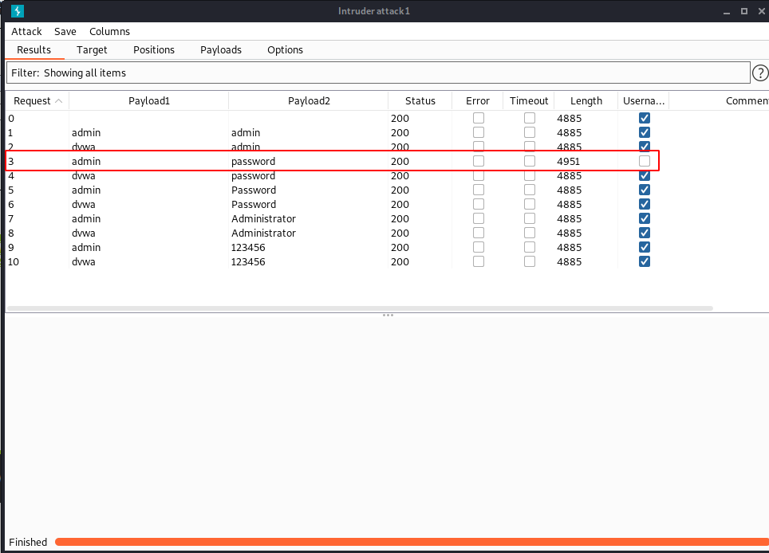
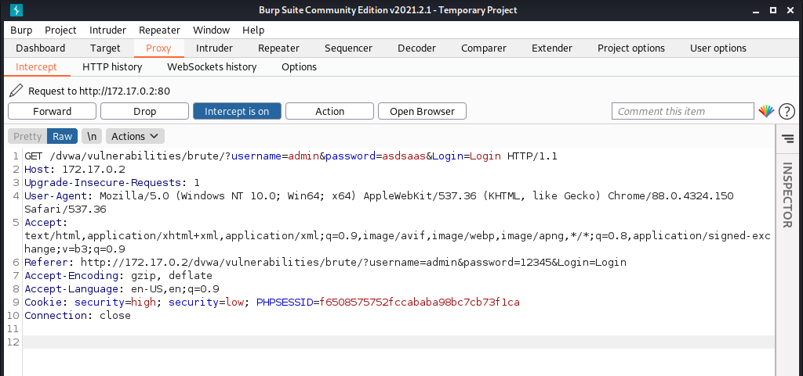

Sent the page on the intruder to Intruder then clear the settings on the payload positions tab, highlight the username and password then click add.

For the Attack type I will use Cluster bomb.
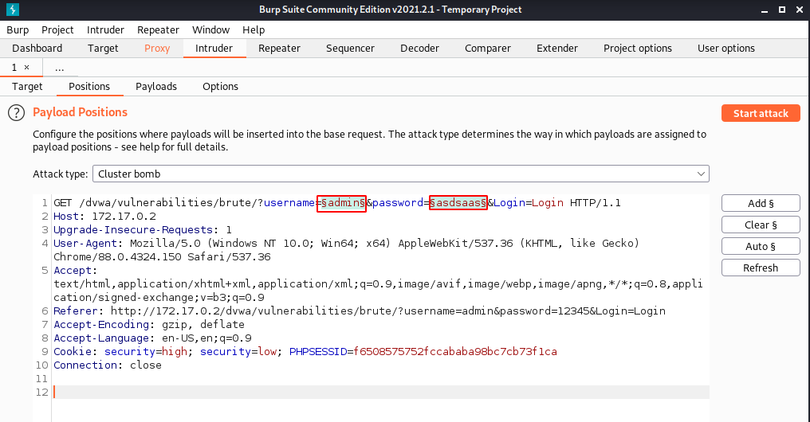

Next up set up the payload options with payload 1 being `username` and payload 2 being `password`.
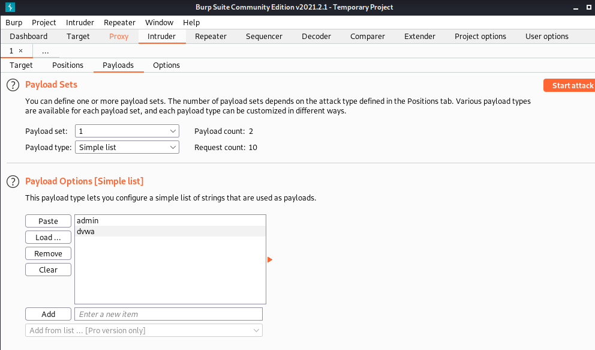
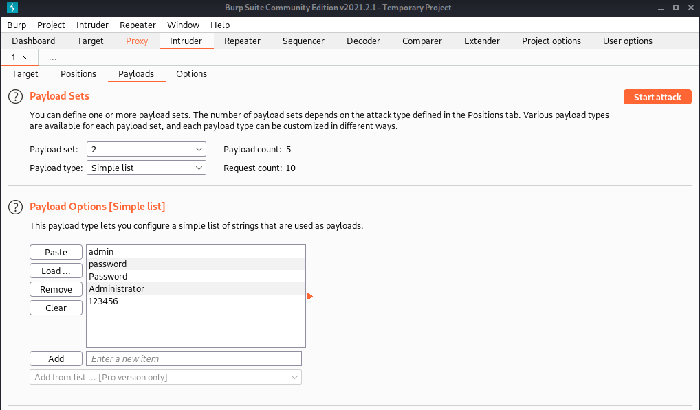

For the options tab, go to `Grep-Match` and look for a flag that can help me identify the password. This can be found by looking at the source code when I entered the incorrect password and this flag is `Username and/or password incorrect`.
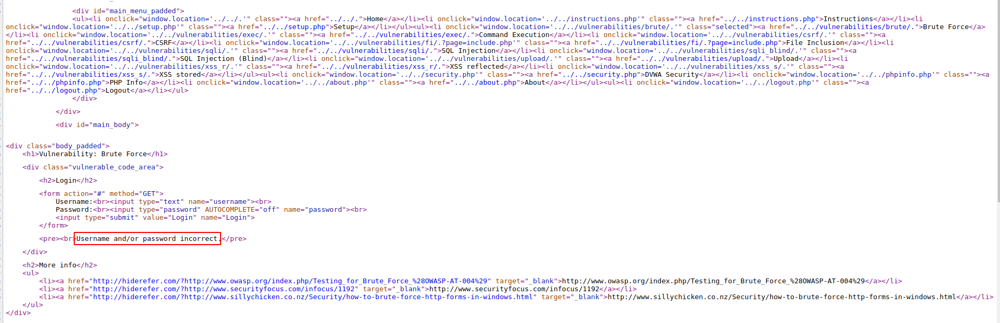
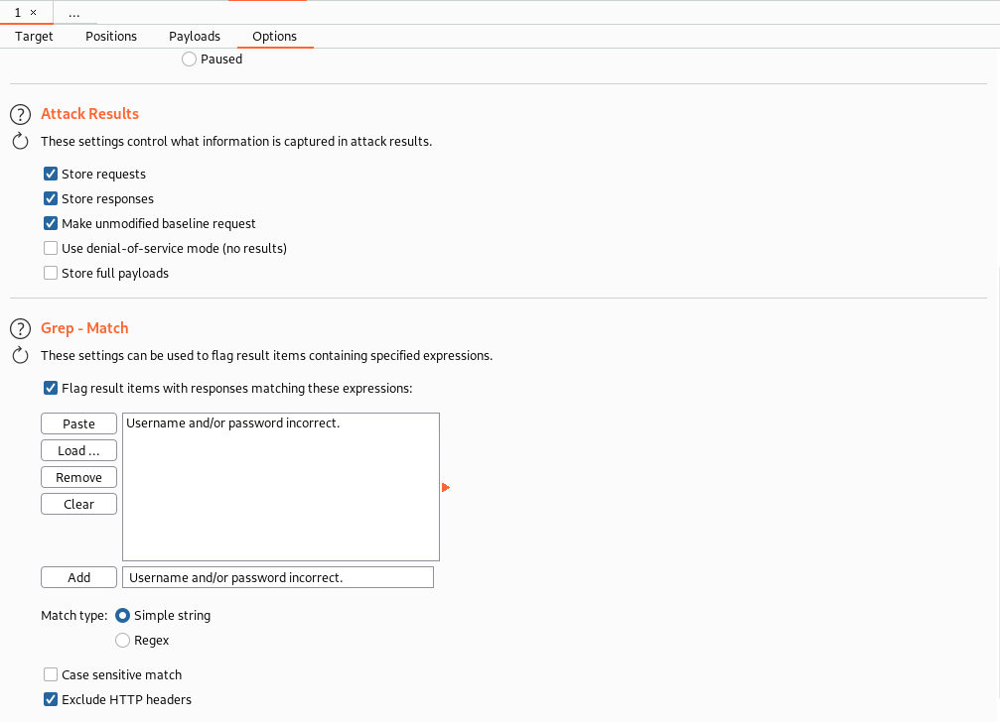

Once this is done, start the attack and burp tries all the logins given and shows the flags. we get a successful login without the incorrect password flag.

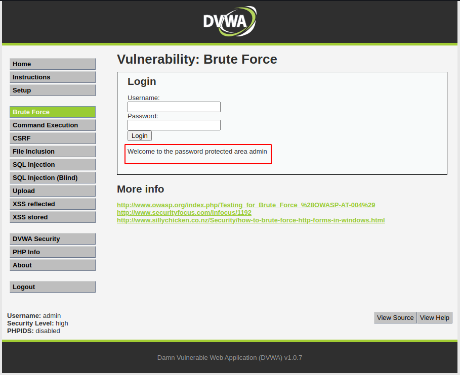

### SQL Injection

sqlmap can be used to identify the vulnerabilities found and crack.

**Low Level**

Using the single quote (') to test for SQLi brings back an error.
```
You have an error in your SQL syntax; check the manual that corresponds to your MySQL server version for the right syntax to use near ''''' at line 1
```

Trying out a different method to test for the vulnerability by trying with `' ORDER BY 2 -- -`

This works out and can be used to identify the number of columns present. There are 2 columns since on ordering by 3 gives the error `Unknown column '3' in 'order clause'` but on order by 2 loads up properly hence there are 2 columns.

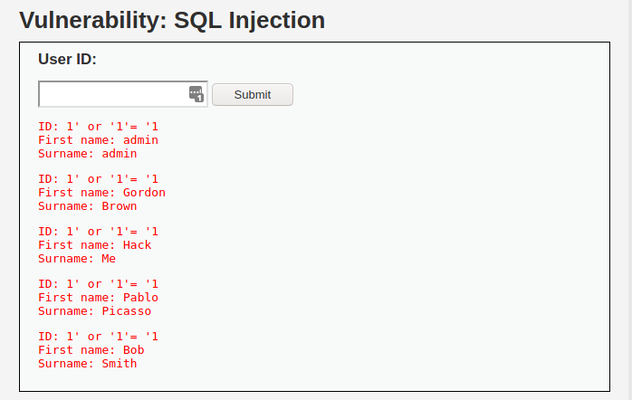

Using `'+union+select+1,2+--+-` gives fields in the first and second column.

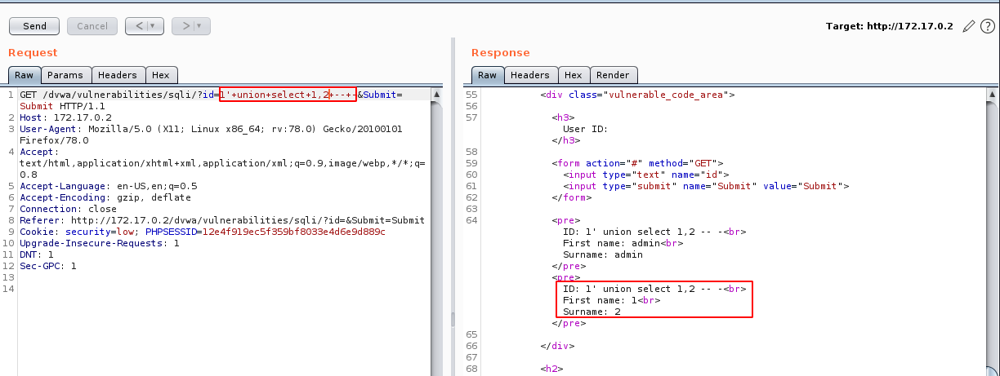

Which can help identify the release version and database name being run
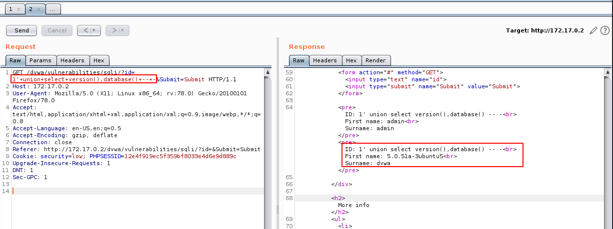

Alternatively can be run on dvwa as `' union select version(),database()#`
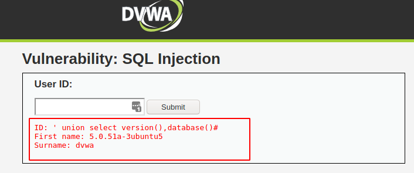

Next up is querying the libraries being run by using `' union select 1,group_concat(schema_name) from information_schema.schemata#`


--------------------------------------------------------------------------------------------

# OWASP JUICE SHOP

Enumerate to find the available directories available using dirbuster. The following are the available directories.

```
---- Scanning URL: http://172.17.0.2:3000/ ----
+ http://172.17.0.2:3000/assets (CODE:301|SIZE:179)                             
+ http://172.17.0.2:3000/ftp (CODE:200|SIZE:11062)                              
+ http://172.17.0.2:3000/profile (CODE:500|SIZE:1241)                           
+ http://172.17.0.2:3000/promotion (CODE:200|SIZE:6586)                         
+ http://172.17.0.2:3000/redirect (CODE:500|SIZE:3102)                          
+ http://172.17.0.2:3000/robots.txt (CODE:200|SIZE:28)                          
+ http://172.17.0.2:3000/snippets (CODE:200|SIZE:777)                           
+ http://172.17.0.2:3000/video (CODE:200|SIZE:10075518)                         
+ http://172.17.0.2:3000/Video (CODE:200|SIZE:10075518)                         
                                                                                
-----------------

```

Checking the pages, the following is retrievable. The snippets page gives some useful information.
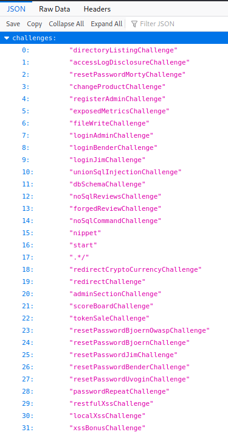 

## Injection

In the Owasp Juice shop page, there is a log in page, which is vulnerable to sql injection and allows access to unauthorized access to the system.

First create an error on the page by using `'` in the email field and for the password any string such as `1234`

The sql query related to this is 
```SELECT * FROM users WHERE email = '''AND password = 1234 AND  deletedt IS NULL
```

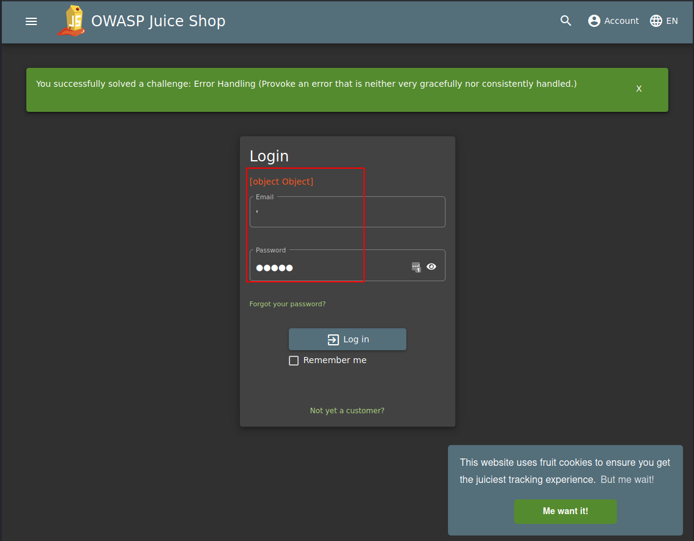

Next up, try and parse ` ' or true --` as the email and any password.
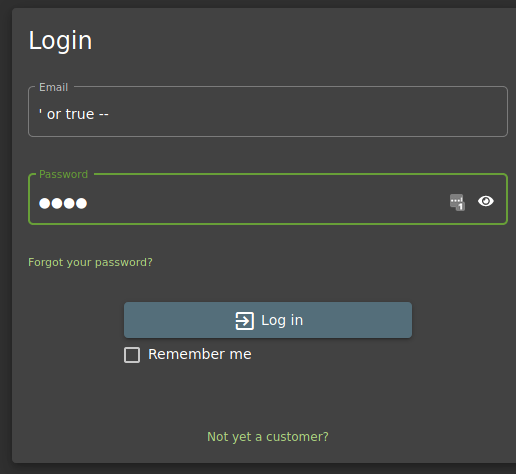

The query will look like :
```
SELECT * FROM Users WHERE email = '' OR TRUE -- AND password = '1234' AND deletedAt IS NULL
```

From the above and further inspection on the page shows that we are logged in as `Admin`
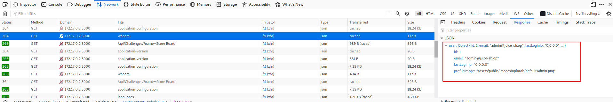


-------------------------------------------------------------------------------------------

# OWASP Bricks

Bricks is a web application security learning platform built on PHP and MySQL and focuses on variations of commonly seen application security issues. Each 'Brick' has some sort of security issue which can be leveraged manually or using automated software tools. The mission is to 'Break the Bricks' and thus learn the various aspects of web application security. 

Bricks are classified into 3 different sections ie;
	1. Login Pages
	2. File upload pages
	3. Content pages


## Login pages

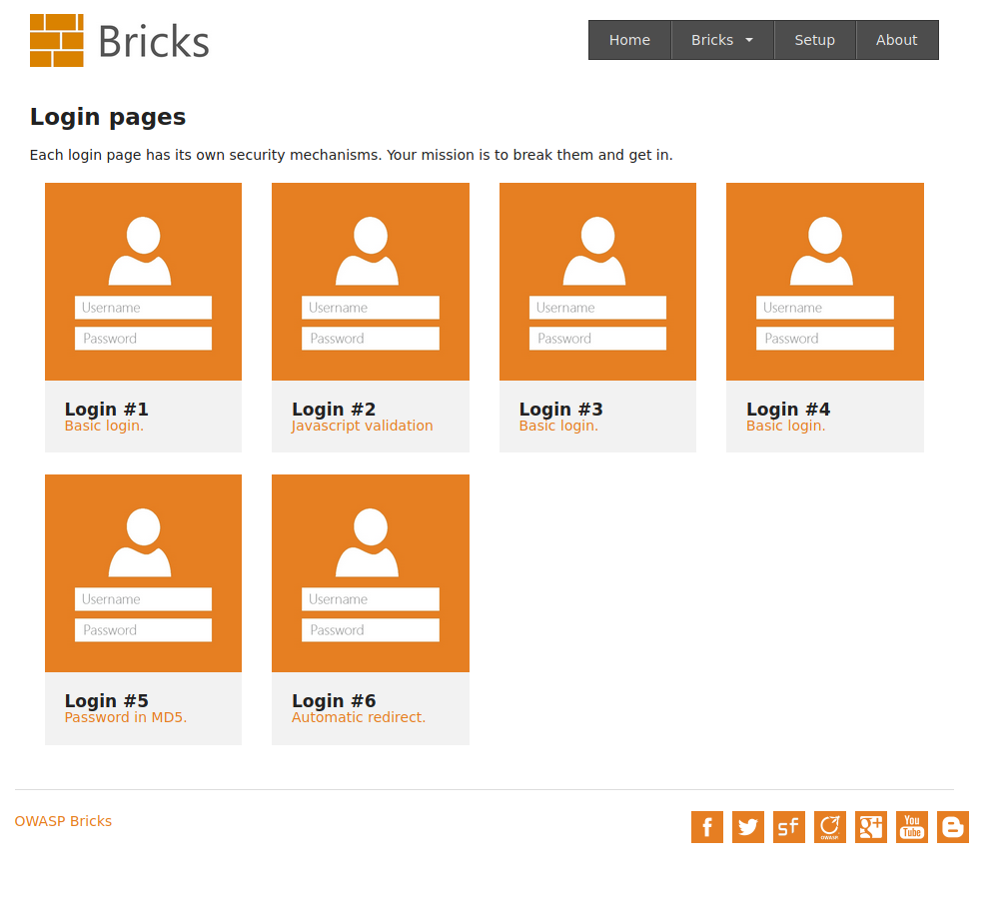

### 1. Login #1 : Basic Login

Test first the login page has an sqli vulnerability by inputing `'` in the username field and any string as the password. The following error is returned `Wrong user name or password` with the following query output:

```
SQL Query: SELECT * FROM users WHERE name=''' and password='1234'
```

Using admin credentials gives a success login
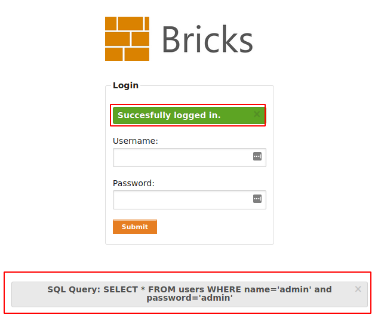

Using the same username and `' or '1'='1` as the password returns a successsful login 
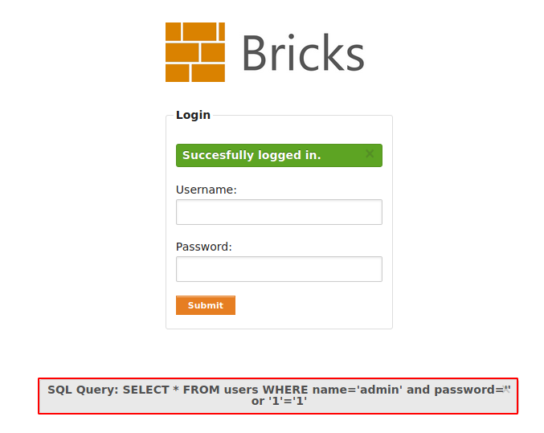

The above condition is always true hence correct password.

Next up is bypassing the username and password by using the condition  `' or '1'='1` as username and password.
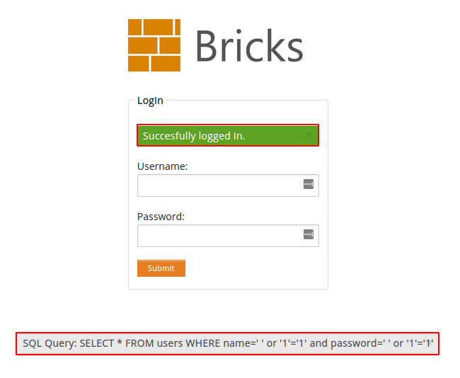
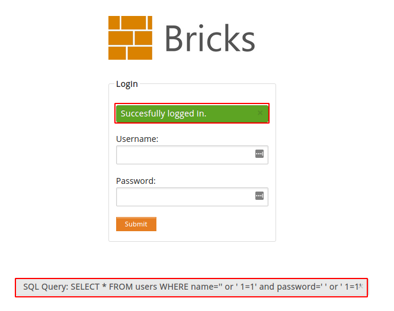

Changing the condition to `1' or 1=1 -- -` as the username and a random password gives a successful login.
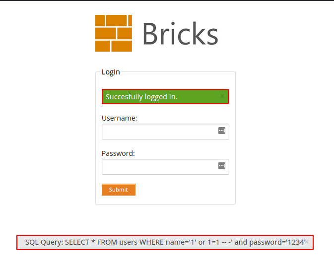

### 2. Login #2 : Javascript validation

Logging in as an admin gives a successful login with the SQL query being : `SQL Query: SELECT * FROM users WHERE name='admin' and password='admin'`

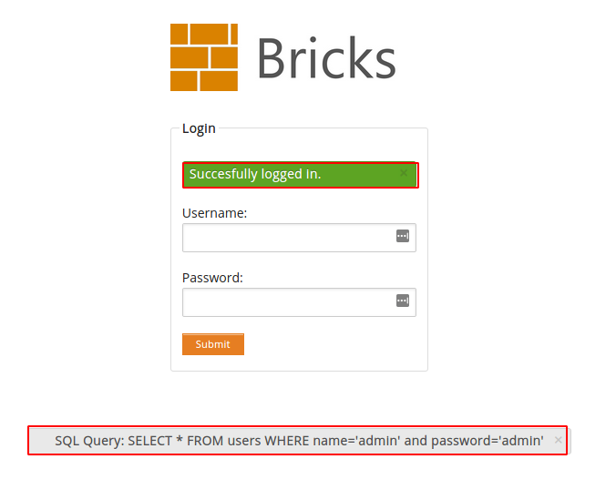

Trying to test the for sql injection in the username field and a guessed password returns an error :
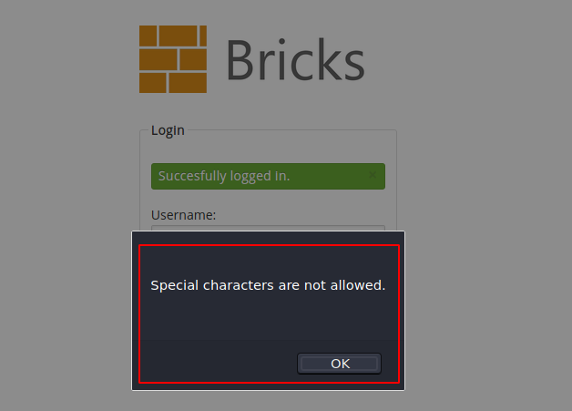


### 3. Login #3 : Basic Login
### 4. Login #4 : Basic Login
### 5. Login #5 : Password in MD5
### 6. Login #6 : Automatic redirect

