# Portswigger writeup

- [ ] **Server Side Attacks**
	- [x] SQL injection 
	- [ ] Authentication
	- [ ] Directory Traversal
	- [ ] Command Injection
	- [ ] Business Logic Vulnerabilities
	- [ ] Information Disclosure
	- [ ] Access Control
	- [ ] Server-Side Request Forgery
	- [ ] XXE Injection
- [ ] **Client Side Attacks**
	- [ ] Cross-site scripting (XSS)
	- [ ] Cross-site request forgery (CSRF)
	- [ ] Cross-origin resource sharing (CORS)
	- [ ] Clickjacking
	- [ ] DOM-based vulnerabilities
	- [ ] WebSockets
- [ ] **Advanced**
	- [ ] Insecure Deserialization
	- [ ] Server-side template injection
	- [ ] Web cache poisoning
	- [ ] HTTP Host header attacks
	- [ ] HTTP request smuggling
	- [ ] OAuth authentication
	

-----------------------------------------------------------------------------------------

## SQL Injection

> SQL injection is a web security vulnerability that allows an attacker to interfere with the queries that an application makes to its database.

An attacker can escalate an SQL injection attack to compromise the underlying server or other back-end infrastructure, or perform a denial-of-service attack.

[SQLi cheat sheet](https://portswigger.net/web-security/sql-injection/cheat-sheet)

**Types Of SQLi**

1. **In-band SQLi (Classic SQLi)** - Occurs when an attacker is able to use the same communication channel to both launch the attack and gather results.
	1. `Error-based SQLi` - Relies on error messages thrown by the database server to obtain information about the structure database.
	2. `Union-based SQLi` - Leverages the **UNION** SQL operator to combine the results of two or more **SELECT** statements into a single result which is then returned as part of the HTTP response.
2. **Inferential SQLi (Blind SQLi)** - An attacker is able to reconstruct the database structure by sending payloads, observing the web apps response and the resulting behaviour of the server.
	1. `Boolean-based (content-based) Blind SQLi` - Relies on sending an SQL query to the database which forces the app to return a different result depending on whether the query returns a TRUE or FALSE result.
	2. `Time-based Blind SQLi` - Relies on sending an SQL query to the database which forces the database to wait for a specified amount of time before responding. Response time will indicate to the attacker whether the result of the query is TRUE or FALSE.
3. **Out-of band SQLi** - Depends on features being enabled on the database server being used by the web app and Occurs when an attacker is unable to use the same channel to launch the attack and gather results.

**Examples of SQL injection**

1. **Retrieving hidden data** by modifying an SQ query to return additional results.
2. **Subverting application logic** where one can change a query to interfere with the application's logic.
3. **UNION attacks** where one can retrieve data from different database tables.
4. **Examining the database** where one can extract information about the version and structure of the database.
5. **Blind SQL injection** where the results of a query you control are not returned in the application's responses.

**Blind SQL injection vulnerabilities**

Depending on the nature of the vulnerability and the database involved, the following techniques can be used to exploit blind SQL injection.

1. One can change the logic of the query to trigger a detectable difference in the application's response depending on the truth of a single condition. This might involve injecting a new condition into some Boolean logic or conditionally triggering an error such as divide-by-zero(1/0)
2. One can conditionally trigger a time delay in the processing of the query allowing one to infer the truth of the condition based on the time 

**Detecting SQL injection vulnerabilities**

1. Submitting the single quote character ' and looking for errors or other anomalies.
2. Submitting some SQL-specific syntax that evaluates to the base value of the entry point and to a different value.
3. Submitting Boolean conditions such as  "OR 1=1" and "OR 1=2" and looking for differences in the application's responses.
4. Submitting payloads designed to trigger time delays when executed wuthin an SQL query, and looking for differences in the time taken to respond.
5. Submitting OAST payloads designed to trigger an out-of-band network interaction when executed within an SQL query, and monitoring for any resulting interactions.

**SQL injection in different parts of the query**

1. In *UPDATE* statements within the updated vales or the WHERE clause.
2. In *INSERT* statements within the inserted values.
3. In *SELECT* statements within the table or column name.
4. In *SELECT* statements within the ORDER BY clause.


### **Lab 1: SQL injection UNION attack, determining the number of columns returned by the query**

[https://portswigger.net/web-security/sql-injection/union-attacks/lab-determine-number-of-columns](https://portswigger.net/web-security/sql-injection/union-attacks/lab-determine-number-of-columns)

This lab contains an SQL injection vulnerability in the product category filter. The results from the query are returned in the application's response, so you can use a UNION attack to retrieve data from other tables. The first step of such an attack is to determine the number of columns that are being returned by the query. You will then use this technique in subsequent labs to construct the full attack.

To solve the lab, determine the number of columns returned by the query by performing an SQL injection UNION attack that returns an additional row containing null values. 

> **Solution** :

A UNION operator concatenates the results of two queries into a single result set.

Basic Rules for combining results of two queries by using UNION according to [microsoft](https://docs.microsoft.com/en-us/sql/t-sql/language-elements/set-operators-union-transact-sql?view=sql-server-ver15): 

1. The number and the order of the columns must be the same in all queries.
2. The data types must be compatible.

_ORDER BY_ sorts data returned by a query in sql Server. This clause, according to [microsoft]() us used to:

1. Order the result set of a query by the specified column list and limit the rows returned to a specified range.
2. Determine the order in which ranking function values are applied to the result set.

To identify whether the page is prone to SQLi, I can introduce a character to the link such as `'` eg [https://ac511f871e48758f808d4a0e000f0051.web-security-academy.net/filter?category=Clothing%2c+shoes+and+accessories' ](https://ac511f871e48758f808d4a0e000f0051.web-security-academy.net/filter?category=Clothing%2c+shoes+and+accessories' )

I get an internal server error hence is susceptible to an SQLi attack.


I can input a correct character such as `'--` and I have a successful input.

I can check the number of columns using `' UNION select NULL--` whereby NULL represents the number of columns. 

This leads to an internal server error, hence there could be more than one column.

I continue to increase the `NULL` value until the page loads successfully on the third NUL value without breaking.


### **Lab 2: SQL injection UNION attack finding a column containing text**

[https://portswigger.net/web-security/sql-injection/union-attacks/lab-find-column-containing-text](https://portswigger.net/web-security/sql-injection/union-attacks/lab-find-column-containing-text)

This lab contains an SQL injection vulnerability in the product category filter. The results from the query are returned in the application's response, so you can use a UNION attack to retrieve data from other tables. To construct such an attack, you first need to determine the number of columns returned by the query. You can do this using a technique you learned in a previous lab. The next step is to identify a column that is compatible with string data.

The lab will provide a random value that you need to make appear within the query results. To solve the lab, perform an SQL injection UNION attack that returns an additional row containing the value provided. This technique helps you determine which columns are compatible with string data. 

> **Solution**:

First of, find the number of columns by using `'+UNION+select+NULL--` till I find the correct number of columns by the number of NULLS used.

I get 3 columns present since I use `'+UNION+select+NULL+NULL+NULL--`


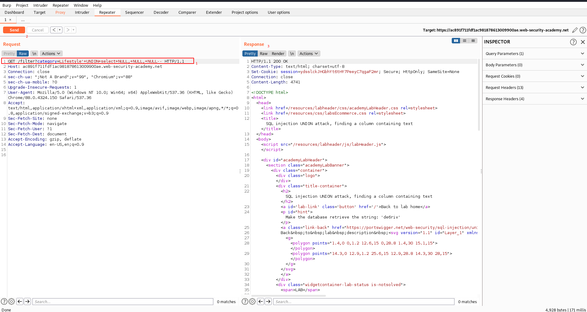

Since I am required to retrieve the text `'de6riv'`, I will be replacing the NULL value with the given text till the page does not crash.


The second column gives a successful load hence the column containing text.

### **Lab 3: SQL injection UNION attack, retrieving data from other tables**
[https://ac1a1fe71f751a9b817192a1004000b4.web-security-academy.net/](https://ac1a1fe71f751a9b817192a1004000b4.web-security-academy.net/)

This lab contains an SQL injection vulnerability in the product category filter. The results from the query are returned in the application's response, so you can use a UNION attack to retrieve data from other tables. To construct such an attack, you need to combine some of the techniques you learned in previous labs.

The database contains a different table called users, with columns called username and password.

To solve the lab, perform an SQL injection UNION attack that retrieves all usernames and passwords, and use the information to log in as the administrator user. 

> **Solution**:


I'm going to first determine te number of columns available using the `UNION` method or `ORDER BY 1--`


There are 2 columns since when I add a third column I get an internal server error.

Next up, confirm if the columns accept string values by using `'+UNION+select+'a',+NULL--`. This runs successfully hence first column accepts string values, next confirm the second column together with the first one using `'+UNION+select+'a',+'a'--`

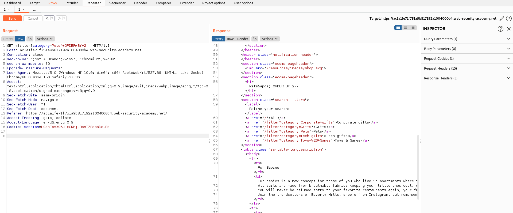


I want to retrieve the username and password so that i can be able to login using the administrator user, use `'+UNION+select+username,+password+FROM+users--`


Use the Aministrator credentials to  log in 
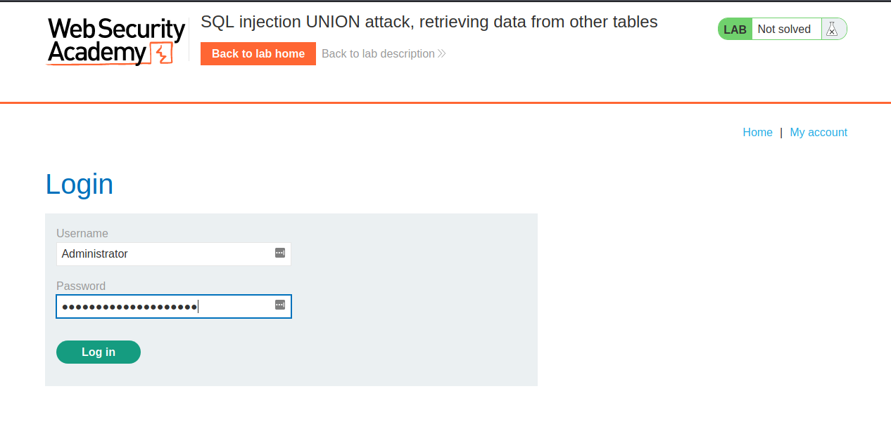
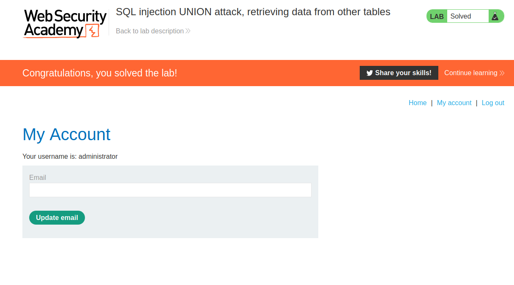

### **Lab 4: SQL injection UNION attack, retrieving multiple values in a single column**

[https://portswigger.net/web-security/sql-injection/union-attacks/lab-retrieve-multiple-values-in-single-column](https://portswigger.net/web-security/sql-injection/union-attacks/lab-retrieve-multiple-values-in-single-column)

This lab contains an SQL injection vulnerability in the product category filter. The results from the query are returned in the application's response so you can use a UNION attack to retrieve data from other tables.

The database contains a different table called users, with columns called username and password.

To solve the lab, perform an SQL injection UNION attack that retrieves all usernames and passwords, and use the information to log in as the administrator user. 

> **Solution**


Confirm the number of columns available using the `' ORDER BY 1--`  method.

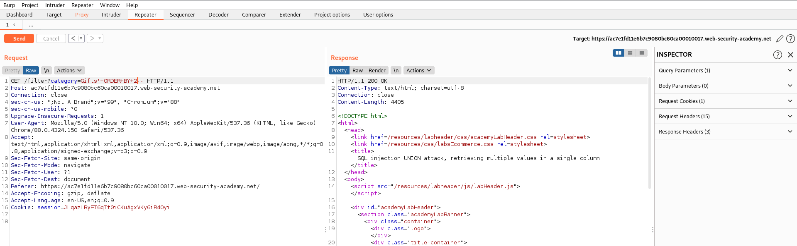

There are 2 columns from the above.

Next up, confirm which column accepts strings;
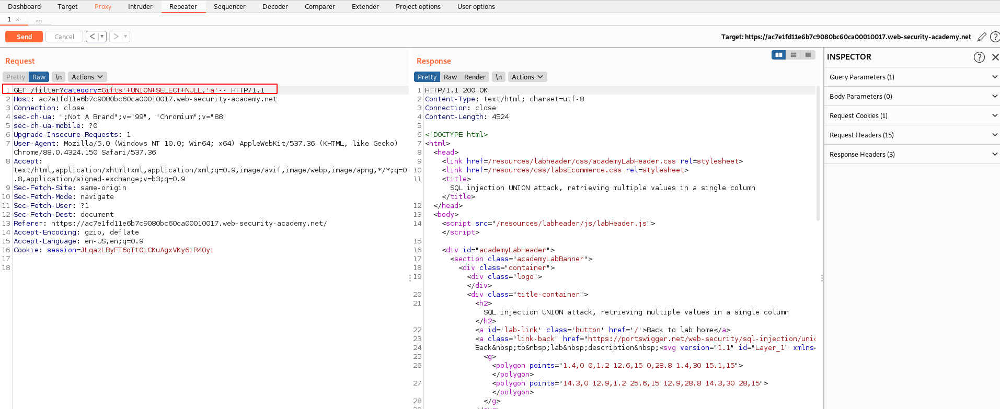

The second column accepts string values whereas the first column sends an internal server error.

Next up is retrieving values from the column, which I can try by using `' UNION select NULL, username from users` to extract the username.

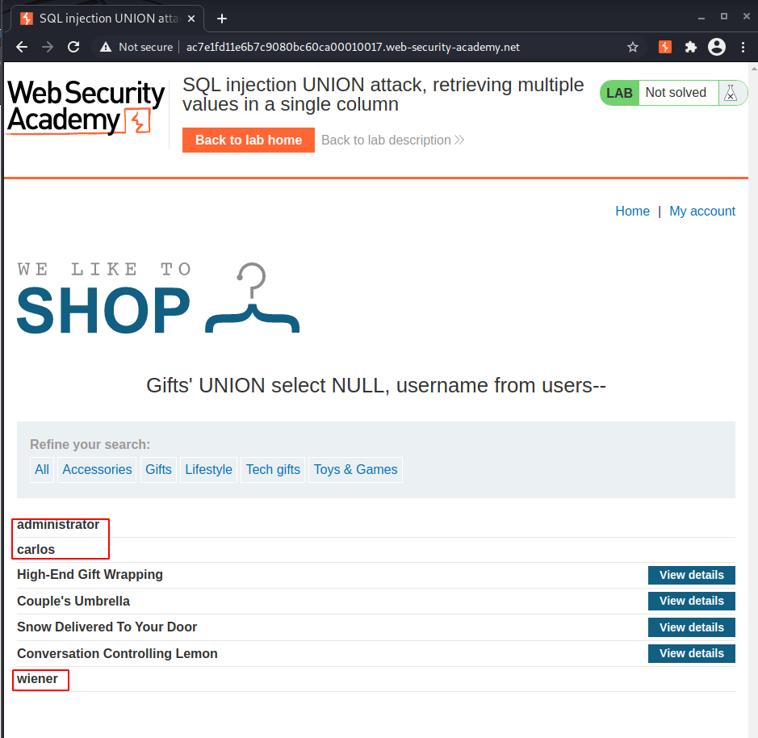

I successfully get 3 usernames.

Let's now extract both the username and password from the column by concatenating the strings together [SQL injection cheat sheet](https://portswigger.net/web-security/sql-injection/union-attacks)

To identify how to concatenate, check the SQL version being run by using the following

| SQL Version | SQL Query method | String Concatenation 
-------|-------------------------------|----------------
Microsoft | SELECT @@version | 'foo'+'bar'
PostgreSQL | SELECT version() | 'foo'||'bar'
MySQL | SELECT @@version | 'foo' 'bar' **or** CONCAT('foo','bar')
Oracle | SELECT banner FROM v$version **or** SELECT version FROM v$instance  | 'foo'||'bar' 

The version is PostgreSQL 11.12 as seen hence will use the PostgreSQL concatenation method.


Hence to retrieve the username and password from the column I will use, `' UNION select NULL, username || password from users--`

From running this I get the usernames and passwords but the requirement is to login using the administrator details.
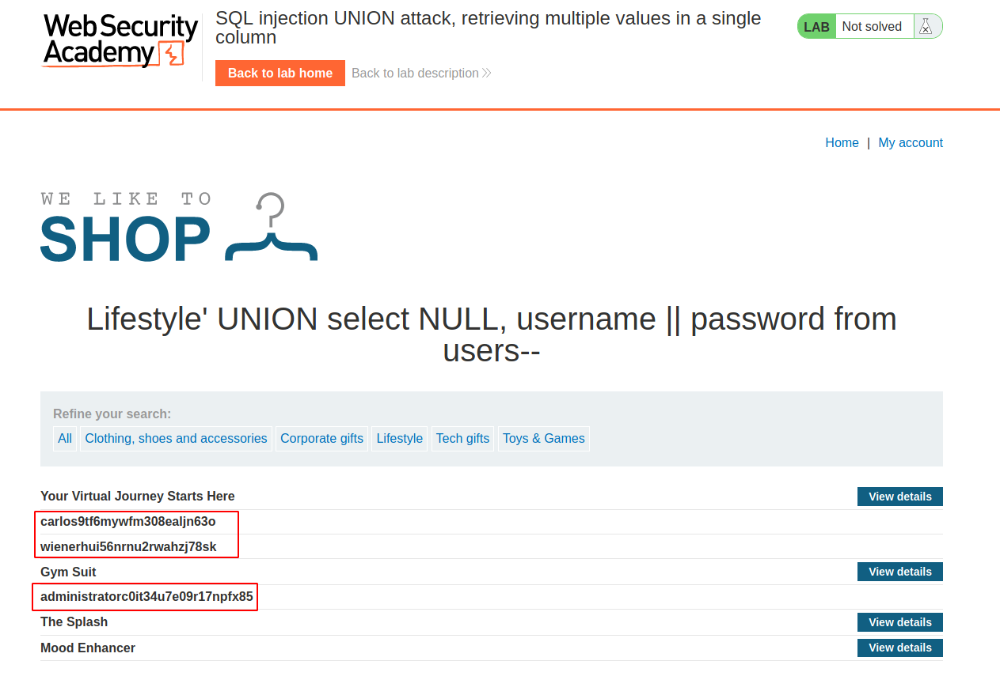


### **Lab 5: SQL injection attack, querying the database type and version on Oracle**

This lab contains an SQL injection vulnerability in the product category filter. You can use a UNION attack to retrieve the results from an injected query.

To solve the lab, display the database version string. 

> **Solution**

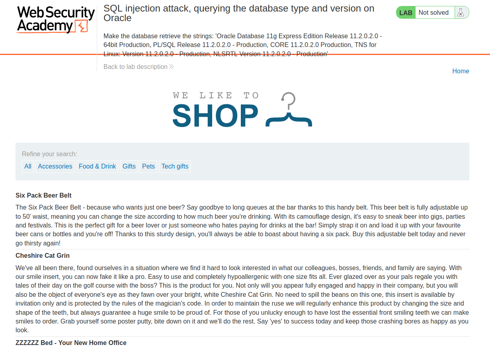

First off I'll determine the number of columns by using the `' ORDER BY 1--` till I get an internal server error which signifies that there are no more columns present.


Being an oracle database, I'll use `'+UNION+SELECT+banner,+NULL+FROM+v$version--` and it gives me the database type and version

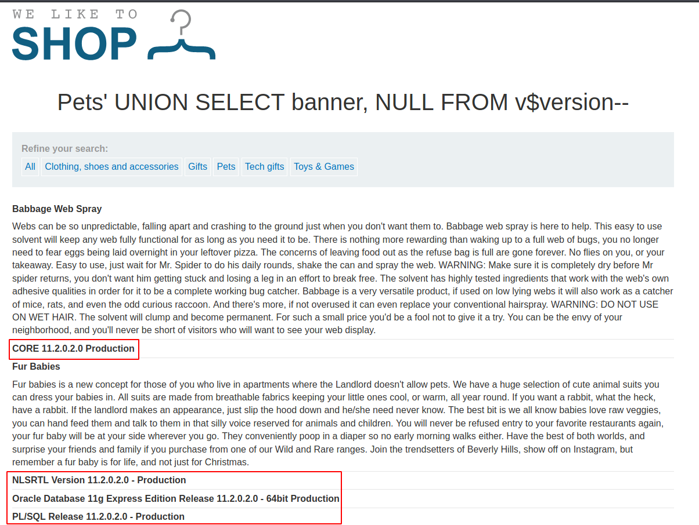

### **Lab 6: SQL injection attack, querying the database type and version on MySQL and Microsoft**

### **Lab 7: SQL injection attack, listing the database contents on non-Oracle databases**

### **Lab 8: SQL injection attack, listing the database contents on Oracle**

### **Lab 9: Blind SQL injection with conditional responses**

[https://portswigger.net/web-security/sql-injection/blind/lab-conditional-responses](https://portswigger.net/web-security/sql-injection/blind/lab-conditional-responses)

This lab contains a blind SQL injection vulnerability. The application uses a tracking cookie for analytics, and performs an SQL query containing the value of the submitted cookie.

The results of the SQL query are not returned, and no error messages are displayed. But the application includes a "Welcome back" message in the page if the query returns any rows.

The database contains a different table called users, with columns called username and password. You need to exploit the blind SQL injection vulnerability to find out the password of the administrator user.

To solve the lab, log in as the administrator user. 

> **Solution**


Once in the page and the tracking id is set, one recieves a `welcome back` message.
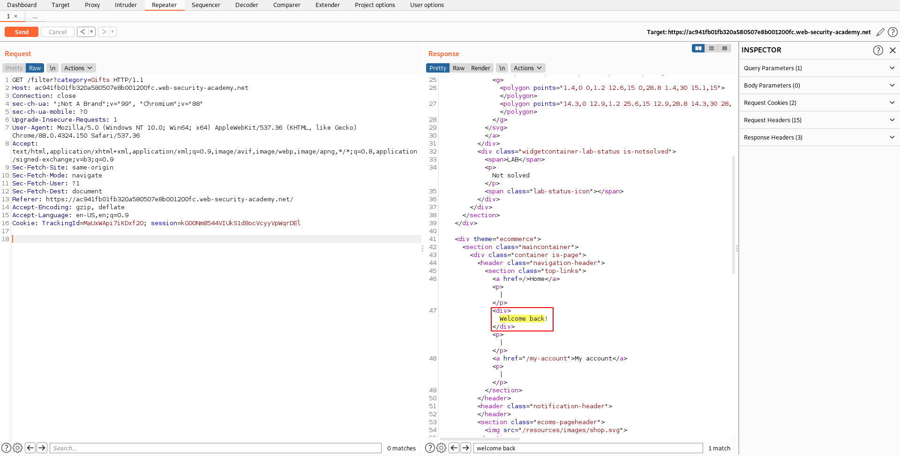

When the tracking id is changed to an incorrect tracking id, there is `no welcome back` message that is displayed.
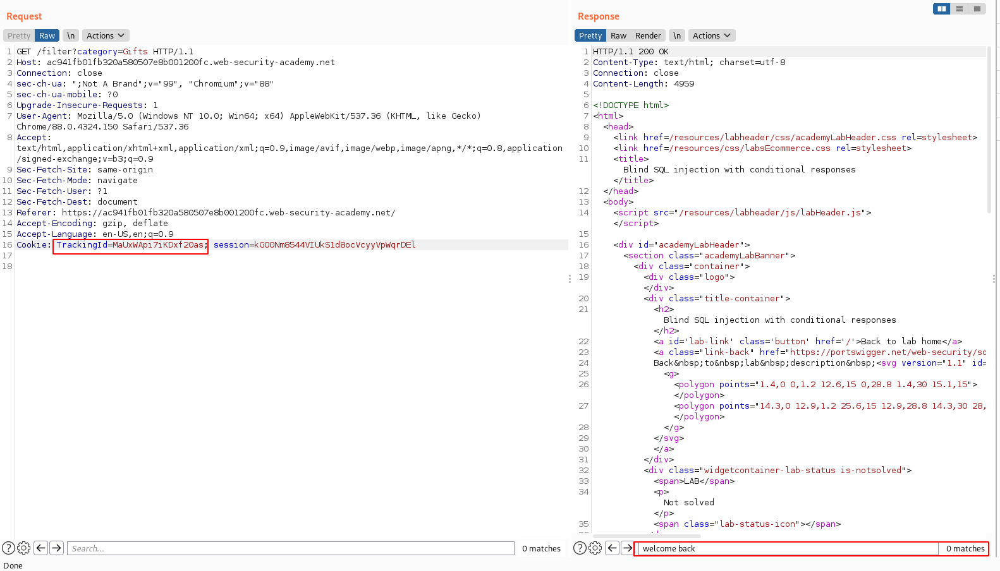
```
select tracking-id from tracking-table where TrackingId=MaUxWApi7iKDxf20' and 1=1--
```
If this is true then the welcome back message will be displayed, if false as in the case where we change to `1=0--` or `1=2--` then the welcome back message will not be displayed.

I can confirm whether there is a users table present by using;
```
TrackingId=MaUxWApi7iKDxf20' and (select 'x' from users LIMIT 1)='x'--
```

This returns a welcome back message verifying that the there is a users table.


Next confirm that the administrator username exists in the users table using a similar method as above. `TrackingId=MaUxWApi7iKDxf20' and (select username from users where username='administrator')='administrator'--`
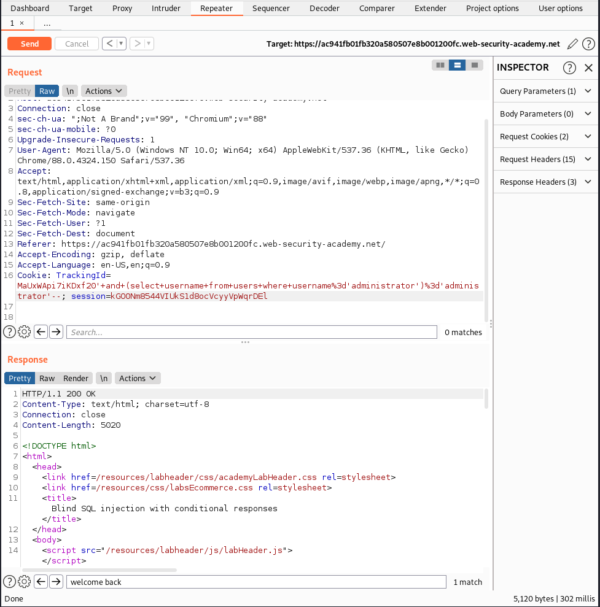

This brings a successful welcome back message hence is present.

Next up, finding the password for the administrator user and identifying the length of the password by using
`TrackingId=MaUxWApi7iKDxf20' and (select username from users where username='administrator' and LENGTH(password)>1)='administrator'--`

The password length will be increased until no welcome back message is received. Alternatively this can also be done by sending the page to intruder in burp.
```
- Send the page to Intruder
- Clear all the positions that have been set then add the length position.
- The attack type will be sniper.
- Go to the Payloads tab and set the payload type as Numbers and payload options as Sequential from 1 to 30 and step to 1
- Start the attack
```
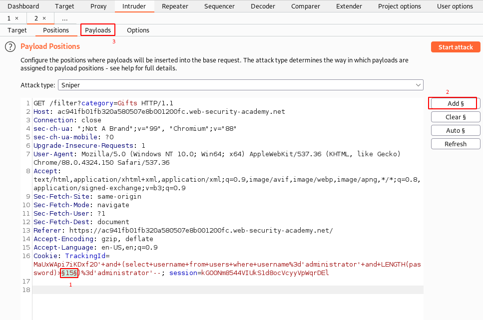


From the attack, the password has exactly 20 characters since only those have the same length as from the rest.


Next is using burp Intruder to find the characters of the password from the 1st character to the 20th character.

I can use the following method substring to find the first character of the password
`TrackingId=MaUxWApi7iKDxf20' and (select substring(password,1,1) from users where username='administrator')='a'--`

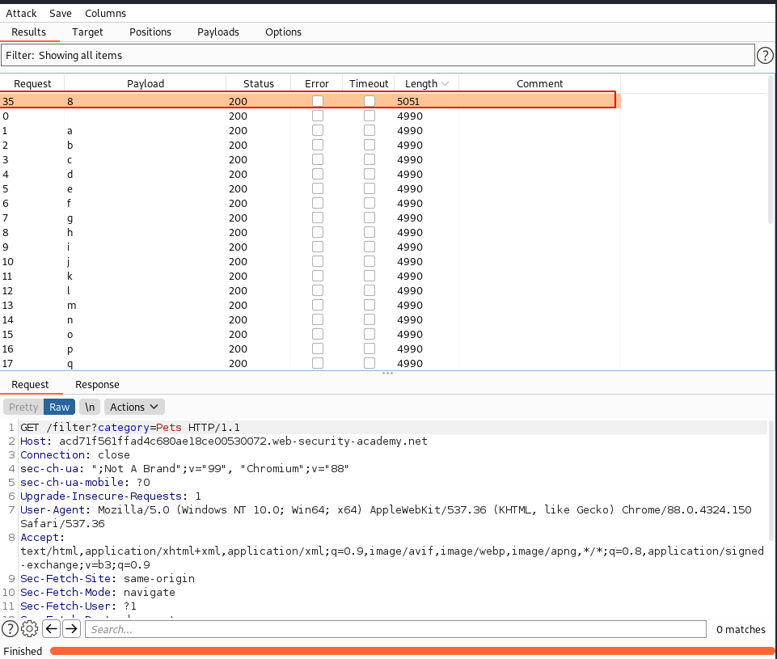

Having to go through the passwords one by one till the 20th character manually can be tidious hence I used a cluster bomb attack and set the positions at set positions and the payload set 1 would be numbers from 1 to 20 and payload set 2 would be bruteforcer then start the attack.


### **Lab 10: Blind SQL injection with conditional errors**

[https://portswigger.net/web-security/sql-injection/blind/lab-conditional-errors](https://portswigger.net/web-security/sql-injection/blind/lab-conditional-errors)

This lab contains a blind SQL injection vulnerability. The application uses a tracking cookie for analytics, and performs an SQL query containing the value of the submitted cookie.

The results of the SQL query are not returned, and the application does not respond any differently based on whether the query returns any rows. If the SQL query causes an error, then the application returns a custom error message.

The database contains a different table called users, with columns called username and password. You need to exploit the blind SQL injection vulnerability to find out the password of the administrator user.

To solve the lab, log in as the administrator user. 

> **Solution**


I'll inject some code in the tracking Id and see if it passes or brings back an error.
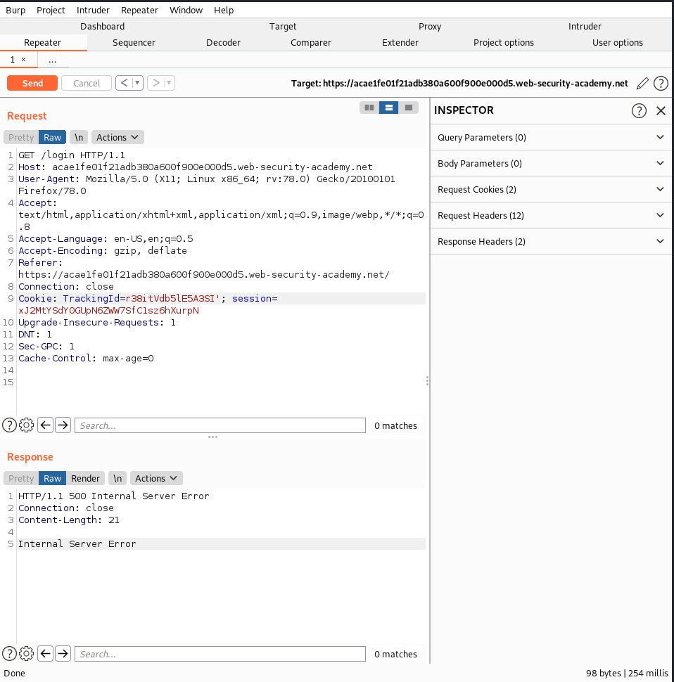

An internal server error is brought back.

Next up is exploiting the page to get conditional errors.

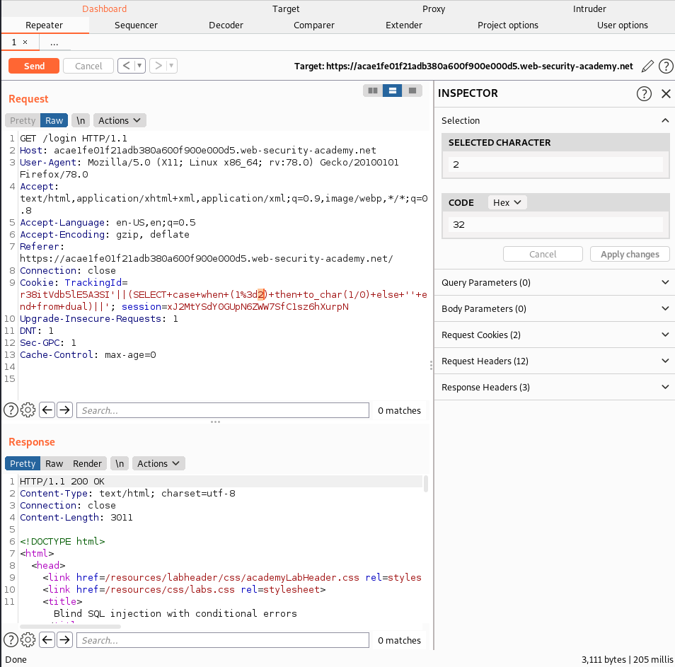

In the first instance, there is an error recieved because the condition from the expression that contains a divide-by-zero `1/0` causes an error and hence is true. In the second instance, there is no error recieved because it is false.

Next up is checking whether the username `administrator` exists.


This brings up an error confirming that the user does exist.

Next is confirm the password of the user and how many characters are present in the password by using burp intruder.


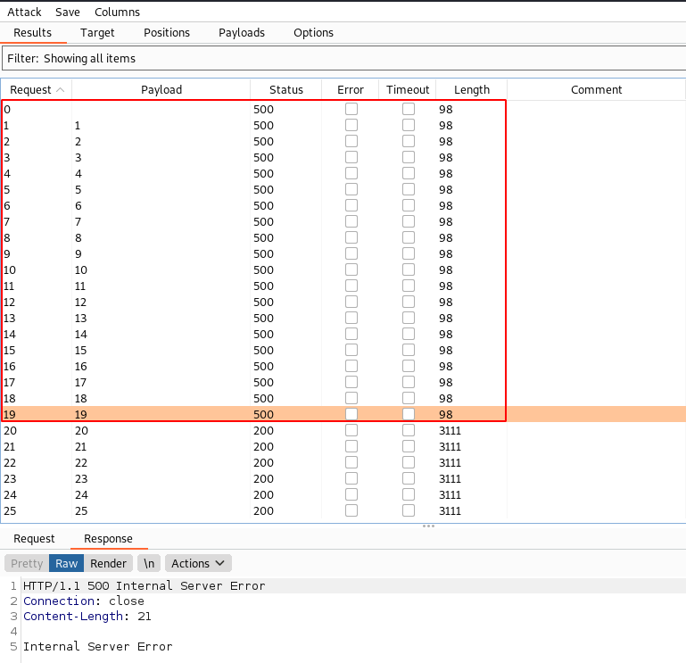

The password is 20 characters long hence can find the entire password by using burp intruder and substring.

The first character of the password is `s`.
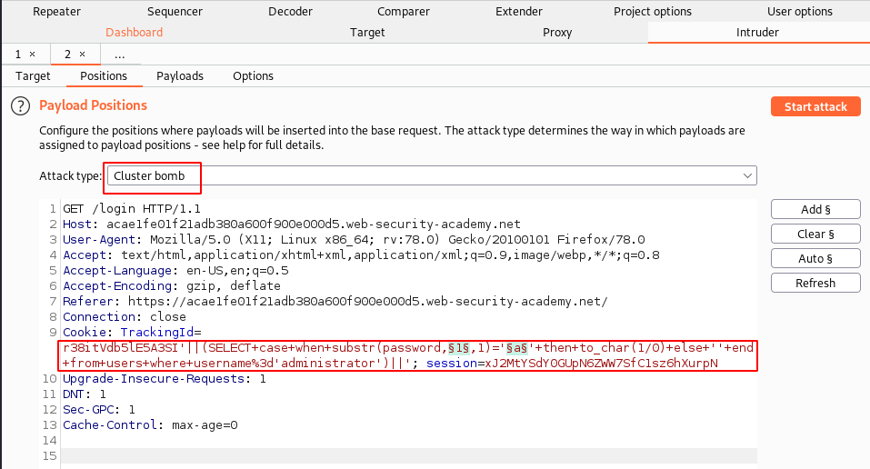
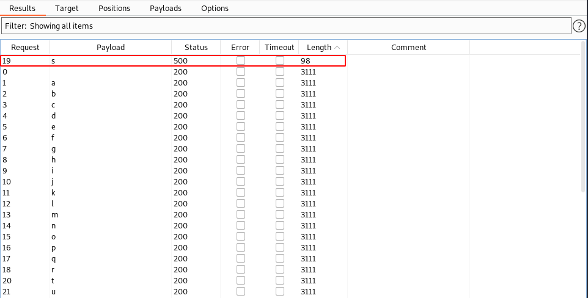

The entire password can be found by using a similar method but using a cluster bomb attack to find the entire password and the characters using 
```
'||(SELECT+case+when+substr(password,§1§,1)='§a§'+then+to_char(1/0)+else+''+end+from+users+where+username%3d'administrator')||
```


After running the bruteforce on the characters I get the characters and their positions.
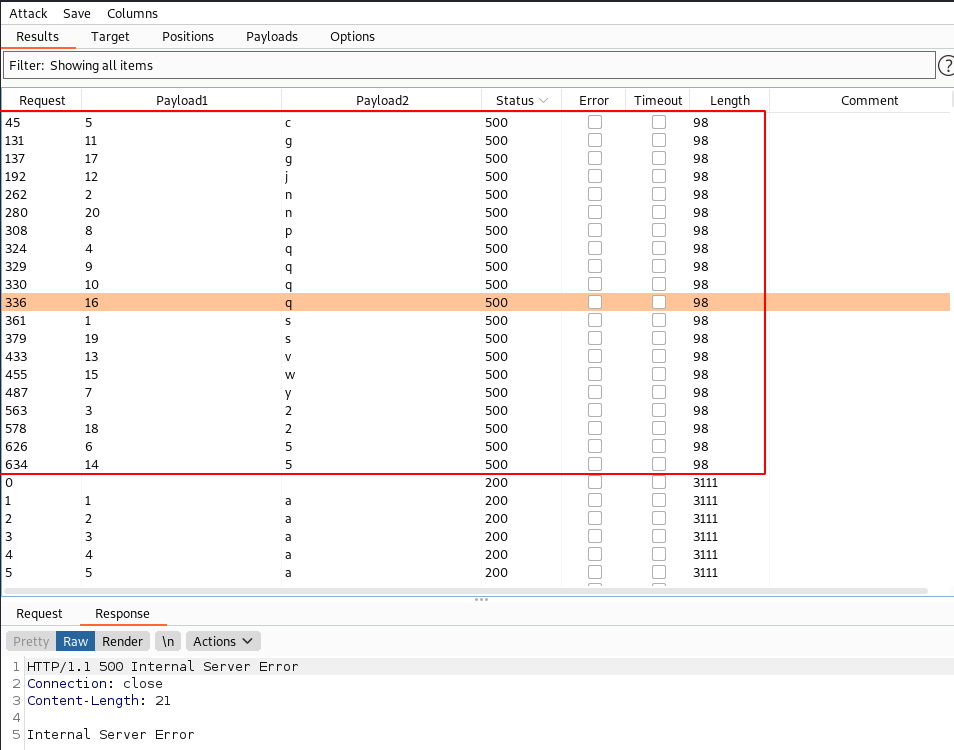

### **Lab 11: Blind SQL injection with time delays**

[https://portswigger.net/web-security/sql-injection/blind/lab-time-delays](https://portswigger.net/web-security/sql-injection/blind/lab-time-delays)

This lab contains a blind SQL injection vulnerability. The application uses a tracking cookie for analytics, and performs an SQL query containing the value of the submitted cookie.

The results of the SQL query are not returned, and the application does not respond any differently based on whether the query returns any rows or causes an error. However, since the query is executed synchronously, it is possible to trigger conditional time delays to infer information.

To solve the lab, exploit the SQL injection vulnerability to cause a 10 second delay. 

> **Solution**

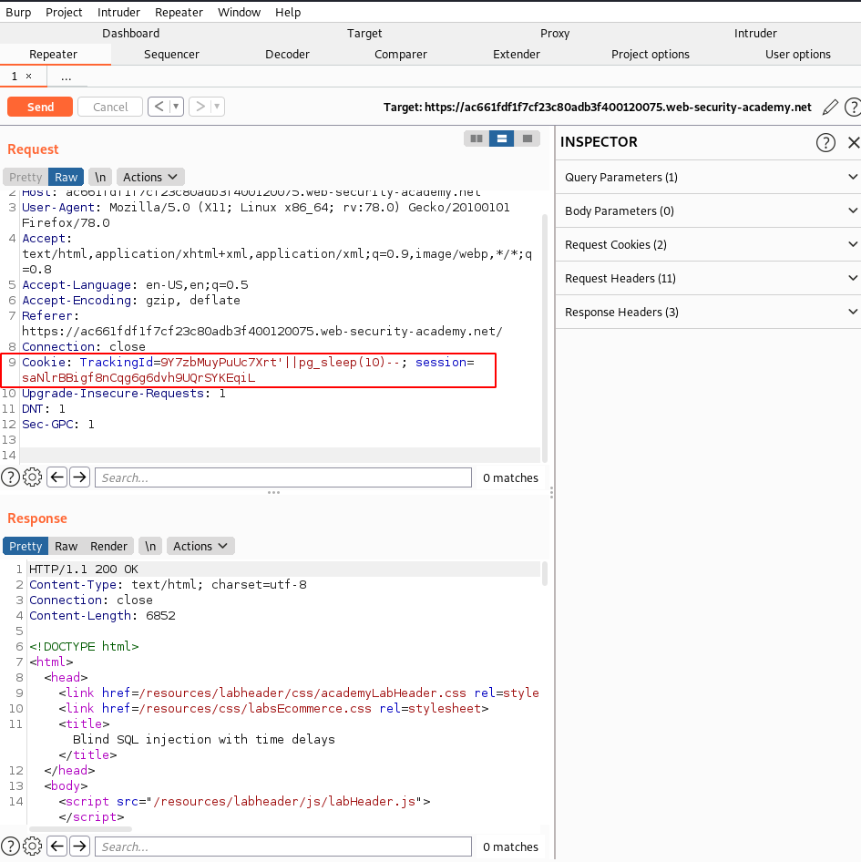

### **Lab 12: Blind SQL injection with time delays and information retrieval**

[https://portswigger.net/web-security/sql-injection/blind/lab-time-delays-info-retrieval](https://portswigger.net/web-security/sql-injection/blind/lab-time-delays-info-retrieval)

This lab contains a blind SQL injection vulnerability. The application uses a tracking cookie for analytics, and performs an SQL query containing the value of the submitted cookie.

The results of the SQL query are not returned, and the application does not respond any differently based on whether the query returns any rows or causes an error. However, since the query is executed synchronously, it is possible to trigger conditional time delays to infer information.

The database contains a different table called users, with columns called username and password. You need to exploit the blind SQL injection vulnerability to find out the password of the administrator user.

To solve the lab, log in as the administrator user. 

> **Solution**

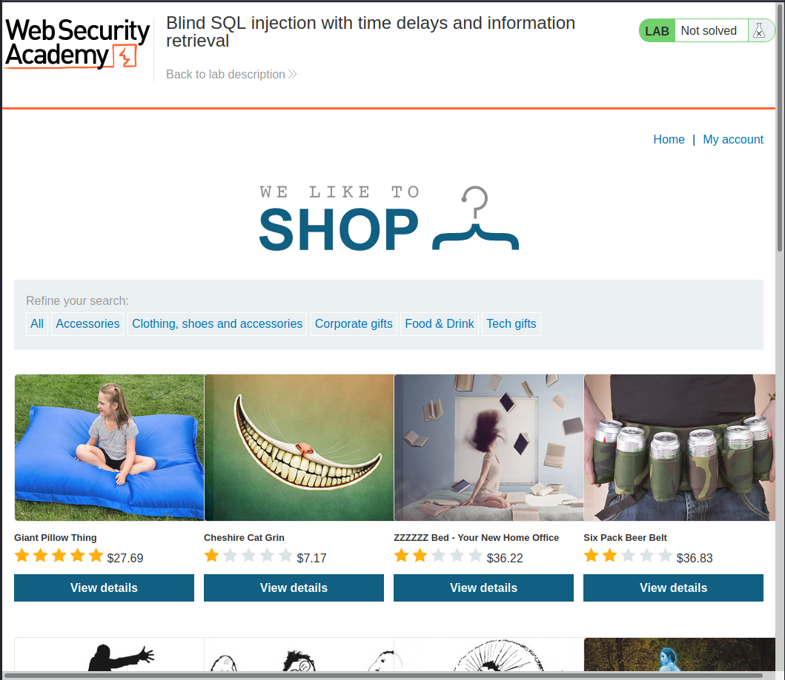

Confirm that there is the vulnerability by creating a delay ` || (select pg_sleep(10))--`

Next up I can confirm that the users table does exist, if it does then the page delays by 10 seconds, if it doesnt then the page doesnt delay.  ` || (select case when (username='administrator') then pg_sleep(10) else pg_sleep(0) end from users)--`

I can enumerate the password length using ` || (select case when (username='administrator' and length(password)>1) then pg_sleep(10) else pg_sleep(0) end from users)--`

Send to intruder then automate by using the sniper attack.

Set the resource pool to create new resource pool with the concurrent requests and set to 1

Once the attack has run, click on columns then the response received, which gives the response recrived.

The length of the password is 20 characters.

Next enumerate the password, Find the first character by using bruteforcer ` || (select case when (username='administrator' and substring(password,1,1)='a' then pg_sleep(10) else pg_sleep(0) end from users)--`

### **Lab 13: Blind SQL injection with out-of-band interaction**

[https://portswigger.net/web-security/sql-injection/blind/lab-out-of-band](https://portswigger.net/web-security/sql-injection/blind/lab-out-of-band)

This lab contains a blind SQL injection vulnerability. The application uses a tracking cookie for analytics, and performs an SQL query containing the value of the submitted cookie.

The SQL query is executed asynchronously and has no effect on the application's response. However, you can trigger out-of-band interactions with an external domain.

To solve the lab, exploit the SQL injection vulnerability to cause a DNS lookup to Burp Collaborator. 

> **Solution**

[Burp Collaborator Client](https://portswigger.net/burp/documentation/desktop/tools/collaborator-clientBurp col)

Modifying the Tracking ID and changing it to a payload that will trigger an interaction with the collaborator server and combining SQL injection with XXE techniques will exploit the lab.

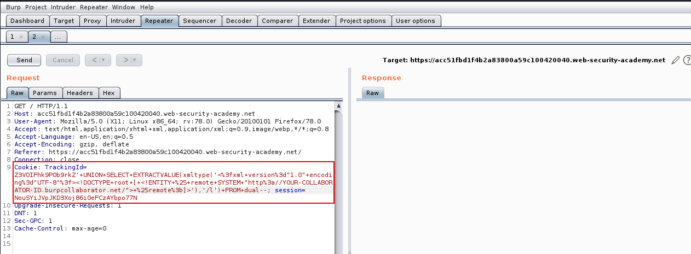

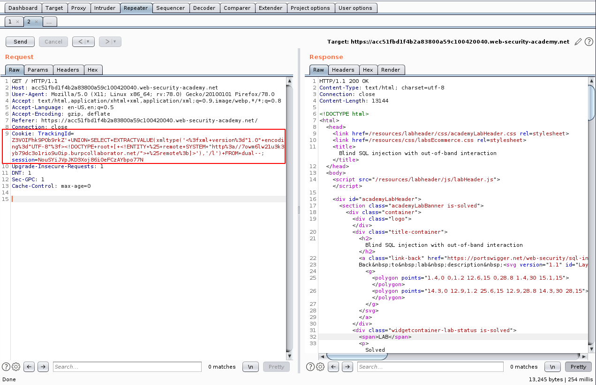

### **Lab 14: Blind SQL injection with out-of-band data exfiltration**

[https://portswigger.net/web-security/sql-injection/blind/lab-out-of-band-data-exfiltration](https://portswigger.net/web-security/sql-injection/blind/lab-out-of-band-data-exfiltration)

 This lab contains a blind SQL injection vulnerability. The application uses a tracking cookie for analytics, and performs an SQL query containing the value of the submitted cookie.

The SQL query is executed asynchronously and has no effect on the application's response. However, you can trigger out-of-band interactions with an external domain.

The database contains a different table called users, with columns called username and password. You need to exploit the blind SQL injection vulnerability to find out the password of the administrator user.

To solve the lab, log in as the administrator user. 

> **Solution**

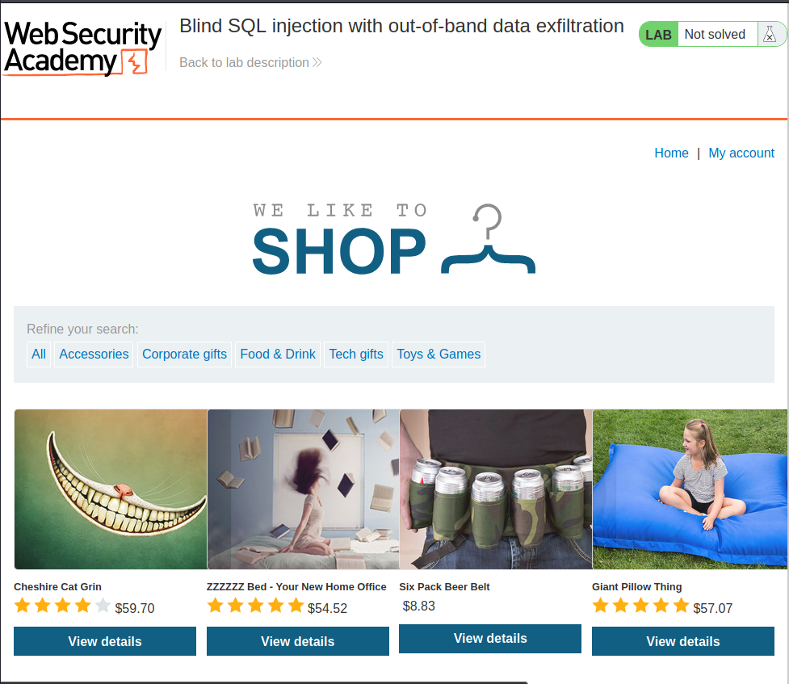

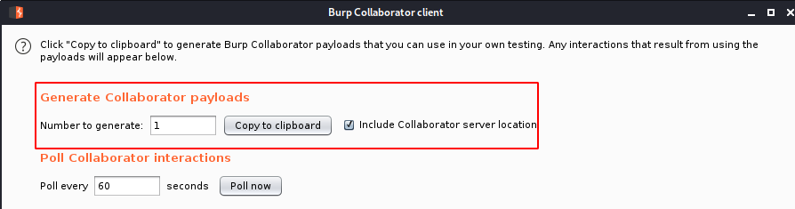
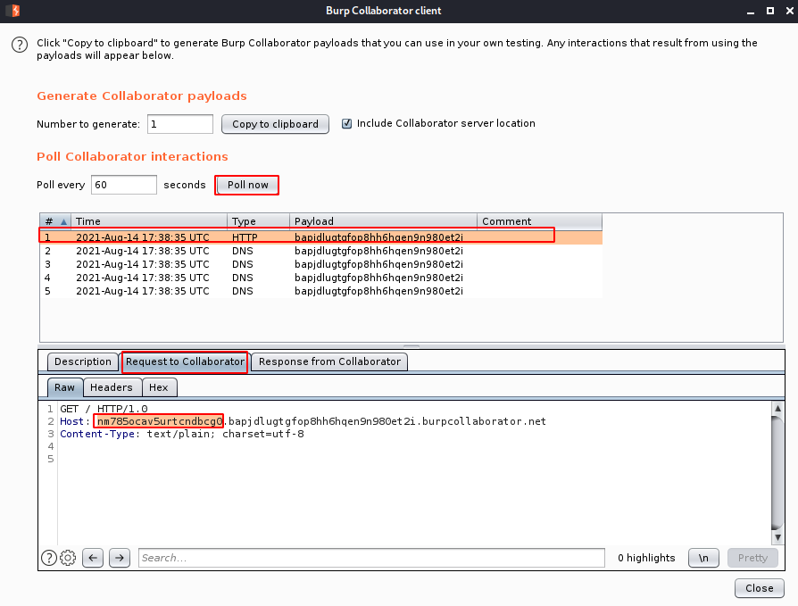


### **Lab 15: SQL injection vulnerability in WHERE clause allowing retrieval of hidden data**

[https://portswigger.net/web-security/sql-injection/lab-retrieve-hidden-data](https://portswigger.net/web-security/sql-injection/lab-retrieve-hidden-data)

> Solution :


When a gift category is selected in the page, eg tech gifts, link would be: `https://ac371f081e4fc1da80be130e00960029.web-security-academy.net/filter?category=Tech+gifts`

The SQL query to retrieve the info would be: `SELECT * FROM products WHERE category = 'Tech gifts' AND released = 1`

Adding a single quote at the end of the query string would result to the following: `?category=Tech+gifts'`

In the SQL query: `SELECT * FROM products WHERE category = 'Tech gifts'' AND released = 1`

This will cause an error as there is one single quote that is not closed

Adding double dash after the quote "--": `?category=Tech+gifts'-- `

In the query string: `SELECT * FROM products WHERE category = 'Tech gifts'--' AND released = 1 `

This would result in showing in all products of category, Tech gifts both released and unreleased would be shown.

To fully show everything in the database:
```
?category=Tech+gifts' or 1=1-- 
SELECT * FROM products WHERE category = 'Tech gifts' or 1=1--' AND released = 1 
```

### **Lab 16: SQL injection vulnerability allowing login bypass**

