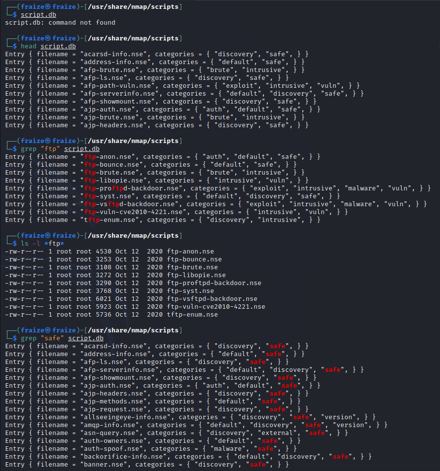

# NMAP

Nmap is an open source utility for network discovery and security auditing.

Nmap uses raw IP packets in novel ways to determine what hosts are available on the network, what services (application name and version) those hosts are offering , what operating systems and OS versions they are running.

When a computer runs a network service, it opens ports to receive the connection.

Ports are necessary for making multiple network requests or having multiple services available.

Network connections are made between 2 ports; an _open listening port_ on the server and a _randomly selected port_ on ones computer.

Every computer has a total of 65535 available ports, however many are registered as standard ports.

Nmap Practice [https://tryhackme.com/room/furthernmap](https://tryhackme.com/room/furthernmap)

Ports can be either: 
  
  1. Open
  2. Closed
  3. Filtered(by firewall)
  
## How to use Nmap

**Command Line**

```
nmap [Scan Type(s)] [Options] {target specification}
```

#### Basic scanning techniques

The `-s` switch determines the type of scan to perform.

| Nmap Switch | Description |
|-------------|-------------|
| -sA | ACK scan |
| -sF | TCP FIN scan |
| -sI | IDLE scan |
| -sL | DNS scan/list scan |
| -sN |	TCP NULL scan |
| -sO |	Protocol scan |
| -sP |	Ping scan |
| -sR |	RPC scan |
| -sS |	SYN "Half-open" scan |
| -sT |	TCP connect scan |
| -sW |	Windows scan |
| -sX |	TCP XMAS scan |
| -sU | UDP Scans |

#### Types of scans
| Scan Type | nmap command |
|-----------|--------------|
| Single Target | `nmap [target]` |
| Multiple Targets | `nmap [target1, target2, target3]`|
| List of Targets | `nmap -iL [list.txt]` |
| Range of Hosts | `nmap [range of IPs]` |
| Entire Subnet | `nmap [ip address/cdir]` |
| Random Hosts | `nmap -iR [number]` |
| Exclude Targets | `nmap [targets] --exclude [targets]` |
| Exclude using a list | `nmap [targets] --excludefile [list.txt]` |
| Perform an Aggresive Scan | `nmap -A [target]` |
| Scan an IPv6 Target | `nmap -6 [target]` |
| Run all default scripts | `nmap -sC [target]` |

#### Port Scanning Options
| Scan option | Nmap command |
|-------------|--------------|
| Perform a fast scan | `nmap -F [target]` |
| Scan specific ports | `nmap -p [port(s)] [target]` |
| Scan ports by name | `nmap -p [port name(s)] [target]` |
| Scan ports by protocol | `nmap -sU -sT -p U:[ports],T:[ports] [target]` |
| Scan All ports | `nmap -p 1-65535 [target]` |
| Scan Top Ports | `nmap --top-ports [number] [target]` |
| Perform a sequential port scan | `nmap -r [target]` |
| Attempt to guess an unknown OS | `nmap -O --oscan-guess [target]` |
| Service Version Detection | `nmap -sV [target]` |
| Troubleshoot version scan | `nmap -sV --version-trace [target]` |
| Perform a RPC scan | `nmap -sR [target]` |

#### Discovery Options

**Host Discovery** the `-p` switch determines the type of ping to perform.
| Nmap Switch | Description |
|-------------|-------------|
| -PI | ICMP ping |
| -Po | No ping |
| -PS | SYN ping |
| -PT | TCP ping |


| Ping option | Nmap command |
|-------------|--------------|
| Perform a Ping Only Scan | `nmap -sn [target]` |
| Do not ping | `nmap -Pn [target]` |
| TCP SYN ping | `nmap -PS [target]` |
| TCP ACK ping | `nmap -PA [target]` |
| UDP ping | `nmap -PU [target]` |
| SCTP INIT ping | `nmap -PY [target]` |
| ICMP echo ping | `nmap -PE [target]` |
| ICMP timestamp ping | `nmap -PP [target]` |
| ICMP Address mask ping | `nmap -PM [target]` |
| IP protocol ping | `nmap -PO [target]` |
| ARP ping | `nmap -PR [target]` |
| Traceroute | `nmap --traceroute [target]` |
| Force Reverse DNS resolution | `nmap -R [target]` |
| Disable Reverse DNS resolution | `nmap -n [target]` |
| Alternative DNS lookup | `nmap --system-dns [target]` |
| Manually specify DNS server | `nmap --dns-server [servers] [target]` |
| Create a Host List | `nmap -sL  [targets]` |


#### Firewall Evasion Techniques

| Option | Nmap command |
|--------|--------------|
| Fragment Packets | `nmap -f [target]` |
| Specify a specific MTU | `nmap --mtu [MTU] [target]` |
| Use a decoy | `nmap -D RND:[number] [target]` |
| Idle Zombie Scan | `nmap -sI [zombie] [target]` |
| Manually specify a source port | `nmap --source-port [port] [target]` |
| Append random data | `nmap --data-length [size] [target]` |
| Randomize target scan order | `nmap --randomize-hosts [target]` |
| Spoof MAC address | `nmap --spoof-mac [MAC|0|vendor] [target]` |
| Send bad checksums | `nmap --badsum [target]` |

#### Advanced Scanning functions

| Scan | Nmap command |
|------|--------------|
| Send raw ethernet packets | `nmap --send-eth [target]` |
| Send IP packets | `nmap --send-ip [target]` |
| Custom TCP scan | `nmap --scanflags [flags] [target]` |

#### Timing options
| Option | Nmap command |
|--------|--------------|
| Timing templates | `nmap -T[0-5] [target]` |
| Set the packet TTL | `nmap --ttl [time] [target]` |
| Minimum Number of parallel operations | `nmap --min-parallelism [number] [target]` |
| Maximum number of parallel operations | `nmap --max-parallelism [number] [target]` |
| Minimum host group size | `nmap --min-hostgroup [number] [targets]` |
| Maximum host group size | `nmap --max-hostgroup [number] [targets]` |
| Maximum RTT timeout | `nmap --initial-rtt-timeout [time] [target]` |
| Initial RTT timeout | `nmap --max-rtt-timeout [TTL] [target]` |
| Maximum number of Retries | `nmap --max-retries [number] [target]` |
| Host timeout | `nmap --host-timeout [time] [target]` |
| Minimum scan delay | `nmap --scan-delay [time] [target]` |
| Maximum scan delay | `nmap --max-scan-delay [time] [target]` |
| Minimum packet rate | `nmap --min-rate [number] [target]` |
| Defeat reset rate limit | `nmap --defeat-rst-ratelimit [target]` |


#### Output Options
| Nmap Switch | Description |
|-------------|-------------|
| -oN | Normal output |
| -oX | XML output |
| -oA | Normal, XML, and Grepable format all at once |

##### Other output options
| Option | Nmap command |
|--------|--------------|
| Save output to a Text File | `nmap -oN [scan.txt] [target]` |
| Save output to a XML file | `nmap -oX [scan.xml] [target]` |
| Grepable output | `nmap -oG [scan.txt] [target]` |
| Output all supported file types | `nmap -oA [path/filename] [target]` |
| Periodically display statistics | `nmap --stats-every [time] [target]` |
| 1337 Output | `nmap -oS [scan.txt] [target]` |

#### Compare Scans
| Option | Nmap Command |
|--------|--------------|
| Comparison Using Ndiff | `ndiff [scan1.xml] [scan2.xml]` |
| Ndiff verbose mode | `ndiff -v [scan1.xml] [scan2.xml]` |
| XML output mode | `ndiff --xml [scan1.xml] [scan2.xml]` |

#### Troubleshooting and Debugging
| Option | Nmap Command |
|--------|--------------|
| Get Help | `nmap -h` |
| Verbose Output | `nmap -v [target]` |
| Debugging | `nmap -d [target]` |
| Display Port state reason | `nmap --reason [target]` |
| Only display open ports | `nmap --open [target]` |
| Trace packets | `nmap --packet-trace [target]` |
| Display Host Networking | `nmap --iflist` |
| Specify a network interface | `nmap -e [interface] [target]` |

#### Nmap Scripting Engine
| Option | Nmap Command |
|--------|--------------|
| Execute Individual Scripts | `nmap --script [script.nse] [target]` |
| Execute Multiple Scripts | `nmap --script [expression] [target]` |
| Execute Scripts by category | `nmap --script [category] [target]` |
| Execute Multiple Script Categories | `nmap --script [category1, category2, etc]` |
| Troubleshoot scripts | `nmap --script [script] --script-trace [target]` |
| Update the Script Database | `nmap --script-updatedb` |

### TCP Scans

If a port is **closed**, the target server will respond with a TCP packet with the RST (reset) flag.

If a port is _closed_ , **RFC 793** states that;

> "If the connection does not exist (CLOSED) then a reset is sent in response to any incoming segment except another reset.  In particular, SYNs addressed to a non-existent connection are rejected by this means."

If the port is **open**, the target will respond with a TCP packet with the SYN/ACK flags set; and completes the handshake by sending back a TXP packet with ACK set.

Some firewalls are configured to drop packets. Nmap sends TCP SYN requests and receives nothing back indicating that the port is protected by a firewall and thus is **filtered**

You can configure a firewall to respond with a RST TCP packet eg in IPtables for linux, a simple version of the command would be;
```
iptables -I INPUT -p tcp --dport <port> -j REJECT --reject-with tcp-reset
```

### SYN scans

SYN `-sS` scans are used to scan the TCP port-range of a target or targets.

Syn send s back a RST TCP packet after receiving a SYN/ACK from the server.

**Advantages**:
  
  1. It can be used to bypass older ISDs as they are looking out for a full 3-way handshake.
  2. SYN scans are often not logged by applications listening on open ports, as standard practice is to log a connection once it's been fully established.
  3. SYN scans are faster than a standard TCP connect scan.
  
**Disadvantages**:
  
  1. They require sudo permissions in order to work correctly since they require the ability to create raw packets which is a privilege only the root user has by default.
  2. Unstable services are sometimes brought down by SYN scans which could prove problematic if a client has provided a production environment for the test.
  
SYN scans can be made to work by giving Nmap the `CAP_NET_RAW`, `CAP_NET_ADMIN` and `CAP_NET_BIND_SERVICE` capabilities; however it may not allow many of the NSE scripts to run properly.


### UDP scans 

UDP `-sU` connections rely on sending packets to a target port and essentially hoping that they make it.

When a packet is sent to an open UDP port, there should be no response hence nmap refers to the port being either **open/ filtered**.

UDP scans can be slow and take alot of time; run Nmap with the following;
```
nmap -sU --top-ports 20 <target>
```


### NULL,FIN and Xmas

1. `NULL Scans` **-sN** are when the TCP request is sent with no flag set at all.

2. `FIN Scans` **-sF**; instead of sending a completely empty packet, a request is sent with the FIN flag.

3. `Xmas Scans` **-sX** sends a malformed TCP packet and expects a RST response for closed ports.


### ICMP Network Scanning

Nmap conducts "ping sweeps" ie sends an ICMP packet to each possible IP address for the specified network.

To perform the ping sweep, we use the `-sn` switch in conjuction with IP ranges which can be specified with either a hiphen `-` or CIDR notation. ie
  
  1. `nmap -sn 192.168.0.1-254`
  2. `nmap -sn 192.168.0.0/24`
  
### NSE scripts

> Also called Nmap Scripting Engine.

Is a tool written in _Lua_ programming language and used to: 

  1. Scan for vulnerabilities.
  2. Automating exploits from them.

The NSE is userful for recon.

Some of the useful catgories:
  - `safe` : Won't affect the target.
  - `intrusive` : Not safe; likely to affect the target.
  - `vuln` : Scan for vulnerabilities.
  - `exploit` : Attempt to exploit a vulnerability.
  - `auth` : Attempt to bypass authentication for running services such as log into an FTP server anonymously.
  - `brute` : Attempt to bruteforce credentials for running services.
  - `discovery` : Attempt to query running services for further information about the network.
  
NSE [scripts](https://nmap.org/nsedoc/)

To run a specific script we use; `--script=<script-name>` 

Multiple scripts can be run simultaneously by separating with a comma eg `--script=smb-enum-users, smb-enum-shares`

Some scripts require arguments eg credentials, when exploiting an authenticated vulnerability. These can be given with the `--scirpt-args` Nmap switch.

Eg:
```
nmap -p 80 --script http-put --script-args http-put.url='/dav/shell.php',http=put.file='./shell.php'
```

The arguments are separated by commas and connected to the corresponding script with periods. ie `<script-name>.<argument>`

Incase of any lookup
```
nmap --script-help <script-name>
```

##### Searching for scripts

Scripts can be found on the Nmap [website](https://nmap.org/nsedoc/) or in the storage in linux machines `/usr/share/nmap/scripts`

One can look for the script using `/usr/share/nmap/scripts/script.db`



### Firewall Evasion

`-Pn` option tells Nmap to not ping the host before scanning it, hence Nmap will always treat the target host(s) as being alive, effectively bypassing the ICMP block, though it takes long.

The following switches can be used;
  - `-f` - fragments the packets making it less likely that the packets will be detected by the firewall or IDS.
  - `--mtu <number>` - This provides more control over the size of the packets and accepts a maximum transmission unit size to use for the packets sent and must be a multiple of **8**.
  - `--scan-delay <time> ms` - used to add a delay between packets sent hence evading any time-based firewall/IDS triggers which may be in place.
  - `--badsum` - is used to generate in invalid checksum packets. Any TCP/IP stack would drop this packet, however, firewalls may potentially respond automatically without bothering to check the checksum of the packet.
  - more [https://nmap.org/book/man-bypass-firewalls-ids.html](https://nmap.org/book/man-bypass-firewalls-ids.html)
