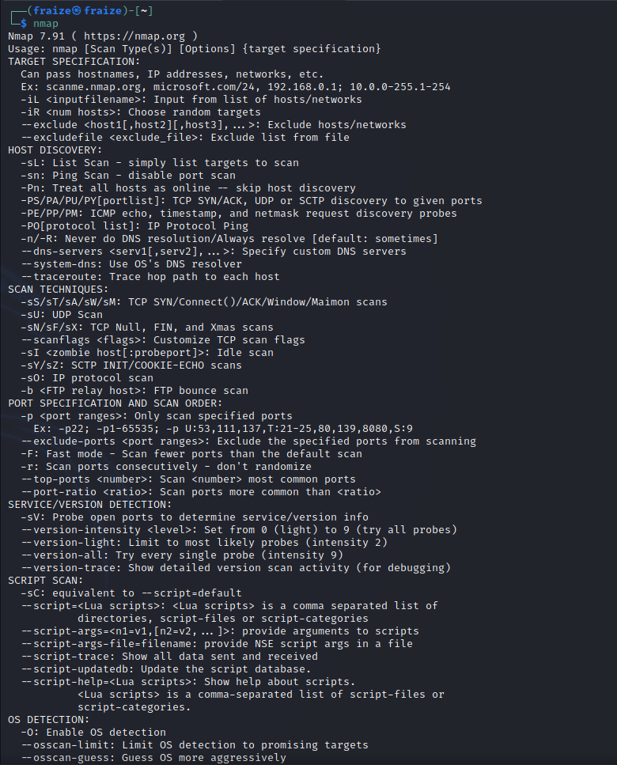
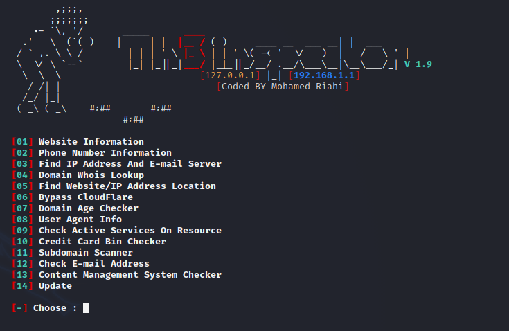
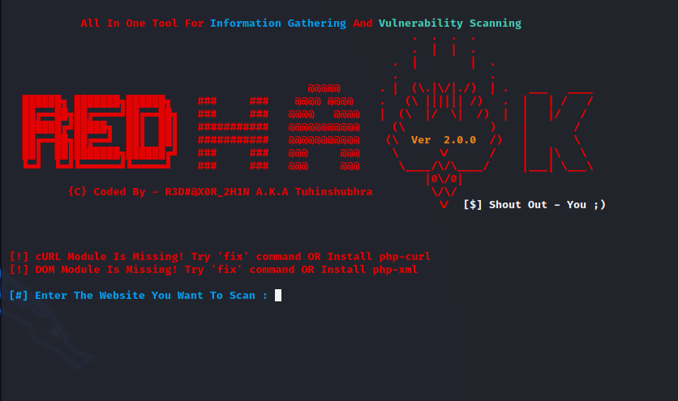
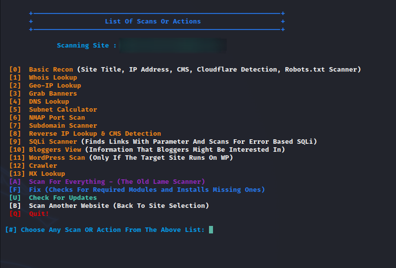
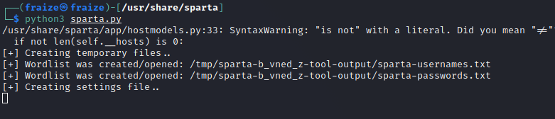
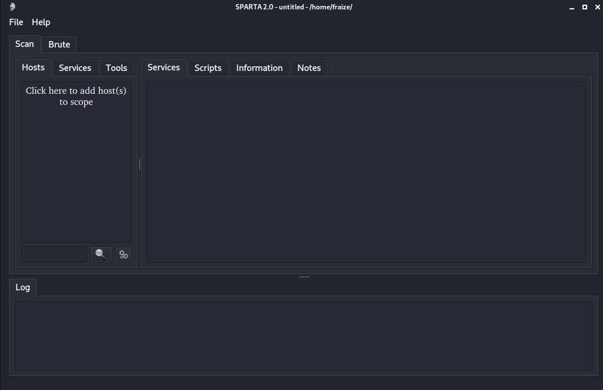
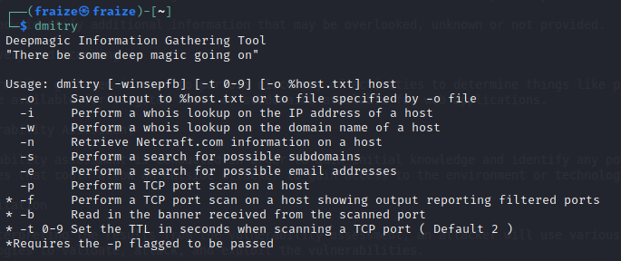
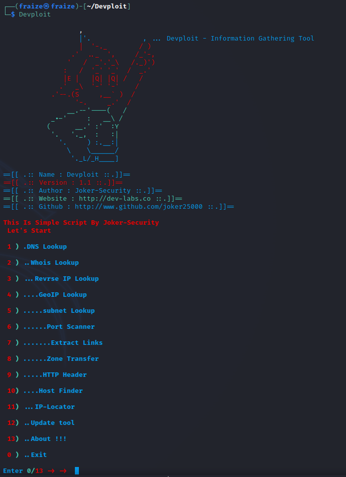

# Penetration Testing Steps
> Stages, Their importance, Tools used, Tools outputs.

## 1. Information Gathering

This is the first step in penetration testing whereby you gather useful information about the target, the more one can find, the more vulnerabilities you may be able to get.

### Objectives of Information gathering
  1. **Collect Network Information**
   - Domain Name
   - Internal Domain Names
   - Network Blocks
   - IP address of the reachable systems
   - Rogue websites/private websites
   - TCP and UDP service running
   - Networking protocols
   - IdSes running
   - System enumeration
   
  2. **Collect System Information**
   - User and group names
   - System banners
   - Routing tables
   - SNMP information
   - System information
   - Remote system type
   - System names
   - Passwords

### Classifications of Information Gathering
#### 1. Footprinting

Footprinting is used to collect as much information as possible about the targeted network/victim/system and is used to determine the security posture of the target.

###### **Types of Footprinting**
  1. **Active Footprinting** - Active footprints are created when personal data gets released consciously and intentionally or by the owner's direct contact.
  2. **Passive Footprinting** - Involves collecting data without the owner knowing that hackers gather his/her data.
  
###### Sub Branches of Footprinting
  1. **Open-Source Footprinting**
  
  This is the safest type of footprinting as it holds all legal limitations and hackers can do it without fear because it is illegal.
  
  Examples include; finding someone's email address, phone number, scanning IP through automated tools, search for ones age, DOB, address etc.
  
  2. **Network-based footprinting**
  
  Hacktivists can retrieve information such as username, information within a group, shared data among individuals, network services etc.
  
  3. **DNS interrogation**
  
  After gethering the information, DNS queries are made using pre-existing tools.

###### Tools
- `Whois` - Is a tool used to identify who owns a domain or who registers for that particular domain along with their contact details.
- `Harvester` - Is an information gathering tool that helps you extract the email address and subdomains of a particular target.
- `Metagoofil` - Is a tool used for extracting information or data which is publicly available on the internet belonging to the company.
- `Netifera` - Is a tool that gives a complete platform to gather information regarding the targeted website you want to attack. This tool gives information such as IP address, Programming Language used for website development, the number of websites hosted, DNS.

###### Techniques
- **OS Identification** - Involves sending illegal TCP or ICMP packets to the victim's system to identify the OS used by the victim on his server or computer.
- **Ping Sweep** - Is a technique of establishing a large number of IP addresses that map hackers to live hosts. Use `Fping, Nmap,Zenmap, ICMPEnum, SuperScan`

Information can also be gathered from other sources such as social networking sites where users share their personal data and additional information related to them.

From the email header one can collect:

  - Address from which message was sent.
  - Sender's email server.
  - Sender's IP address.
  - Date and time received by the originator's email server.
  - The sender's mail server uses the authentication system.
  - Sender's full name.

###### Objectives of Footprinting
- Collecting Network Information
- Collecting System Information
- Collecting Organization's Information

###### Countermeasures
- Classify the type of information which is needed to be kept public.
- Don't put unnecessary information into any profile, social networking account or any website.
- Don't keep personal contact number in any company or organization's phone book to prevent war-dialing.

###### Countermeasures against DNS interrogation
- Keep internal and external DNS separate.
- Restrict and disable zone transfer to authorized servers.

#### 2. Scanning

Scanning is essential in this stage and it refers to the techniques and procedures used to identify hots, ports and other services within a network.

This stage is used to create an overview scenario of the target organization.

This technique is done to detect the possibility of network security attacks.

It helps identify vulnerabilities such as missing patches, unnecessary services, weak authentication and/or weak encryption algorithms.

###### Objectives of Network Scanning
- Discover live hosts/computers, IP address, and open ports of the victim.
- Discover services that are running on a host computer.
- Discover the OS and system architecture of the target.
- Discover and deal with vulnerabilities in live hosts.

###### Scanning Methodologies
1. Check for live systems.
2. Port scanning.
3. Scanning beyond IDS.
4. Banner Grabbing - method for obtaining information regarding the targeted system on a network and services running on its open ports. Use `Telnet and ID Serve`.
5. Scan for vulnerability.
6. Prepare proxies.

**Port Scanning**

Attackers may find out live hosts, firewalls installed, OS used, devices attached to the system and organization's topology.

**Scanning Techniques used:**

1. **SYNScan** - Is a stealth scan that doesn't complete the 3-way handshake. Is advantageous as few IDS systems log this as an attack or connection attempt.
2. **XMASSScan** - Sends a packet which contains _URG_, _FIN_ and _PSH_ flags. If there is an open port, there will be no response but if there is a closed port the target responds with an RST/ACK packet.
3. **FINScan** - Similar to an XMAS scan except it sends a packet with just the FIN flag and no URG or PSH flags.
4. **IDLEScan** - Uses a spoofed/hoax IP to send the SYN packet to the target by determining the port scan response and IP header sequence number. The response of the scan determines whether the port is open or closed.
5. **Inverse TCP Flag Scan** - The attacker sends TCP probe packets with a TCP flag _FIN, URG, PSH_ or no flags. No response = open port, RST response = Closed port.
6. **ACK Flag Probe Scan** - The attacker sends TCP probe packets where an ACK flag is set to a remote device analyzing the header information (_TTL and WINDOW field_). RST packet = open/closed port. This scan checks the target's filtering system.

###### Vulnerability Scanning
Is the proactive identification of the system's vulnerabilities within a network in an automated manner to determine whether the system can be exploited or threatened.

###### Tools
  1. **Nmap** - this is a vulnerability scanning and network discovery tool. It is used to identify what devices are running on the systems, discovering hosts that are obtainable and the services they provide,finding type of packet filters/firewalls, OS versions, finding open ports and detecting security risks.
  
  2. **Angry IP scanner** - Scans for systems available in a given input range.
  3. **Superscan** - Are command-line tools developed by Mcafee; is a TCP port scanners
  4. **hping2/hping3** - are command-line packet crafting and network scanning tools used for TCP/IP protocols.
  5. **Net Scan Tool Suite Pack** - Is a collection of different types of tools that can perform a port scan, flooding, webrippers, mass emailers.
  6. **Wireshark and Omnipeak** - They listen to network traffic and act as a network analyzer.
  7. Other tools include - _Advanced Port Scanner, Net Tools, MegaPing, CurrPorts, PRTG Network Monitor, SoftPerfect Network Scanner, Network Inventory Explorer_
  
  Tools and softwares used in mobile devices as scanners are - _Umit Network Scanner, Fing, IP network Scanner, PortDroid network Analysis, Panm IP Scanner, Nessus Vulnerability Scanner, Shadow Sec Scanner_
  
###### Countermeasures against scanning
- Configure firewalls and IDS to detect and block probes.
- Use custom rules to lock down the network and block unwanted ports.
- Run port scanning tools to determine whether the firewall accurately detects the port scanning activities.
- Ensure proper configuration of anti-scanners and anti-spoofing rules.
- Ensure that the IDS, routers and firewall firmware are up to date with the latest releases.

#### 3. Enumeration
Is the process which establishes an active connection to the target hosts to discover potential attack vectors in the system.

This step is used to gather the following information:
   - Usernames, group names
   - Hostnames
   - Network shares and services
   - IP tables and routing tables
   - Service settings and audit configurations
   - Application and banners
   - SNMP and DNS details

###### Techniques for Enumeration
 - Extracting usernames using email ID's.
 - Extracting information using the default password.
 - Bruteforcing active directory.
 - Extracting user names using SNMP.
 - Extracting user groups from windows.
 - Extracting information using DNS Zone transfer.
 
###### Classification of Enumeration
1. NetBios enumeration
  - An attacker can perform the following : Choosing to read or write to a remote machine depending on the availability of shares; Launching a DoS attack on the remote machine; Enumerating password policies on the remote machines.
  - Tools to use : [Nbtstat](http://www.technet.microsoft.com/), [SuperScan](http://www.mcafee.com/in/downloads/free-tools/superscan.aspx), [Hyena](http://www.systemtools.com/hyena/), [Winfingerprint](https://packetstormsecurity.com/files/38356/winfingerprint-0.6.2.zip.html), [NetBios enumerator](http://nbtenum.sourceforge.net/)
2. SNMP enumeration
  - SNMP (_Simple Network Management Protocol_) is based on a client-server architecture where the SNMP client or agent is located on every network device and communicates with the SNMP managing station via requests and responses.
  - Attackers can enumerate SNMP on remote network devices for the following: Information about network resources; ARP and routing tables; Device specific information; Traffic statistics among so much more
  - Tools used are: [OpUtils](https://www.manageengine.com/products/oputils/), [SolarWinds](http://www.solarwinds.com/), [SNScan](http://www.mcafee.com/us/downloads/free-tools/snscan.aspx), [SNMP Scanner](http://www.secure-bytes.com/snmp-scanner.php), [NS Auditor](http://www.nsauditor.com/)
3. LDAP enumeration
  - LDAP, _Light-weight Directory Access Protocol_,  is an internet protocol for accessing distributed directory services like AD or OpenLDAP.
  - LDAP supports anonymous remote queries on the server. This query discloses sensitive information such as usernames, address, contact details, department details etc.
  - Tools used: [Softerra LDAP administrator](http://www.ldapadministrator.com/), [Jxplorer](http://jxplorer.org/), [active directory domain services management pack for system center](https://www.microsoft.com/en-in/download/details.aspx?id=21357), [LDAP Admin Tool](http://www.ldapadmin.org/), [LDAP administrator Tool](https://sourceforge.net/projects/ldapadmin/)
4. NTP enumeration
  - NTP, _Network Time Protocol_, was designed to synchronize clocks of networked computers.
  - An attacker can enumerate the following information  by quering the NTP server: List of hosts connected to the NTP server; Internal client IP addresses, hostnames and OS used.
  - Tools used are ntptrace; ntpdc; ntpq.
5. SMTP enumeration
  - SMTP, _Simple Mail Transfer Protocol_, is desiged for email transmissions.
  - SMTP provides 3 in-built commands: 
   a. _VRFY_ : Validates users on the SMTP servers.
   b. _EXPN_ : Delivery addresses of aliases and mailing lists.
   c. _RCPT TO_ : Defines the recipients of the message.
  - Attackers can determine the valid users on the SMTP servers with above techniques.
  - Tools used are : [NetScan Tools Pro](http://www.netscantools.com/nstpromain.html), [SMTP User Enum](http://pentestmonkey.net/tools/user-enumeration/smtp-user-enum)
6. DNS enumeration
  - DNS resolves hostnames to its respective IP addresses and vice versa and internally maintains a database for storing the records.
  - Most commonly used record types are; Start of Authority(SOA); IP Addresses(A and AAAA); SMTP mail exchangers(MX), Nameserver(NS); Pointers for reverse DNS lookups(PTR); Domain Name Aliases(CNAME)
  - DNS enumeration is possible by sending zone transfer requests to the DNS primary server pretending to be a client. DNS reveals sensitive domain records in response to the request.
  - Tools used are : [nslookup](https://centralops.net/co/), [DNS Dumpster](https://dnsdumpster.com/), [DNS Recon](http://tools.kali.org/information-gathering/dnsrecon)
7. Windows enumeration
  - Windows OS can be enumerated with multiple tools from Sysinternals
  - Some of the important utilities include: 
    | Name of tool | Description |
    |--------------|-------------|
    | PsExec | Executes processes on remote machines |
    | PsFile | Displays list of files opened remotely |
    | PsGetSid | Translate SID to display name and vice versa |
    | PsKill | Kill processes on local or remote machines |
    | PsInfo | Displays installation, install date, kernel build, physical memory, processors type and number, etc |
    | PsList | Display process, CPU, memory, thread statistics etc |
    | PsLoggedOn | Displays local and remote logged users. |
    | PsLogList | View event logs. |
    
8. UNIX/Linux enumeration
  - Below is a list of utilities provided by the OS.
  | Name of tool | Description |
  |--------------|-------------|
  | Finger | Enumerate users on remote machines. |
  | rpcInfo | Enumerate remote procedure calls. |
  | rpcclient | Enumerate usernames on linux. |
  | showmount | Enumerate list of shared directories. |
  | Enum4Linux | [https://labs.portcullis.co.uk/tools/enum4linux/](https://labs.portcullis.co.uk/tools/enum4linux/) |

###### Services and Ports to Enumerate
 - TCP 53 : DNS Zone Transfer
 - TCP 135 : Microsoft RPC Endpoint Mapper
 - TCP 137 : NetBIOS Name Service
 - TCP 139 : NetBIOS session service (SMB over NetBIOS)
 - TCP 445 : SMB over TCP (Direct Host)
 - UDP 161 : SNMP
 - TCP/UDP 389 : LDAP
 - TCP 25 : SMTP
   
**Information Gathering Tools**

  1. **[Th3inspector](https://github.com/Moham3dRiahi/Th3inspector)** - This is a powerful tool used to find much information about the target such as server details, whois lookup, target IP location, phone number, email address, sub-domains amongst others.
  
  
  2. **[Red Hawk](https://github.com/cys3c/RED_HAWK)** - This is a tool that supports many scans & features like basic scan, web server detection, cms detection, whois lookup, geo-ip lookup,  grab banners, dns lookup, subnet calculator, sub-domain scanners, reverse ip lookup and CMS detection.
  
  
  
  3. **[Raccoon](https://github.com/evyatarmeged/Raccoon)** - This is a tool used for both information gathering and reconnaissance. It is used for gathering DNS records, retrieving WHOIS information, getting TLS information, sleuthing WAF presence, dirbusting and subdomain enumeration.
  
  4. **[BadKarma - Advanced Network Recon Toolkit](https://github.com/r3vn/badKarma)** - This tool assists in gathering information about network infrastructure. It gives a point-and-click access to their toolkits, launch them against a single or multiple targets and interacts with them through GUIs or terminal.
  
  5. **[Sandmap](https://github.com/trimstray/sandmap)** - This is a tool used for network and system reconnaissance using the Nmap engine.
  
  6. **[Sparta](https://github.com/SECFORCE/sparta)** - Is a GUI app used with inbuilt Network Penetration Testing tools used for information gathering, scanning and enumeration.
  
  
  
  7. **[DMitry](https://github.com/jaygreig86/dmitry)** - Is a command line tool used to gather information about a host. It removes multiple commands. This tool performs whois search; retrieves attainable uptime information; system and server information; performs a SubDomain search, Email address search on a target host, tcp Port scan on host target.
  
  
  8. **[Devploit](https://github.com/GhettoCole/Devploit)** -Is a tool used for information gathering. It performs Whois lookup, Geo-IP lookup, subnet lookup, port scanner, Extract links, Zone transfer, HTTP header, Host finder, IP-locator, Traceroute, Host DNS finder, Reverse IP lookup, Subdomain finder.
  
  
**Other Information Gathering Tools(in kali)**

  1. **DNS Analysis** - dnsenum, dnsrecon, fierce
  2. **IDS/IPS Identification** - lbd, wafw00f
  3. **Live Host Identification** - airping, fping, hping3, masscan, thcping6, unicornscan
  4. **Network and port scan** - masscan, nmap, unicornscan
  5. **OSINT Analysis** - Maltego, Spiderfoot, theHarvester
  6. **Route Analysis** - Net discover, Netmask
  7. **SMB Analysis** - enum4linux, nbtscan, smbmap
  8. **SMTP Analysis** - Swaks
  9. **SNMP Analysis** - onesixtyone, snmp check
  10. **SSL Analysis** - ssldump,sslh, sslscan,sslyze
  
-------------------------------------------------------------------------------------------
## 2. **Reconnaissance**

This stage uses the information gathered to collect additional details from publicly accessible sources.

One can now identify additional information that may be overlooked, unknown or not provided.

###### Tools used
1. **Google**
2. **Maltego CE**
3. **FireCompass**
4. **

--------------------------------------------------------------------------------------------
## 3. **Discovery and scanning**

The information gathered is used to perform discovery of activities to determine things like ports and services that were available for targeted hosts or subdomains available for web applications.

  
--------------------------------------------------------------------------------------------------
## 4. **Vulnerability Assessment**

A vulnerability assessment is conducted in order to gain initial knowledge and identify any potential security weaknesses that could allow an outside attacker to gain access to the environment or technology being tested.

---------------------------------------------------------------------------------------------------
## 5. **Exploitation**

After interpreting the results from the vulnerability assessment, an attacker will use various tools and methodologies to validate, attack, and exploit the vulnerabilities.
